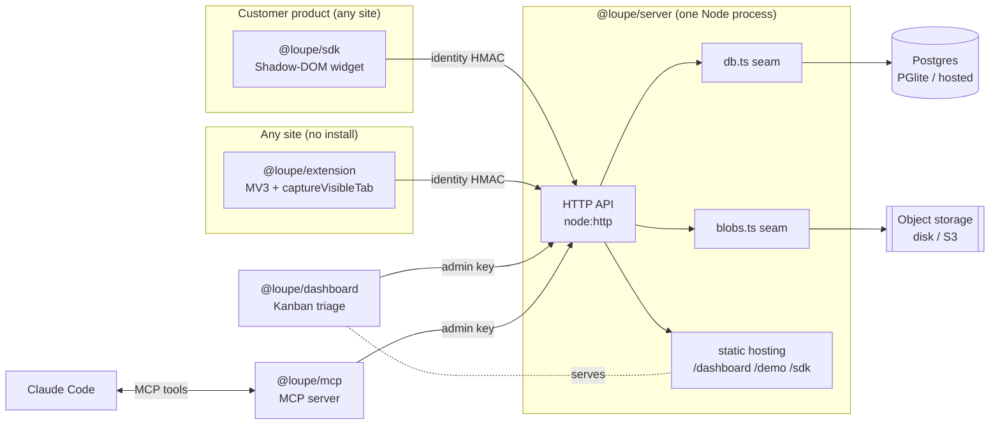
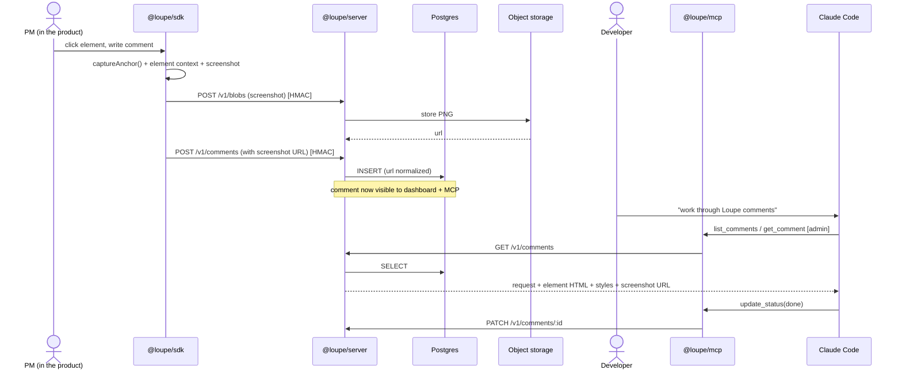
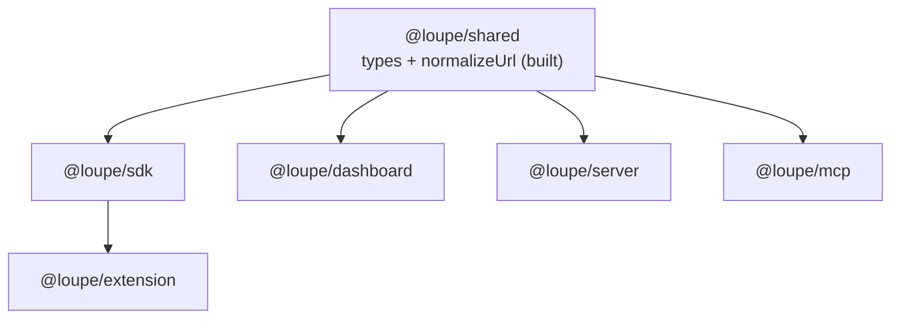
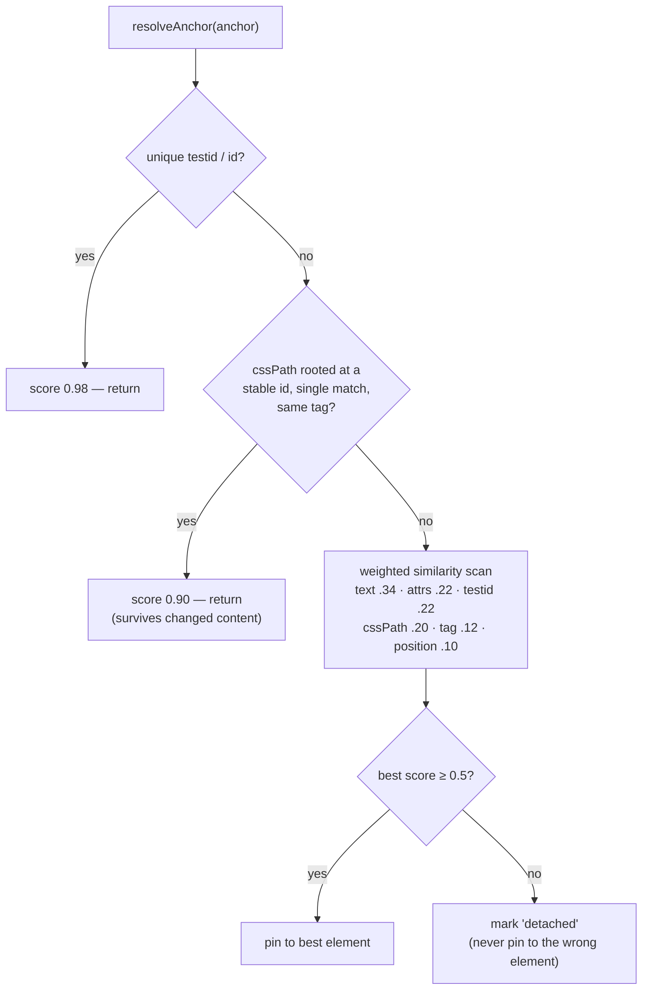
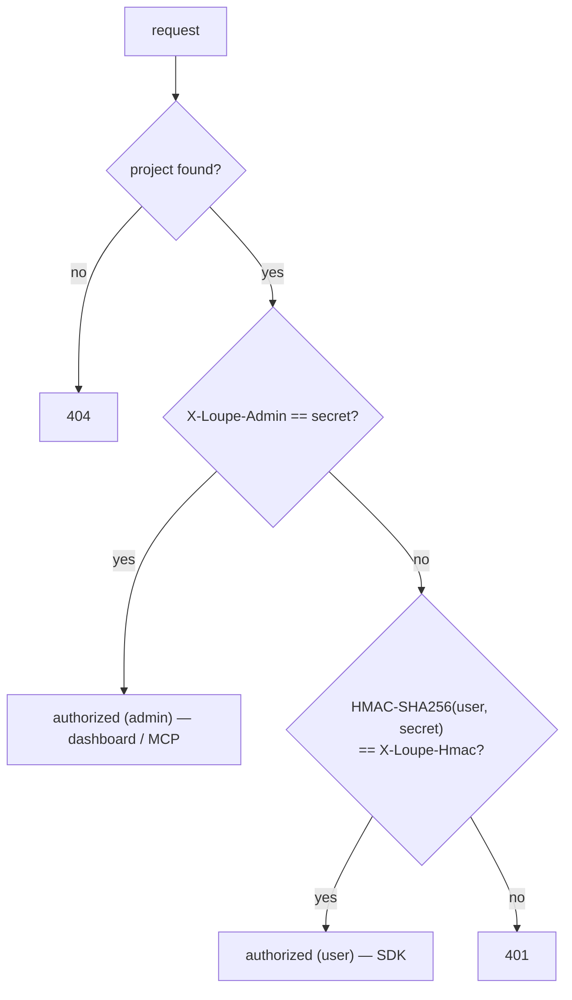
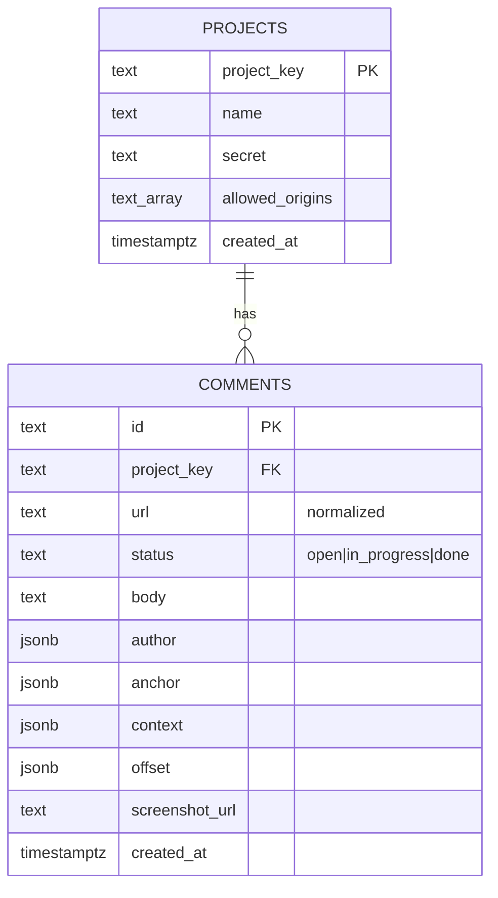
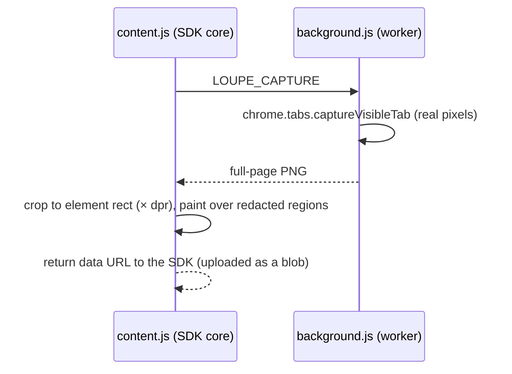

# Loupe — Architecture

Loupe turns a comment a PM leaves on a live product into an actionable, fully-contextual
task for a developer (or for Claude Code). This document explains how every piece fits
together and how the non-obvious logic works.

- [System overview](#system-overview)
- [The feedback loop](#the-feedback-loop-end-to-end)
- [Packages](#packages)
- [Re-anchoring: the crown jewel](#re-anchoring-the-crown-jewel)
- [Authentication](#authentication)
- [Data model](#data-model)
- [Screenshots & object storage](#screenshots--object-storage)
- [URL normalization](#url-normalization)
- [The browser extension](#the-browser-extension)
- [Seams (extension points)](#seams-extension-points)

## System overview

Everything runs from a single Node process locally — the API, the database (embedded
PGlite), object storage (disk), and static hosting of the dashboard, demo, and SDK bundle.

## The feedback loop (end to end)

## Packages

| Package | Runtime | Build | Responsibility |
|---|---|---|---|
| `@loupe/shared` | both | `tsc` → dist | Canonical types + `normalizeUrl` |
| `@loupe/sdk` | browser | tsup (ESM + IIFE) | Inspect, comment, capture, re-anchor |
| `@loupe/server` | Node (native TS) | none | API, Postgres, blobs, auth, static |
| `@loupe/dashboard` | browser | tsup (ESM) | Kanban triage board |
| `@loupe/mcp` | Node (native TS) | none | MCP server for Claude Code |
| `@loupe/extension` | browser | tsup (IIFE) | MV3 extension, pixel-perfect capture |

## Re-anchoring: the crown jewel

A pin must survive the developer rewriting the markup. Loupe stores a multi-signal
*fingerprint* and re-resolves it by scoring candidates on every load and DOM change.

`captureAnchor` records: stable id/testid, a CSS path anchored at the nearest stable
ancestor, an XPath, normalized text, identifying attributes, nth-of-type, and the
bounding rect + viewport (for positional scoring and the detached fallback). Live proof
is in `docs/before-redeploy.png` / `docs/after-redeploy.png`.

## Authentication

The host app's **server** computes the user HMAC and injects it into the page — the
browser never sees the secret. The dashboard and MCP server act as admin. Writes are
gated; a user may only post comments as themselves.

## Data model

## Screenshots & object storage

The SDK uploads the PNG to `POST /v1/blobs` and stores only the returned **URL** on the
comment, so lists and reads never carry base64. `blobs.ts` is a seam: local disk today,
S3/R2 with signed URLs in production. `[data-loupe-redact]` regions and Loupe's own UI
are excluded before the image ever leaves the browser.

## URL normalization

`normalizeUrl` (in `@loupe/shared`) strips `utm_*`, click ids (`gclid`, `fbclid`, …), and
Loupe's dev params (`api`, `key`), sorts the remaining query, and drops trailing slashes.
Applied server-side on write and on the list filter, so `/checkout?utm_source=x` and
`/checkout` share one comment thread instead of fragmenting.

## The browser extension

Identical SDK core; the only difference is the screenshot source.

The SDK exposes a `captureScreenshot` override in its config; the extension passes this
function, so nothing else in the widget changes.

## Seams (extension points)

Change implementations behind these; leave the contracts alone.

| Seam | File | Local | Production |
|---|---|---|---|
| Storage adapter | `sdk/src/store.ts` / `http-adapter.ts` | localStorage / HTTP | HTTP |
| Database | `server/db.ts` | PGlite | hosted Postgres (`DATABASE_URL`) |
| Object storage | `server/blobs.ts` | disk | S3 / R2 signed URLs |
| Screenshot capture | SDK `captureScreenshot` config | modern-screenshot | extension `captureVisibleTab` |
