# Loupe architecture

This page explains how Loupe 0.14.0 is built: which package does what, how a comment moves
from a click on a live page to a resolved ticket, and why the non-obvious parts work the way
they do. It is written for contributors and for teams integrating Loupe into their own stack.
For exact options, endpoints and defaults, follow the links to the reference pages.

A *comment* (also called a *thread* or *ticket*) is one piece of feedback pinned to a page.
A *project* is the scope comments belong to, identified by a project key such as
`pk_demo_acme`. On the Node server each project also has a *project secret*: a server-side
value stored in the project's `secret` column (packages/server/db.ts:51) that admin callers
send as `X-Loupe-Admin` and that signs user identities. Loupe Hub has its own, separate
*Hub project secret* (`psk_…`), described in [Loupe Hub](#loupe-hub).

The diagrams and text below use these terms:

- **MCP** (Model Context Protocol): the protocol AI clients such as Claude Code use to call
  tools that another program exposes.
- **stdio**: standard input and output; an MCP client starts the MCP server as a child process
  and talks to it over these streams.
- **HMAC** (hash-based message authentication code): a signature computed from a message and
  a shared secret, so the receiver can check who sent it.
- **CSRF token**: the per-session token Laravel checks to block cross-site request forgery.
- **Shadow DOM**: a browser feature that gives an element its own isolated DOM tree and styles.
- **PGlite**: Postgres compiled to run inside the Node process, with no database server.
- **Manifest V3 (MV3)**: the current Chrome extension format.
- **Eloquent**: Laravel's ORM, where each database table has a model class.
- **Gate**: a named Laravel authorization check, such as `loupe:use`, that returns allow or deny.
- **Proposal**: HTML, CSS and notes an agent writes back on a comment, shown as a before and
  after preview.

## Contents

- [System overview](#system-overview)
- [Components](#components)
- [Data flow](#data-flow)
- [Lifecycle and stages](#lifecycle-and-stages)
- [Re-anchoring](#re-anchoring)
- [Sync and presence](#sync-and-presence)
- [Loupe Hub](#loupe-hub)
- [Authentication](#authentication)
- [Screenshots and object storage](#screenshots-and-object-storage)
- [URL normalization](#url-normalization)
- [The browser extension](#the-browser-extension)
- [Seams](#seams)
- [Data model](#data-model)

## System overview

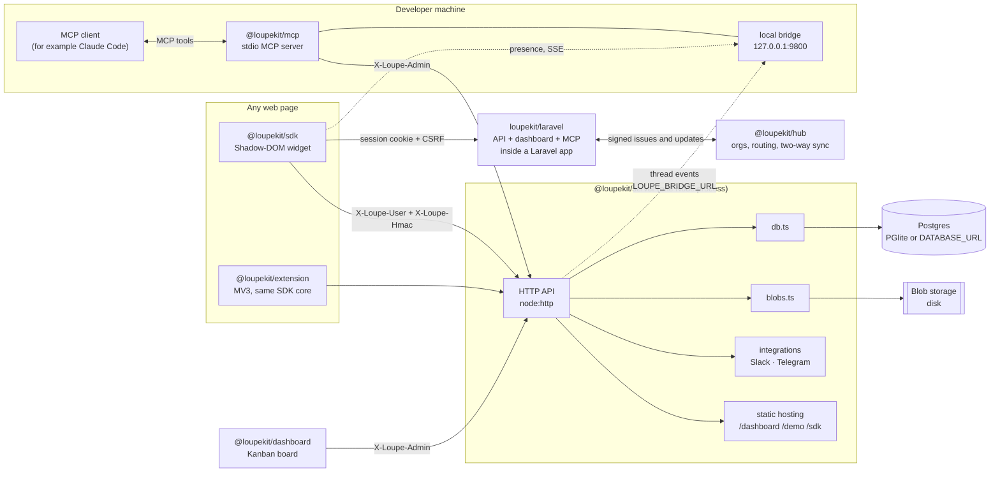
```mermaid
flowchart LR
  subgraph Page["Any web page"]
    SDK["@loupekit/sdk<br/>Shadow-DOM widget"]
    EXT["@loupekit/extension<br/>MV3, same SDK core"]
  end
  subgraph Node["@loupekit/server (one Node process)"]
    API["HTTP API<br/>node:http"]
    DBSEAM["db.ts"]
    BLOB["blobs.ts"]
    INT["integrations<br/>Slack · Telegram"]
    STATIC["static hosting<br/>/dashboard /demo /sdk"]
  end
  LARA["loupekit/laravel<br/>API + dashboard + MCP<br/>inside a Laravel app"]
  PG[("Postgres<br/>PGlite or DATABASE_URL")]
  OBJ[["Blob storage<br/>disk"]]
  DASH["@loupekit/dashboard<br/>Kanban board"]
  subgraph Agent["Developer machine"]
    MCP["@loupekit/mcp<br/>stdio MCP server"]
    BRIDGE["local bridge<br/>127.0.0.1:9800"]
    CLAUDE["MCP client<br/>(for example Claude Code)"]
  end
  HUB["@loupekit/hub<br/>orgs, routing, two-way sync"]

  SDK -->|"X-Loupe-User + X-Loupe-Hmac"| API
  SDK -->|"session cookie + CSRF"| LARA
  EXT --> API
  API --> DBSEAM --> PG
  API --> BLOB --> OBJ
  API --> INT
  API --> STATIC
  DASH -->|"X-Loupe-Admin"| API
  MCP -->|"X-Loupe-Admin"| API
  CLAUDE <-->|"MCP tools"| MCP
  MCP --- BRIDGE
  SDK -.->|"presence, SSE"| BRIDGE
  API -.->|"thread events<br/>LOUPE_BRIDGE_URL"| BRIDGE
  LARA <-->|"signed issues and updates"| HUB
```

Locally, one Node process runs the API, the database (embedded PGlite), blob storage on disk,
and static hosting for the dashboard, demo and SDK bundle. A Laravel app can replace that
process with the `loupekit/laravel` package. Loupe Hub is optional and connects apps to each
other.

## Components

| Component | Runtime | Build | Reference |
|---|---|---|---|
| `@loupekit/sdk` | browser | tsup: ESM and IIFE (global `Loupe`) | [SDK](reference/sdk.md) |
| `@loupekit/shared` | browser and Node | `tsc` to `dist` | [Shared types](reference/shared.md) |
| `@loupekit/server` | Node 24, native TypeScript | none | [Local server](reference/server.md) |
| `@loupekit/dashboard` | browser | tsup to `dist/app.js` | [Local server](reference/server.md) |
| `@loupekit/mcp` and its bridge | Node 24 | tsup to `dist` | [MCP server](reference/mcp.md) |
| `@loupekit/extension` | browser, Manifest V3 | tsup IIFE to `content.js` | [Browser extension](reference/extension.md) |
| `loupekit/laravel` | PHP 8.2+, Laravel 11 to 13 | Composer | [Laravel package](LARAVEL.md) |

The Node packages need Node 24, because the server and Hub run their TypeScript files directly
with `node index.ts` (README.md:46; CI uses `node-version: 24`, .github/workflows/ci.yml:15).
No `package.json` declares an `engines` field.
| Loupe Hub (`packages/hub`) | Node 24, native TypeScript | none; not published to npm, self-hosted from `packages/hub` | [Loupe Hub](reference/hub.md) |

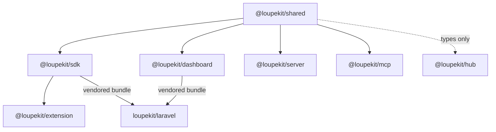
```mermaid
flowchart TD
  SHARED["@loupekit/shared"]
  SDK["@loupekit/sdk"]
  DASH["@loupekit/dashboard"]
  SRV["@loupekit/server"]
  MCP["@loupekit/mcp"]
  EXT["@loupekit/extension"]
  HUB["@loupekit/hub"]
  LARA["loupekit/laravel"]
  SHARED --> SDK
  SHARED --> DASH
  SHARED --> SRV
  SHARED --> MCP
  SHARED -.->|"types only"| HUB
  SDK --> EXT
  SDK -->|"vendored bundle"| LARA
  DASH -->|"vendored bundle"| LARA
```

**SDK.** The widget a reviewer sees. `init()` mounts a panel inside a shadow root on
`#loupe-root`, so the host page's CSS cannot reach it and captures can exclude it. It provides
the Inspect, Note, Region and Record tools, the composer, pins, the Home, Comments and Activity
tabs, threads with mentions and reactions, and the re-anchoring engine. It talks to a backend
through a `StorageAdapter`: `HttpAdapter` when `apiBase` is set, otherwise
`LocalStorageAdapter`, which keeps everything in the browser (packages/sdk/src/app.ts:374-378).
See the [SDK reference](reference/sdk.md).

**Shared.** The types and pure helpers every other package agrees on: the `Comment` shape,
the five stages, priorities, change types, `normalizeUrl`, and the logic behind lifecycle
labels, "needs you", mentions, reactions, presence, threads and timelines. Keeping this logic in
one package means the widget, the dashboard and the MCP server compute the same answer. See
[Shared types](reference/shared.md).

**Server.** A plain `node:http` API that stores comments, messages, reactions, notifications
and integration settings in Postgres, keeps blobs on disk, and serves the dashboard, demo and
SDK bundle as static files on port 8787. It also runs the Slack and Telegram integrations.
See the [Local server reference](reference/server.md).

**Dashboard.** A Kanban triage board in vanilla TypeScript. It shows one column per stage,
filters and saved views, expandable cards with proposals, an Integrations page and a Connect
Claude page. The server serves it at `/dashboard/`; the Laravel package serves its own copy at
`/{path}/dashboard`. It refreshes every 4 s (packages/dashboard/app.ts:991). See the
[Local server reference](reference/server.md).

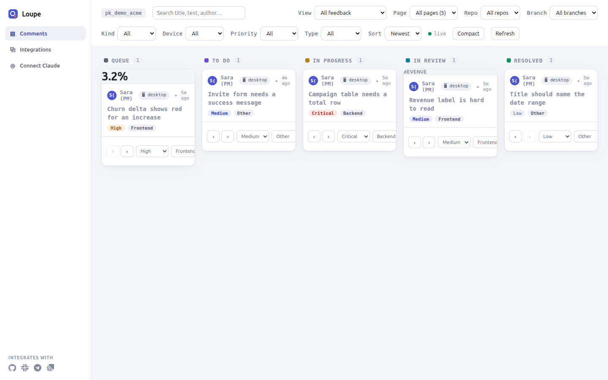

**MCP server and bridge.** `@loupekit/mcp` exposes 19 tools over stdio to an MCP client: read
comments, propose a change, move a thread to In Review, reply, open a pull request, and read the
agent's own activity. In the same process it runs a local HTTP *bridge* on `127.0.0.1` (port
9800 by default, `0` turns it off; packages/mcp/index.ts:74). The bridge carries presence,
server-sent events (SSE) for live threads, element selections, companion chat, Claude Code hook
events, and the `/monitor` activity page. *Companion chat* is a chat from the widget to an agent
that is already working: the bridge queues each message and adds it to the agent's next tool
result (packages/mcp/src/bridge/companion-queue.ts:1-15). See the
[MCP server reference](reference/mcp.md).

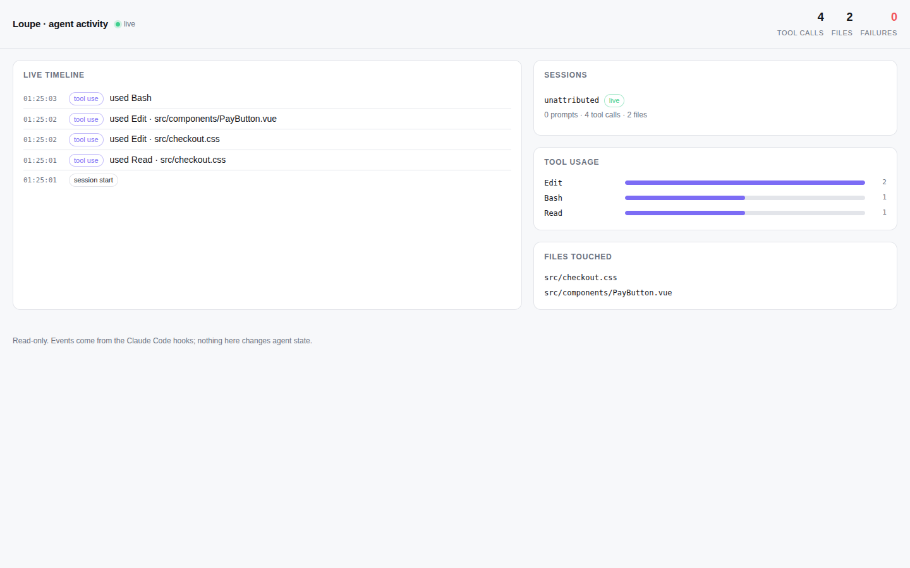

**Extension.** A Manifest V3 browser extension that injects the same SDK core into any tab on
request, without an install on the site. It swaps in pixel-accurate screenshots from
`chrome.tabs.captureVisibleTab` and adds right-click menus. See the
[Browser extension reference](reference/extension.md) and
[The browser extension](#the-browser-extension) below.

**Laravel package.** `loupekit/laravel` replaces the Node server, dashboard and MCP server
with a Laravel implementation that lives in the host app. Comments are Eloquent models in the
host database; the widget authenticates with the session cookie and CSRF token instead of an
HMAC. Access is decided by the `loupe.authorize.use` and `loupe.authorize.dashboard`
closures when set, else by closures registered with `Loupe::useWhen()` or `Loupe::adminWhen()`,
else by the `loupe:use` and `loupe:admin` gates. In the `local` environment, any signed-in user
is allowed unless `allow_in_local` is `false` (packages/laravel/src/Loupe.php:176-197,
packages/laravel/config/loupe.php:90-106). The package's own gates deny by default
(packages/laravel/src/LoupeServiceProvider.php:66-74). It ships the SDK and
dashboard as prebuilt bundles, an MCP server on `laravel/mcp`, Laravel events, and the Hub
sender and receiver. See the [Laravel package reference](LARAVEL.md).

**Hub.** An optional, self-hosted service for organizations. It checks that a ticket's author
belongs to the organization, routes the ticket to another project's app or to a webhook, and
relays status changes and replies between the two apps. See [Loupe Hub](#loupe-hub) and the
[Loupe Hub reference](reference/hub.md).

## Data flow

A comment travels through seven steps: capture, storage adapter, API, dashboard or MCP,
proposal or pull request, review, and resolve.

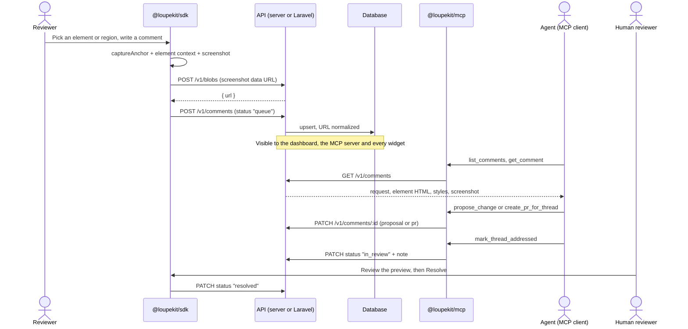
```mermaid
sequenceDiagram
  actor R as Reviewer
  participant SDK as @loupekit/sdk
  participant API as API (server or Laravel)
  participant DB as Database
  participant MCP as @loupekit/mcp
  actor AI as Agent (MCP client)
  actor H as Human reviewer

  R->>SDK: Pick an element or region, write a comment
  SDK->>SDK: captureAnchor + element context + screenshot
  SDK->>API: POST /v1/blobs (screenshot data URL)
  API-->>SDK: { url }
  SDK->>API: POST /v1/comments (status "queue")
  API->>DB: upsert, URL normalized
  Note over API,DB: Visible to the dashboard, the MCP server and every widget
  AI->>MCP: list_comments, get_comment
  MCP->>API: GET /v1/comments
  API-->>AI: request, element HTML, styles, screenshot
  AI->>MCP: propose_change or create_pr_for_thread
  MCP->>API: PATCH /v1/comments/:id (proposal or pr)
  AI->>MCP: mark_thread_addressed
  MCP->>API: PATCH status "in_review" + note
  H->>SDK: Review the preview, then Resolve
  SDK->>API: PATCH status "resolved"
```

1. **Capture.** The SDK records an anchor (see [Re-anchoring](#re-anchoring)), the element's
   outer HTML (up to 6,000 characters) and selected computed styles, and a screenshot. A region
   or recording is captured with `modern-screenshot` or `getDisplayMedia`, unless the host
   overrides capture.
2. **Storage adapter.** The widget calls the `StorageAdapter`. The HTTP adapter uploads
   screenshots and recordings to `POST /v1/blobs` first, then posts the comment with the
   returned URL. If the upload fails, it keeps the inline data URL. The offline adapter writes
   to `localStorage` instead.
3. **API.** The server or the Laravel package checks identity, normalizes the URL, and upserts
   the comment by its client-generated id.
4. **Dashboard and MCP.** People triage on the board. An agent reads the same comments through
   the MCP server, which sends the Node server's project secret as `X-Loupe-Admin`.
5. **Proposal or pull request.** The agent writes back either a `proposal` (HTML, CSS and notes
   rendered as a before and after preview) or a `pr` record after `create_pr_for_thread` commits
   to a branch.
6. **Review.** The agent moves the thread to In Review. The widget and the board flag it as
   needing a human.
7. **Resolve.** A person resolves the thread in the widget or on the board.

## Lifecycle and stages

Every comment sits in one of five stages (packages/shared/src/index.ts:27-42):

| Stage | Label | Meaning |
|---|---|---|
| `queue` | Queue | New, not triaged yet. Every new comment starts here. |
| `todo` | To Do | Triaged and accepted. |
| `in_progress` | In Progress | Someone or something is working on it. |
| `in_review` | In Review | A change is ready and waits for a person. |
| `resolved` | Resolved | A person accepted the change. |

Older rows used `open` and `done`. `normalizeStatus` maps `open` to `queue` and `done` to
`resolved`, and any unknown value to `queue` (packages/shared/src/index.ts:49-66). The server
rewrites stored legacy values on startup (packages/server/db.ts:232-233).

**An agent may move a comment to In Review; only a human resolves it**
(packages/shared/src/index.ts:21-26). Five stages exist so that "not triaged", "waiting on me"
and "waiting on a preview" can be told apart. The MCP tool built for the handoff,
`mark_thread_addressed`, has no status argument and always sets In Review
(packages/mcp/index.ts:584-591). The `update_status` tool states the same rule in its
description (packages/mcp/index.ts:348-352), but in 0.14.0 its code does not refuse `resolved`:
the allow-list in packages/mcp/src/tools/handoff.ts:111 is not applied to it.

### Lifecycle labels

On top of the stage, the widget shows a lifecycle chip derived by `lifecycle()`
(packages/shared/src/lifecycle.ts:31-85). The checks are applied in this order:

1. Resolved with a proposal or a PR: **Reviewed**. Resolved without either: no chip.
2. Any PR: **In PR**, with a checks meter such as `3/4` when the PR reports checks.
3. In Review: **Review preview**.
4. A proposal: **Sent to agent**.
5. Otherwise: no chip.

Any PR, open or merged, outranks the board column because it says more than the column does.
`lifecycle()` does not read the PR's `state` (packages/shared/src/lifecycle.ts:80-81).

### Needs you

`needsYou()` decides whether a person has to act (packages/shared/src/needs-you.ts:56-73).
The checks are applied in this order:

1. A resolved thread never needs anyone.
2. A failed agent run: "The agent's run failed".
3. The agent's last message ends in a question mark: "The agent asked you something".
4. The thread is In Review: "Waiting on your review".

A failure outranks a question, and both outrank a routine review. A question from a person is
addressed to the agent, so it does not count. The Home tab's **Needs you** tile sees only
each thread's stage, so it counts threads In Review (packages/sdk/src/app.ts:1549-1552). The
agent-question and failed-run reasons appear as a line on the item in the Comments list, once
that thread's messages are loaded (packages/sdk/src/app.ts:3510-3523).

## Re-anchoring

A pin has to survive a redeploy that changes the markup. Loupe stores a multi-signal
fingerprint, the *anchor*, and resolves it again on every load and DOM change. The canonical
implementation is packages/sdk/src/fingerprint.ts.

The anchor holds these fields (packages/sdk/src/fingerprint.ts:14-32):

| Field | Content |
|---|---|
| `tag` | Lowercase tag name. |
| `cssPath` | A CSS path rooted at the nearest stable id or test id. |
| `xpath` | An XPath to the element. |
| `testid` | `data-testid`, `data-test`, or a stable `id`. |
| `text` | Normalized text, up to 120 characters. |
| `attrs` | `role`, `aria-label`, `name`, `type`, `alt`, `href`, `placeholder`, `title`, each up to 200 characters. |
| `nthOfType` | Position among siblings of the same tag. |
| `rect`, `viewport` | Document position and size, and the viewport at capture time. |

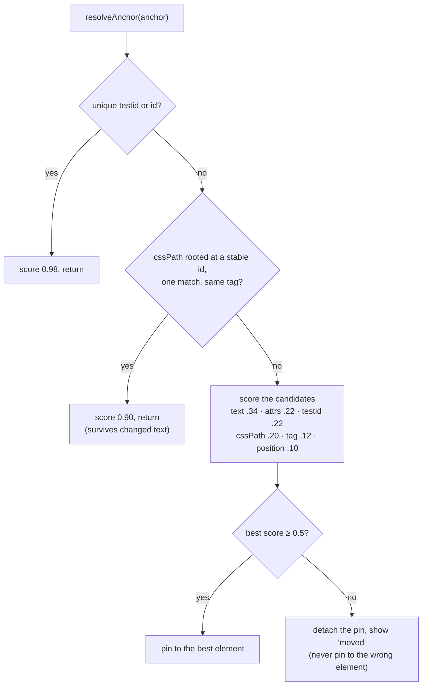
```mermaid
flowchart TD
  A["resolveAnchor(anchor)"] --> B{"unique testid or id?"}
  B -- yes --> B1["score 0.98, return"]
  B -- no --> C{"cssPath rooted at a stable id,<br/>one match, same tag?"}
  C -- yes --> C1["score 0.90, return<br/>(survives changed text)"]
  C -- no --> D["score the candidates<br/>text .34 · attrs .22 · testid .22<br/>cssPath .20 · tag .12 · position .10"]
  D --> E{"best score ≥ 0.5?"}
  E -- yes --> E1["pin to the best element"]
  E -- no --> E2["detach the pin, show 'moved'<br/>(never pin to the wrong element)"]
```

- **Resolve order.** A unique test id or id wins at 0.98. A CSS path rooted at a stable id,
  with one match and the same tag, wins at 0.9. Otherwise the elements the CSS path and the
  XPath select and every element with the same tag are always candidates; elements with
  matching text are added until there are more than 4,000 candidates. Each is scored by
  weighted similarity (packages/sdk/src/fingerprint.ts:42-84).
- **Weights.** tag 0.12, text 0.34, attrs 0.22, testid 0.22, cssPath 0.2, position 0.1
  (packages/sdk/src/fingerprint.ts:10).
- **Threshold.** Below a score of 0.5 the pin detaches and the list shows a "moved" badge
  (packages/sdk/src/fingerprint.ts:8, :84). A detached pin is safer than a confident pin on
  the wrong element.
- **Unstable ids are rejected.** An id longer than 40 characters, starting with `ember`,
  `react`, `radix`, `headlessui` or `:r`, or containing `:` is treated as framework-generated
  and ignored (packages/sdk/src/fingerprint.ts:175-181).
- **Hidden elements are skipped** when the browser supports `checkVisibility`
  (packages/sdk/src/fingerprint.ts:198-204).

For the best results, give important elements a `data-testid`. The demo page, at
`http://localhost:8787/demo/` once the local server runs (packages/server/index.ts:28, :33), has a
**Simulate redeploy** button that shows a pin surviving a markup change. To start the server, see
[Pin your first comment](tutorials/first-comment-local.md) or
[Run the local server](how-to/run-local-server.md).

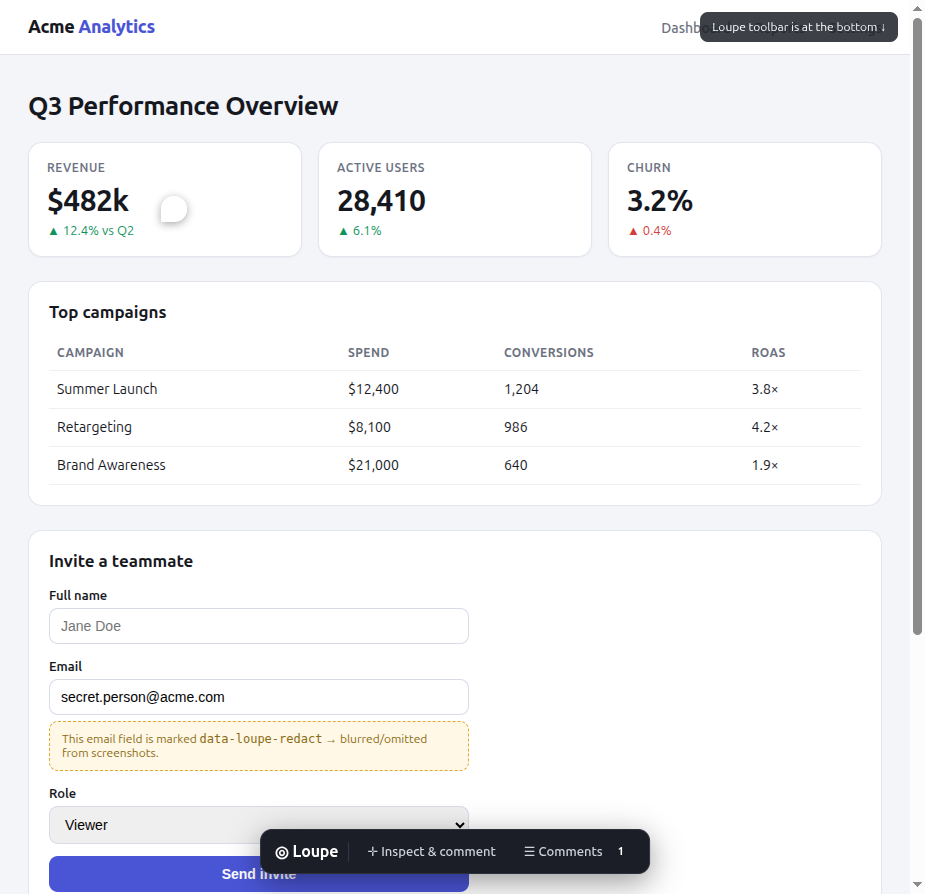

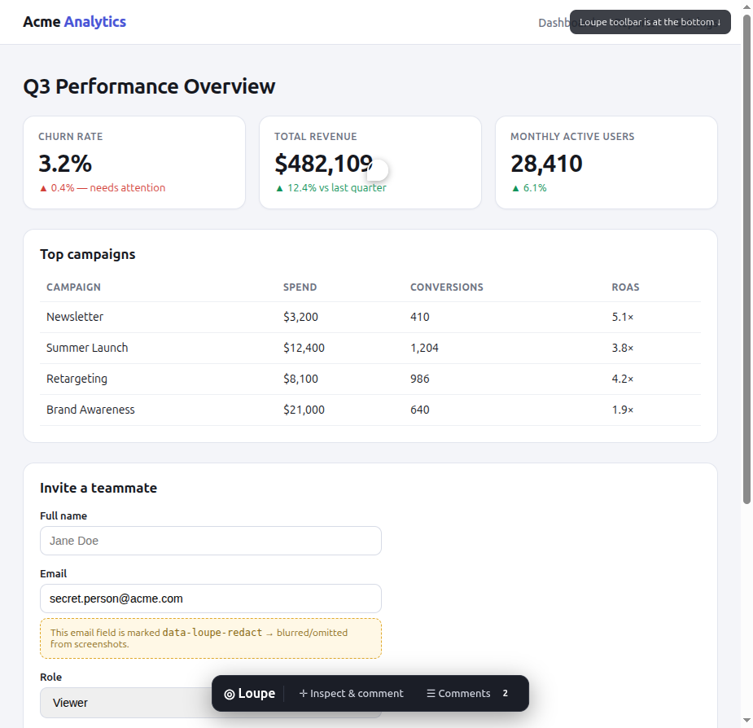

### Region anchoring

Since 0.11.1, a region comment anchors to the **smallest ancestor that covers at least 60% of
the region**, starting from the element under the region's centre and walking up
(packages/sdk/src/app.ts:2304-2305). `body` and `html` never
qualify; a region nothing smaller contains is page-level (packages/sdk/src/app.ts:5009-5027,
`REGION_COVER_MIN = 0.6`). The region also stores its rectangle as fractions of that anchor
(`RegionRect.rel`), so it can be placed again after a responsive reflow. The absolute rectangle
is used only when the anchor is gone.

## Sync and presence

Loupe keeps open panels current in two ways. A poll works with any backend. A push channel
works when the widget is given a `bridge`.

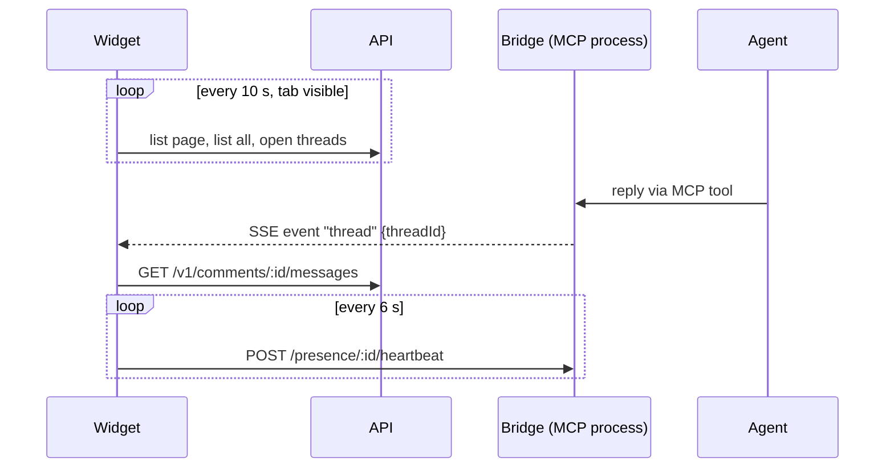
```mermaid
sequenceDiagram
  participant W as Widget
  participant API as API
  participant B as Bridge (MCP process)
  participant AI as Agent
  loop every 10 s, tab visible
    W->>API: list page, list all, open threads
  end
  AI->>B: reply via MCP tool
  B-->>W: SSE event "thread" {threadId}
  W->>API: GET /v1/comments/:id/messages
  loop every 6 s
    W->>B: POST /presence/:id/heartbeat
  end
```

- **Poll.** Every 10 s (`SYNC_POLL_MS`, packages/sdk/src/app.ts:149) the widget re-reads the
  current page's comments, the all-pages list when it is loaded, and every open thread, then
  reloads notifications. It pauses while the tab is hidden and catches up on `visibilitychange`.
  It skips a tick while an input inside the widget has focus, so a re-render cannot steal the
  caret. Replies still sending, or failed with Retry, are kept (packages/sdk/src/app.ts:466-520).
  This is how a status changed in another app, or a reply relayed through Hub, appears without a
  reload.
- **SSE through the bridge.** With `bridge` set, the widget opens an `EventSource` on
  `{bridge}/thread-updates` and refetches a thread when an event named `thread` arrives for one
  it has loaded (packages/sdk/src/app.ts:4443-4472). The server forwards thread events to the
  bridge when `LOUPE_BRIDGE_URL` is set (packages/server/index.ts:94-100).
- **Presence.** With `bridge` set, the widget joins with `POST {bridge}/presence`, sends a
  heartbeat every 6 s (`PEER_HEARTBEAT_MS`), and re-joins when the heartbeat answers 404. The
  bridge forgets a peer after 20 s without one (`PEER_TTL_MS`, packages/shared/src/presence.ts:26-28).
  The panel header shows up to four peer avatars, then "+N".
- **SPA navigation.** The widget wraps `pushState` and `replaceState` and listens to `popstate`,
  so a client-side route change reloads the right page's comments
  (packages/sdk/src/app.ts:431-448).

Without a bridge, the peer list is hidden and presence, live threads and companion chat are off;
the 10 s poll still runs.

## Loupe Hub

Hub (`packages/hub`, private, not published to npm) connects the Loupe installs of one
organization. The full explanation is in [How Loupe Hub works](explanation/hub.md); this
section summarizes the parts that shape the rest of the system.

- **Organizations and members.** People sign in to the Hub dashboard with Google. An owner
  manages members, an allowed email domain and projects. Each project gets a project id
  (`prj_…`), a Hub project secret (`psk_…`) and a webhook signing secret (`whs_…`).
- **Ingest.** An app sends `POST /v1/issues` signed with
  `hex(HMAC-SHA256(timestamp + "." + rawBody, Hub project secret))`, within ±300 s. Hub accepts the
  ticket only when the author's email is a member or on the allowed domain; otherwise it answers
  `403 user not in organization`.
- **Routing.** Hub sends the ticket to the destination project's *Inbound URL* (the address,
  set per project in the Hub dashboard, where that project's app receives tickets), signed with
  that project's own Hub project secret, when one is set. Otherwise it sends it to the source project's webhook.
  Otherwise it answers `delivery: "none"` (packages/hub/index.ts:229-241). Delivery makes up to
  3 attempts with 1 s and 4 s backoff and a 10 s timeout per attempt.

### Two-way sync (0.13)

Since 0.13.0, a ticket delivered from one project to another stays linked. Both apps send
updates to `POST /v1/issues/{id}/updates`, and Hub relays each one to the other side
(packages/hub/index.ts:263-314). The `{id}` is the comment id both apps share: the receiver
stores the ticket under the sender's comment id
(packages/laravel/src/Http/Controllers/InboundTicketController.php:99), and both sides send
updates with that id (packages/laravel/src/Support/Relay.php:71, :94). The receiver's own
reference, such as `TCK-42`, travels only as the optional `reference` field of a status update
(packages/laravel/src/Support/Relay.php:47-58).
In the diagram, `c_8f2a` stands for that comment id.

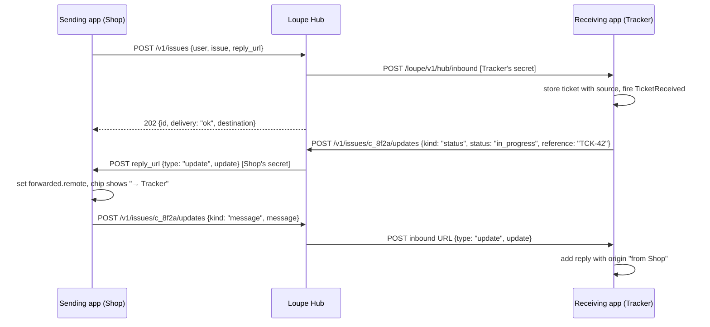
```mermaid
sequenceDiagram
  participant S as Sending app (Shop)
  participant Hub as Loupe Hub
  participant T as Receiving app (Tracker)
  S->>Hub: POST /v1/issues {user, issue, reply_url}
  Hub->>T: POST /loupe/v1/hub/inbound  [Tracker's secret]
  T->>T: store ticket with source, fire TicketReceived
  Hub-->>S: 202 {id, delivery: "ok", destination}
  T->>Hub: POST /v1/issues/c_8f2a/updates {kind: "status", status: "in_progress", reference: "TCK-42"}
  Hub->>S: POST reply_url {type: "update", update}  [Shop's secret]
  S->>S: set forwarded.remote, chip shows "→ Tracker"
  S->>Hub: POST /v1/issues/c_8f2a/updates {kind: "message", message}
  Hub->>T: POST inbound URL {type: "update", update}
  T->>T: add reply with origin "from Shop"
```

- **Status is owned by the receiving project.** A status change there goes back to the sender;
  a status change on the sending side stays local (packages/laravel/src/Support/Relay.php:61-72).
- **Replies flow both ways.** A reply on either side is relayed unless it arrived through Hub
  itself, so nothing echoes back (packages/laravel/src/Support/Relay.php:75-96).
- **Return address.** The sender includes a `reply_url` ending in `/v1/hub/inbound`. Hub keeps
  it only for a project-to-project delivery, which is why webhook deliveries cannot receive
  updates. From the next release, Hub also checks the `reply_url` path, credentials and origin
  (packages/hub/index.ts:243, :301).
- **In the widget,** a forwarded ticket carries a chip such as "→ Tracker" with the receiver's
  status and reference, and a received ticket shows "from Shop" and gets no pin.

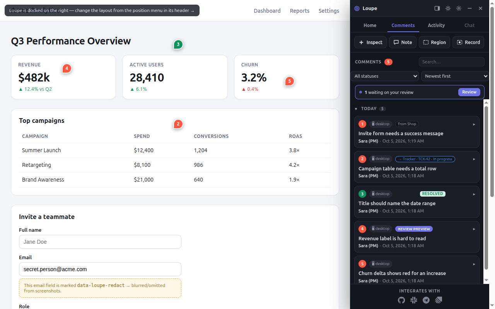

Hub's refusal to deliver to private, loopback and link-local addresses, and the `reply_url`
origin check, are listed under Unreleased in the [changelog](../CHANGELOG.md), not in 0.14.0.

## Authentication

The Node server knows two kinds of caller (packages/server/auth.ts:30-45):

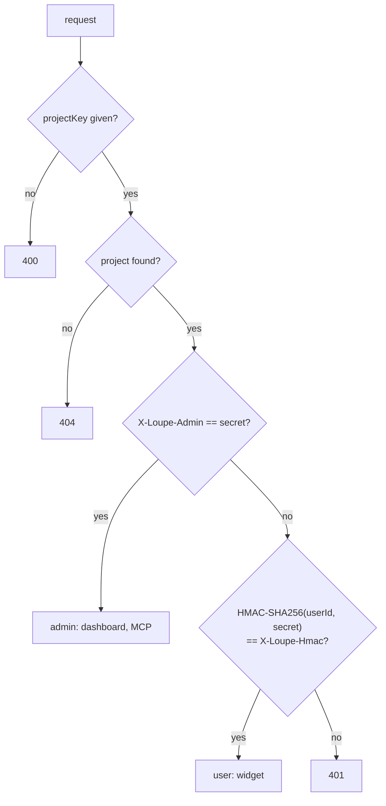
```mermaid
flowchart TD
  R["request"] --> K{"projectKey given?"}
  K -- no --> E400["400"]
  K -- yes --> P{"project found?"}
  P -- no --> E404["404"]
  P -- yes --> ADM{"X-Loupe-Admin == secret?"}
  ADM -- yes --> OKA["admin: dashboard, MCP"]
  ADM -- no --> USR{"HMAC-SHA256(userId, secret)<br/>== X-Loupe-Hmac?"}
  USR -- yes --> OKU["user: widget"]
  USR -- no --> E401["401"]
```

The host app's server computes the user HMAC and puts it in the page, so the browser never sees
the secret. A user may post comments only as themselves.

The Laravel package does not use these headers. The widget sends the session cookie and the
CSRF token (`credentials: 'same-origin'`), the `loupe.auth` middleware resolves the user across
the configured guards, and access is decided by the `loupe.authorize` closures, else the
`loupe:use` and `loupe:admin` gates. In `local`, any signed-in user is allowed unless
`allow_in_local` is `false` (packages/laravel/src/Loupe.php:176-197). See
[Authentication and privacy](explanation/auth-and-privacy.md).

## Screenshots and object storage

The SDK uploads each screenshot or recording to `POST /v1/blobs` and stores the returned URL
on the comment, so lists normally carry URLs. If an upload fails, the data URL is kept inline
(packages/sdk/src/http-adapter.ts:47-73). The server keeps blobs on disk under
`LOUPE_BLOB_DIR`; the Laravel package stores them on a filesystem disk. Elements marked
`data-loupe-redact` and Loupe's own UI are left out of element captures; in a region capture,
redacted rectangles are painted solid before the image leaves the browser
(packages/sdk/src/capture.ts:53-54, :106).

## URL normalization

`normalizeUrl` in `@loupekit/shared` keeps only the path and query. It drops `utm_*`, click ids
such as `gclid` and `fbclid`, Loupe's own `api` and `key` parameters, and a few other tracking
keys. It sorts what remains and removes one trailing slash, except on the root path
(packages/shared/src/index.ts:390-418). The server and the Laravel package apply it on write and
in the list filter, so `/checkout?utm_source=x` and `/checkout` share one set of comments.

## The browser extension

The extension runs the same SDK core. It differs in where screenshots come from and in how
Loupe gets onto a page.

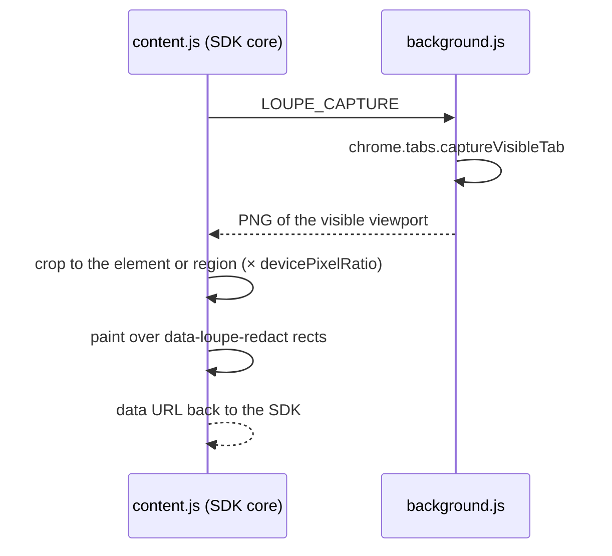
```mermaid
sequenceDiagram
  participant C as content.js (SDK core)
  participant BG as background.js
  C->>BG: LOUPE_CAPTURE
  BG->>BG: chrome.tabs.captureVisibleTab
  BG-->>C: PNG of the visible viewport
  C->>C: crop to the element or region (× devicePixelRatio)
  C->>C: paint over data-loupe-redact rects
  C-->>C: data URL back to the SDK
```

- The content script passes `captureScreenshot` and `captureRegion` overrides to `init()`;
  recording uses the SDK default.
- Nothing is injected automatically. Loupe enters a page when the user clicks "Start Loupe on
  this tab" in the popup or picks one of the right-click menu entries.
- A per-site show/hide toggle is remembered in `chrome.storage.local`.

See the [Browser extension reference](reference/extension.md).

## Seams

A *seam* is a place where you can swap an implementation without changing the contracts around
it. This table is a summary; the complete options are in the [SDK reference](reference/sdk.md),
the [Local server reference](reference/server.md) and the [Laravel package reference](LARAVEL.md).

| Seam | Where | Default | What you can plug in |
|---|---|---|---|
| `StorageAdapter` | `LoupeConfig` via `apiBase`; packages/sdk/src/types.ts:202 | `HttpAdapter` with `apiBase`, `LocalStorageAdapter` without | Any backend that implements `list`, `listAll`, `save`, `update`, `remove`, `upload`, `listMessages`, `addMessage`, `listPeople`, `listNotifications`, `markNotificationsRead`, `listReactions`, `toggleReaction`, and optionally `getOrg` and `listActivity`. |
| Request headers and credentials | `headers`, `credentials` options (types.ts:177, :199) | none | Session auth, as the Laravel package does. |
| Capture overrides | `captureScreenshot`, `captureRegion`, `captureRecording` (types.ts:155-171) | `modern-screenshot`, `getDisplayMedia` | Pixel-accurate capture, as the extension does. |
| Tabs | `tabs` option (types.ts:138); `connectTab()` | Home, Comments, Activity, Chat | Your own panel pages. |
| Generate | `generate` and `onRequestAccess` options (types.ts:144-149) | "Request access to generate" | Your own model call returning `{ html, css?, notes? }`. |
| Integration providers | `IntegrationProvider` (packages/server/integrations.ts:96-111); register in providers/index.ts | Slack, Telegram | Another chat or tracker: implement `test`, `render` and `send`, then `register`. |
| Notifications | server: lifecycle events `thread_created`, `agent_working`, `pr_created`, `thread_resolved`, `agent_replied` (integrations.ts:54-60); in-app inbox through the `StorageAdapter` | in-app inbox, mapped integrations | Route a repo to a channel. `*` catches every repo without its own route; a thread with no repo goes to every route (integrations.ts:383-399). |
| Database | packages/server/db.ts | embedded PGlite | Postgres through `DATABASE_URL`. |
| Laravel model events | `CommentCreated`, `CommentDeleted`, `CommentStatusChanged`, `MessageAdded` (packages/laravel/src/LoupeServiceProvider.php:95-120) | none | Your own listeners. They fire on any write to the model, whoever makes it. |
| Laravel Hub events | `HubUpdateReceived` (packages/laravel/src/Support/Relay.php:167), `TicketReceived` (packages/laravel/src/Http/Controllers/InboundTicketController.php:105) | none | Your own listeners. They fire only when Hub delivers an update or a ticket. |
| Laravel resolvers | `user_resolver`, `people_resolver` (packages/laravel/config/loupe.php:132, :144) | the auth user; allowed emails plus participants | Your own identity and mention list. Use a class name, not a closure, so `config:cache` works. |

## Data model

This is a summary of the Node server's schema, created and migrated on startup by
packages/server/db.ts:45-234. The Laravel package uses its own tables (`loupe_comments`,
`loupe_messages`, `loupe_reactions`, `loupe_notifications`, `loupe_activity`), documented in the
[Laravel package reference](LARAVEL.md).

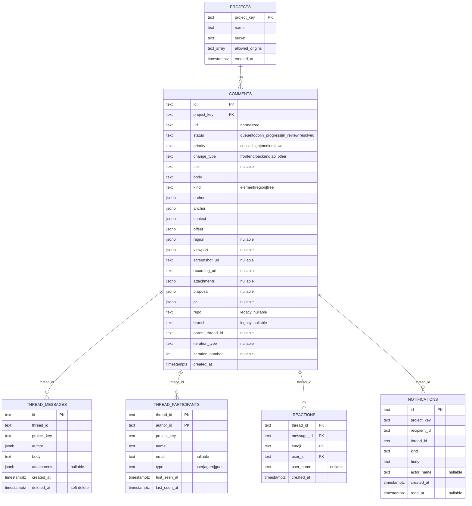
```mermaid
erDiagram
  PROJECTS ||--o{ COMMENTS : has
  COMMENTS ||--o{ THREAD_MESSAGES : "thread_id"
  COMMENTS ||--o{ THREAD_PARTICIPANTS : "thread_id"
  COMMENTS ||--o{ REACTIONS : "thread_id"
  COMMENTS ||--o{ NOTIFICATIONS : "thread_id"
  PROJECTS {
    text project_key PK
    text name
    text secret
    text_array allowed_origins
    timestamptz created_at
  }
  COMMENTS {
    text id PK
    text project_key FK
    text url "normalized"
    text status "queue|todo|in_progress|in_review|resolved"
    text priority "critical|high|medium|low"
    text change_type "frontend|backend|api|other"
    text title "nullable"
    text body
    text kind "element|region|free"
    jsonb author
    jsonb anchor
    jsonb context
    jsonb offset
    jsonb region "nullable"
    jsonb viewport "nullable"
    text screenshot_url "nullable"
    text recording_url "nullable"
    jsonb attachments "nullable"
    jsonb proposal "nullable"
    jsonb pr "nullable"
    text repo "legacy, nullable"
    text branch "legacy, nullable"
    text parent_thread_id "nullable"
    text iteration_type "nullable"
    int iteration_number "nullable"
    timestamptz created_at
  }
  THREAD_MESSAGES {
    text id PK
    text thread_id
    text project_key
    jsonb author
    text body
    jsonb attachments "nullable"
    timestamptz created_at
    timestamptz deleted_at "soft delete"
  }
  THREAD_PARTICIPANTS {
    text thread_id PK
    text author_id PK
    text project_key
    text name
    text email "nullable"
    text type "user|agent|guest"
    timestamptz first_seen_at
    timestamptz last_seen_at
  }
  REACTIONS {
    text thread_id PK
    text message_id PK
    text emoji PK
    text user_id PK
    text user_name "nullable"
    timestamptz created_at
  }
  NOTIFICATIONS {
    text id PK
    text project_key
    text recipient_id
    text thread_id
    text kind
    text body
    text actor_name "nullable"
    timestamptz created_at
    timestamptz read_at "nullable"
  }
```

Design notes:

- **The comment is message #1.** `thread_messages` holds replies only; the comment's own body is
  presented as the first message, so there is nothing to backfill (packages/server/db.ts:132-134).
- **The reactions primary key is the toggle.** One row per message, emoji and person means
  reacting twice cannot create two rows (packages/server/db.ts:216-218).
- **`repo` and `branch` are legacy.** The widget stopped writing them in 0.12.0; the API, the
  MCP server and the dashboard filters still accept them.

The server also keeps these tables, not drawn above:

| Table | Purpose |
|---|---|
| `working_branches` | The branch that collects a repo's fixes, and its PR and preview (db.ts:99-116). |
| `repo_urls` | URL patterns per repo and environment, for preview detection (db.ts:118-127). |
| `integrations` | One row per project and provider. The token is stored only in `sealed`, encrypted with AES-256-GCM; `credentials` stays `{}` (db.ts:162-175). |
| `integration_mappings` | Repo to channel routes; `*` catches every repo without its own route (db.ts:177-186). |
| `integration_deliveries` | Every delivery attempt, success or failure (db.ts:188-202). |

## Related pages

- [How Loupe Hub works](explanation/hub.md)
- [Authentication and privacy](explanation/auth-and-privacy.md)
- [SDK reference](reference/sdk.md)
- [Laravel package reference](LARAVEL.md)
- [Testing](TESTING.md)
