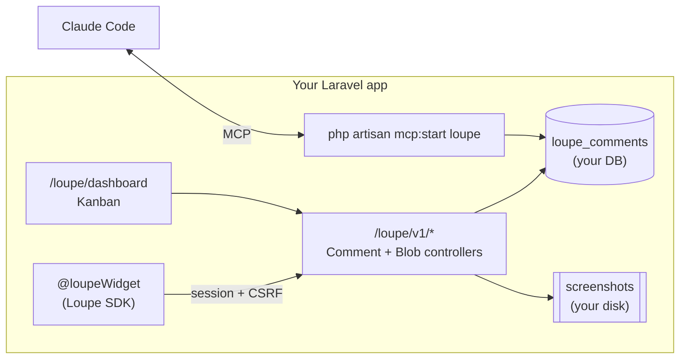

# Loupe for Laravel — full guide

<div align="center">
  <a href="https://mohamed-ashraf-elsaed.github.io/loupe/">
    
  </a>
  <p>
    
    
    
    
  </p>
</div>

`loupekit/laravel` brings the Loupe visual-feedback loop to any Laravel application: the
in-app commenting widget, comments stored in your own database, per-user access control, a
Laravel-served triage dashboard, and an MCP server that hands the backlog to Claude Code.

<div align="center">
  
</div>

- [What you get](#what-you-get)
- [Requirements & compatibility](#requirements--compatibility)
- [Installation](#installation)
- [Authorization (who can use it)](#authorization-who-can-use-it)
- [The widget](#the-widget)
- [The dashboard](#the-dashboard)
- [Data model](#data-model)
- [Screenshots & storage](#screenshots--storage)
- [Authentication model](#authentication-model)
- [MCP: hand the backlog to Claude](#mcp-hand-the-backlog-to-claude)
- [Configuration reference](#configuration-reference)
- [Sanctum / SPA setups](#sanctum--spa-setups)
- [Testing & coverage](#testing--coverage)
- [How it relates to the rest of Loupe](#how-it-relates-to-the-rest-of-loupe)
- [Troubleshooting](#troubleshooting)

## What you get

The same loop as standalone Loupe (see [ARCHITECTURE.md](./ARCHITECTURE.md)), but the
backend is **your Laravel app**:



## Requirements & compatibility

| | Supported |
|---|---|
| PHP | **8.4** and higher |
| Laravel | **11, 12, 13** |
| Database | anything Eloquent supports (MySQL, Postgres, SQLite, SQL Server) |
| MCP (optional) | `laravel/mcp` **^0.8** — Laravel 11, 12 & 13 |

Every PHP × Laravel combination is exercised in CI (`.github/workflows/laravel.yml`) —
**including the MCP layer on all three Laravel versions** — under a **100% line-coverage
gate**.

> The MCP layer is optional and guarded by `class_exists`, so the core package still works
> even if `laravel/mcp` isn't installed (its tests skip cleanly in that case).

> Laravel 9/10 are intentionally not supported: this package targets PHP 8.4, which those
> releases do not support.

## Installation

```bash
composer require loupekit/laravel
php artisan loupe:install
php artisan migrate
```

`loupe:install`:

1. publishes `config/loupe.php`,
2. publishes the migration,
3. publishes the browser assets to `public/vendor/loupe`,
4. publishes `app/Providers/LoupeServiceProvider.php` and registers it in
   `bootstrap/providers.php`.

Add the widget to your Blade layout, just before the closing `</body>`:

```blade
@loupeWidget
</body>
```

That single directive injects the SDK `<script>` and a `Loupe.init({...})` call — but only
for users who pass the `loupe:use` check (see below).

### Publishing individual pieces

```bash
php artisan vendor:publish --tag=loupe-config      # config/loupe.php
php artisan vendor:publish --tag=loupe-migrations  # the migration
php artisan vendor:publish --tag=loupe-assets      # public/vendor/loupe/*
php artisan vendor:publish --tag=loupe-provider    # app/Providers/LoupeServiceProvider.php
php artisan vendor:publish --tag=loupe-views       # resources/views/vendor/loupe/*
```

## Authorization (who can use it)

Two distinct abilities:

- **`loupe:use`** — who sees the in-app widget and can create/update comments.
- **`loupe:admin`** — who can open the triage dashboard.

Out of the box both are **allowed only in the `local` environment** so a fresh install is
safe. Grant real access in the published provider:

```php
// app/Providers/LoupeServiceProvider.php
Gate::define('loupe:use', fn ($user) => $user->hasRole('staff'));
Gate::define('loupe:admin', fn ($user) => $user->hasRole('admin'));
```

You can **also** (or instead) use config closures, which take precedence over the Gates:

```php
// config/loupe.php
'authorize' => [
    'use' => fn ($user) => $user->can_give_feedback,
    'dashboard' => fn ($user) => $user->is_admin,
],
```

> Config closures cannot be used with `config:cache`. If you cache config in production,
> use the Gate abilities in the provider instead.

Either way, denied users never receive the widget markup, and the API/dashboard return
`403`.

## The widget

`@loupeWidget` renders (for authorized users only):

```html
<script src="/vendor/loupe/sdk/loupe.js"></script>
<script>
  Loupe.init({
    projectKey: "app",
    user: { id: "42", name: "Sara", email: "sara@example.com" },
    apiBase: "https://your-app.test/loupe",
    headers: { "X-CSRF-TOKEN": "…" },
    credentials: "same-origin",
  });
</script>
```

Customize how the user is described to the SDK with a resolver:

```php
// config/loupe.php
'user_resolver' => fn ($user) => [
    'id' => (string) $user->id,
    'name' => $user->full_name,
    'email' => $user->email,
],
```

## The dashboard

The full Kanban triage board (open / in progress / done), page filter, screenshot
thumbnails, status moves, delete, and **Copy for Claude** — served at
`/loupe/dashboard`, behind your `web`+`auth` middleware and the `loupe:admin` ability.

The board is the exact `@loupekit/dashboard` bundle, vendored into the package and
configured server-side via an injected `window.__LOUPE__` (API base, project key, CSRF
token) — no secret ever reaches the browser.

<div align="center">
  
</div>

## Data model

Migration `create_loupe_comments_table` → `loupe_comments`:

| Column | Type | Notes |
|---|---|---|
| `id` | string (PK) | client-generated UUID |
| `project_key` | string, indexed | scopes to this app |
| `url` | text | normalized (utm/click ids stripped) |
| `status` | string, indexed | `open` \| `in_progress` \| `done` |
| `body` | text | the comment |
| `kind` | string | `element` \| `region` \| `free` (page-level note) |
| `author` | json | `{ id, name, email? }` |
| `author_id` | string, indexed | denormalized for cheap checks |
| `anchor` | json | element fingerprint (for re-anchoring) |
| `context` | json | element HTML + computed styles |
| `offset` | json | pin position — within the element, or a document fraction for `free` notes |
| `region` | json, nullable | rectangle for region comments |
| `screenshot_url` | text, nullable | URL of the stored screenshot |
| `created_at` / `updated_at` | timestamps | |

Bring your own model to add relationships or scopes:

```php
// config/loupe.php
'comment_model' => App\Models\Feedback::class, // extends Loupekit\Loupe\Models\Comment
```

## Screenshots & storage

Screenshots are uploaded to `POST /loupe/v1/blobs` as a data URL, stored on the configured
disk (`config('loupe.disk')`, default `public`) under `loupe/screenshots`, and served back
via `GET /loupe/v1/blobs/{id}` with a long immutable cache. Use a private disk for stricter
setups — the read route streams the bytes rather than exposing a public URL.

## Authentication model

Unlike the standalone Loupe server (which uses an HMAC identity header), the Laravel
package authenticates with your **session**:

- The API middleware is `['web', 'auth']` — the session cookie identifies the user and the
  SDK sends the `X-CSRF-TOKEN` from `@loupeWidget`.
- The store endpoint enforces `author.id === auth()->id()`, so a user cannot post as
  someone else.

There is no shared secret to provision.

## MCP: hand the backlog to Claude

With `laravel/mcp` installed, a local MCP server named **`loupe`** is registered
automatically. Start it and add it to Claude Code:

```bash
php artisan mcp:start loupe
```

Tools (all read your database directly — no HTTP hop, no admin key):

| Tool | Arguments | Returns |
|---|---|---|
| `list_comments` | `status?`, `url?` | the backlog, newest first |
| `get_comment` | `id` | Claude-ready package: request + element HTML + computed styles + screenshot URL (or the region rect) |
| `update_status` | `id`, `status` | marks a comment open/in_progress/done |

This is the same loop as `@loupekit/mcp`, but in-process.

<div align="center">
  
</div>

## Configuration reference

See [`config/loupe.php`](../packages/laravel/config/loupe.php). Highlights:

```php
return [
    'enabled' => env('LOUPE_ENABLED', true),
    'path' => env('LOUPE_PATH', 'loupe'),
    'project_key' => env('LOUPE_PROJECT_KEY', 'app'),
    'middleware' => [
        'api' => ['web', 'auth'],
        'dashboard' => ['web', 'auth'],
    ],
    'authorize' => ['use' => null, 'dashboard' => null],
    'comment_model' => Loupekit\Loupe\Models\Comment::class,
    'disk' => env('LOUPE_DISK', 'public'),
];
```

## Sanctum / SPA setups

If your frontend runs on a **different subdomain** from the API, add Sanctum's stateful
middleware to the API stack and switch the SDK to cross-origin credentials:

```php
// config/loupe.php
'middleware' => [
    'api' => [\Laravel\Sanctum\Http\Middleware\EnsureFrontendRequestsAreStateful::class, 'auth:sanctum'],
],
```

The SDK's `credentials` / `headers` options (set by `@loupeWidget`) already carry the
cookie and CSRF token; for cross-origin you'll want `credentials: 'include'` — publish the
widget view (`--tag=loupe-views`) and adjust.

## Testing & coverage

The package ships a Testbench suite with a **100% line-coverage gate**:

```bash
cd packages/laravel
composer install
composer test               # fast
composer test:coverage-100  # enforces 100% (fails the build otherwise)
```

## How it relates to the rest of Loupe

The package reuses the shipped browser bundles: `@loupekit/sdk` (widget) and
`@loupekit/dashboard` (board), vendored into `packages/laravel/resources/dist`. The SDK
gained two generic options — `headers` and `credentials` — so it can authenticate with a
session/CSRF instead of HMAC; the dashboard reads an injected `window.__LOUPE__`. Refresh
the vendored bundles with `packages/laravel/bin/sync-assets.sh`.

## Troubleshooting

- **Widget doesn't appear** — the current user fails `loupe:use` (default: local only), or
  `@loupeWidget` isn't in the rendered layout, or `LOUPE_ENABLED=false`.
- **419 on save** — CSRF token missing; ensure `@loupeWidget` runs inside a session (`web`)
  context and the meta/token is present.
- **403 on the dashboard** — the user fails `loupe:admin`.
- **Screenshots 404** — the disk isn't public and the read route can't reach the file;
  check `config('loupe.disk')` and that `storage:link` is run for the `public` disk.
- **`mcp:start` unknown** — install `laravel/mcp` (`composer require laravel/mcp:^0.8`).
- **`403 "cannot post as another user"`** — your app uses separate auth guards (e.g.
  `web` + `admin`) and the widget rendered under one while the API authenticated under
  another. Set `LOUPE_GUARDS=web,admin` (the guards to try, in order) so Loupe resolves
  identity consistently across both.
- **Widget missing only in production behind a CDN** — Loupe's JS lives at
  `public/vendor/loupe/**` on the app's own disk and is loaded from the app URL (not via
  `asset()`), so a CDN `ASSET_URL` won't break it. If you serve `public/vendor/loupe` from
  a different origin, set `LOUPE_ASSET_URL` to that origin. Also make sure your deploy runs
  `php artisan vendor:publish --tag=loupe-assets --force` (the files aren't part of your
  `npm`/Vite build).
