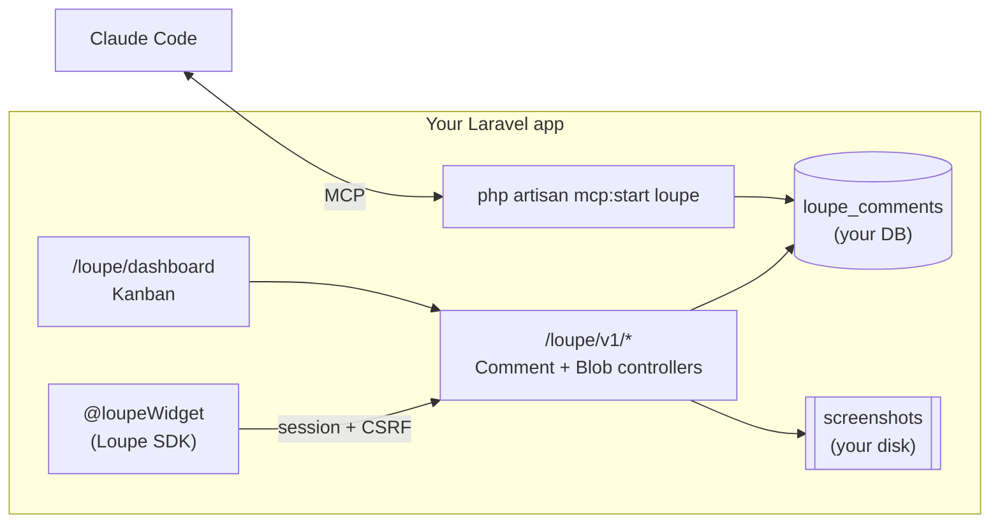

# Loupe for Laravel — full guide

<div align="center">
  <a href="https://mohamed-ashraf-elsaed.github.io/loupe/">
    
  </a>
  <p>
    
    
    
    
  </p>
</div>

`loupekit/laravel` brings the Loupe visual-feedback loop to any Laravel application: the
in-app commenting widget, comments stored in your own database, per-user access control, a
Laravel-served triage dashboard, and an MCP server that hands the backlog to Claude Code.

<div align="center">
  
</div>

- [What you get](#what-you-get)
- [Requirements & compatibility](#requirements--compatibility)
- [Installation](#installation)
- [Authorization (who can use it)](#authorization-who-can-use-it)
- [The widget](#the-widget)
- [The dashboard](#the-dashboard)
- [Data model](#data-model)
- [Screenshots & storage](#screenshots--storage)
- [Authentication model](#authentication-model)
- [MCP: hand the backlog to Claude](#mcp-hand-the-backlog-to-claude)
- [Configuration reference](#configuration-reference)
- [Sanctum / SPA setups](#sanctum--spa-setups)
- [Testing & coverage](#testing--coverage)
- [How it relates to the rest of Loupe](#how-it-relates-to-the-rest-of-loupe)
- [Troubleshooting](#troubleshooting)

## What you get

The same loop as standalone Loupe (see [ARCHITECTURE.md](./ARCHITECTURE.md)), but the
backend is **your Laravel app**:


```mermaid
flowchart LR
  subgraph App["Your Laravel app"]
    W["@loupeWidget<br/>(Loupe SDK)"]
    API["/loupe/v1/*<br/>Comment + Blob controllers"]
    DASH["/loupe/dashboard<br/>Kanban"]
    DB[("loupe_comments<br/>(your DB)")]
    FS[["screenshots<br/>(your disk)"]]
    MCP["php artisan mcp:start loupe"]
  end
  CLAUDE["Claude Code"]

  W -->|"session + CSRF"| API --> DB
  API --> FS
  DASH --> API
  MCP --> DB
  CLAUDE <-->|MCP| MCP
```

## Requirements & compatibility

| | Supported |
|---|---|
| PHP | **8.2** and higher (**8.3+** on Laravel 13) |
| Laravel | **11, 12, 13** |
| Database | anything Eloquent supports (MySQL, Postgres, SQLite, SQL Server) |
| MCP (optional) | `laravel/mcp` **^0.8** — Laravel 11, 12 & 13 |

Every PHP × Laravel combination is exercised in CI (`.github/workflows/laravel.yml`) —
**including the MCP layer on all three Laravel versions** — under a **100% line-coverage
gate**.

> The MCP layer is optional and guarded by `class_exists`, so the core package still works
> even if `laravel/mcp` isn't installed (its tests skip cleanly in that case).

> Laravel 9/10 are intentionally not supported: this package targets PHP 8.4, which those
> releases do not support.

## Installation

```bash
composer require loupekit/laravel
php artisan loupe:install
php artisan migrate
```

`loupe:install`:

1. publishes `config/loupe.php`,
2. publishes the migration,
3. publishes the browser assets to `public/vendor/loupe`,
4. publishes `app/Providers/LoupeServiceProvider.php` and registers it in
   `bootstrap/providers.php`.

Add the widget to your Blade layout, just before the closing `</body>`:

```blade
@loupeWidget
</body>
```

That single directive injects the SDK `<script>` and a `Loupe.init({...})` call — but only
for users who pass the `loupe:use` check (see below).

### Publishing individual pieces

```bash
php artisan vendor:publish --tag=loupe-config      # config/loupe.php
php artisan vendor:publish --tag=loupe-migrations  # the migration
php artisan vendor:publish --tag=loupe-assets      # public/vendor/loupe/*
php artisan vendor:publish --tag=loupe-provider    # app/Providers/LoupeServiceProvider.php
php artisan vendor:publish --tag=loupe-views       # resources/views/vendor/loupe/*
```

## Authorization (who can use it)

Two distinct abilities:

- **`loupe:use`** — who sees the in-app widget and can create/update comments.
- **`loupe:admin`** — who can open the triage dashboard.

Out of the box both are **allowed only in the `local` environment** so a fresh install is
safe. Grant real access in the published provider:

```php
// app/Providers/LoupeServiceProvider.php
Gate::define('loupe:use', fn ($user) => $user->hasRole('staff'));
Gate::define('loupe:admin', fn ($user) => $user->hasRole('admin'));
```

You can **also** (or instead) use config closures, which take precedence over the Gates:

```php
// config/loupe.php
'authorize' => [
    'use' => fn ($user) => $user->can_give_feedback,
    'dashboard' => fn ($user) => $user->is_admin,
],
```

> Config closures cannot be used with `config:cache`. If you cache config in production,
> use the Gate abilities in the provider instead.

Either way, denied users never receive the widget markup, and the API/dashboard return
`403`.

## The widget

`@loupeWidget` renders (for authorized users only):

```html
<script src="/vendor/loupe/sdk/loupe.js"></script>
<script>
  Loupe.init({
    projectKey: "app",
    user: { id: "42", name: "Sara", email: "sara@example.com" },
    apiBase: "https://your-app.test/loupe",
    headers: { "X-CSRF-TOKEN": "…" },
    credentials: "same-origin",
    timeZone: "Africa/Cairo",      // config('loupe.timezone') ?: config('app.timezone')
    locale: null,                  // config('loupe.locale'), null = the browser's
    packageVersion: "v0.11.0",     // Composer's record of loupekit/laravel
  });
</script>
```

Customize how the user is described to the SDK with a resolver:

```php
// config/loupe.php
'user_resolver' => fn ($user) => [
    'id' => (string) $user->id,
    'name' => $user->full_name,
    'email' => $user->email,
],
```

Every thread shows its author and an absolute timestamp. The clock is `loupe.timezone`
(`LOUPE_TIMEZONE`), falling back to `app.timezone`, so a team in one place reads one clock
whatever a reporter's laptop is set to. `loupe.locale` (`LOUPE_LOCALE`) picks the date format,
e.g. `en-GB` for day-first; leave it empty to use each browser's own.

The widget also shows the version baked into the published JS beside the version Composer
installed, and flags the pair when they differ. That is what you see after a `composer`
upgrade without `vendor:publish --tag=loupe-assets --force`.

## The dashboard

The full Kanban triage board (open / in progress / done), page filter, screenshot
thumbnails, status moves, delete, and **Copy for Claude** — served at
`/loupe/dashboard`, behind your `web`+`auth` middleware and the `loupe:admin` ability.

The board is the exact `@loupekit/dashboard` bundle, vendored into the package and
configured server-side via an injected `window.__LOUPE__` (API base, project key, CSRF
token) — no secret ever reaches the browser.

<div align="center">
  
</div>

## Data model

Migration `create_loupe_comments_table` → `loupe_comments`:

| Column | Type | Notes |
|---|---|---|
| `id` | string (PK) | client-generated UUID |
| `project_key` | string, indexed | scopes to this app |
| `url` | text | normalized (utm/click ids stripped) |
| `status` | string, indexed | `queue` \| `todo` \| `in_progress` \| `in_review` \| `resolved` |
| `priority` | string | `critical` \| `high` \| `medium` \| `low` (default `medium`) |
| `change_type` | string | `frontend` \| `backend` \| `api` \| `other` (default `other`) |
| `repo` | string, nullable | the repository the feedback was filed against |
| `branch` | string, nullable | the branch in play |
| `body` | text | the comment |
| `kind` | string | `element` \| `region` \| `free` (page-level note) |
| `author` | json | `{ id, name, email? }` |
| `author_id` | string, indexed | denormalized for cheap checks |
| `anchor` | json | element fingerprint (for re-anchoring) |
| `context` | json | element HTML + computed styles |
| `offset` | json | pin position — within the element, or a document fraction for `free` notes |
| `region` | json, nullable | rectangle for region comments |
| `screenshot_url` | text, nullable | URL of the stored screenshot |
| `created_at` / `updated_at` | timestamps | |

Bring your own model to add relationships or scopes:

```php
// config/loupe.php
'comment_model' => App\Models\Feedback::class, // extends Loupekit\Loupe\Models\Comment
```

## Screenshots & storage

Screenshots are uploaded to `POST /loupe/v1/blobs` as a data URL, stored on the configured
disk (`config('loupe.disk')`, default `public`) under `loupe/screenshots`, and served back
via `GET /loupe/v1/blobs/{id}` with a long immutable cache. Use a private disk for stricter
setups — the read route streams the bytes rather than exposing a public URL.

## Authentication model

Unlike the standalone Loupe server (which uses an HMAC identity header), the Laravel
package authenticates with your **session**:

- The API middleware is `['web', 'auth']` — the session cookie identifies the user and the
  SDK sends the `X-CSRF-TOKEN` from `@loupeWidget`.
- The store endpoint enforces `author.id === auth()->id()`, so a user cannot post as
  someone else.

There is no shared secret to provision.

## MCP: hand the backlog to Claude

With `laravel/mcp` installed, a local MCP server named **`loupe`** is registered
automatically. Start it and add it to Claude Code:

```bash
php artisan mcp:start loupe
```

Tools (all read your database directly — no HTTP hop, no admin key):

| Tool | Arguments | Returns |
|---|---|---|
| `list_comments` | `status?`, `url?` | the backlog, newest first |
| `get_comment` | `id` | Claude-ready package: request + element HTML + computed styles + screenshot URL (or the region rect) |
| `update_status` | `id`, `status` | moves a comment along the board: queue / todo / in_progress / in_review / resolved |

This is the same loop as `@loupekit/mcp`, but in-process.

<div align="center">
  
</div>

## Configuration reference

See [`config/loupe.php`](../packages/laravel/config/loupe.php). Highlights:

```php
return [
    'enabled' => env('LOUPE_ENABLED', true),
    'path' => env('LOUPE_PATH', 'loupe'),
    'project_key' => env('LOUPE_PROJECT_KEY', 'app'),
    'middleware' => [
        'api' => ['web', 'auth'],
        'dashboard' => ['web', 'auth'],
    ],
    'authorize' => ['use' => null, 'dashboard' => null],
    'timezone' => env('LOUPE_TIMEZONE'),   // null = app.timezone
    'locale' => env('LOUPE_LOCALE'),       // null = the browser's
    'comment_model' => Loupekit\Loupe\Models\Comment::class,
    'disk' => env('LOUPE_DISK', 'public'),
    'hub' => [
        'url' => env('LOUPE_HUB_URL'),
        'project_id' => env('LOUPE_PROJECT_ID'),
        'project_secret' => env('LOUPE_PROJECT_SECRET'),
    ],
    'activity' => [
        'enabled' => env('LOUPE_ACTIVITY', true),
        'retention_days' => 30,
    ],
];
```

## Loupe Hub (optional)

[Loupe Hub](../packages/hub) is a small hosted service. Organization owners sign in with
Google, add allowed members (Google emails and/or one email domain) and create one project
per app. Hub accepts an issue only when its author belongs to the project's organization.
It then sends the issue to the project's destination project, or to its webhook, signed.

Create a project in Hub, then set all three keys. The feature is **off unless all three
are set**:

```env
LOUPE_HUB_URL=https://hub.example.com
LOUPE_PROJECT_ID=prj_…
LOUPE_PROJECT_SECRET=psk_…
```

How it behaves:

- Each **new** comment (not later edits of the same id) dispatches
  `Loupekit\Loupe\Jobs\SendToHub`. It POSTs `{ user: { email, name }, issue }` to
  `{LOUPE_HUB_URL}/v1/issues`. `user` is the logged-in user (through `user_resolver`, if
  set); `issue` is the comment in the canonical Loupe shape.
- Signing: `X-Loupe-Project: prj_…`, `X-Loupe-Timestamp: <unix seconds>` and
  `X-Loupe-Signature = hex(HMAC-SHA256(timestamp + "." + body, project_secret))`. Hub
  rejects timestamps more than 5 minutes off, so keep the server clock in sync (NTP).
- Queueing: the job runs on your default queue. With `QUEUE_CONNECTION=sync`, or when the
  queue can't accept the job, it runs **after the response** so users never wait on Hub.
  With a real queue (`database`, `redis`, …) a worker must be running.
- Failures never break comment creation. A Hub rejection (`403 user not in organization`,
  `401` bad signature), a network error or a failed webhook delivery is logged as a
  warning (`[loupe] Hub rejected comment`, …). The job is not retried. Users without an
  email are skipped (and logged).
- Result: the job stores Hub's answer on the comment as `forwarded`
  (`{ status, deliveryId, destinationProjectId, destinationName, at }`). The widget shows
  "→ CRM" on the card, in red when `status` is `failed`.

### Send tickets to another project

An organization often has several apps and one place where tickets are worked, for example a
CRM. Hub can send every ticket filed on one app to another app in the same organization.

1. Install the package on the receiving app with its own Hub project keys, and run
   `php artisan migrate`.
2. In Hub, open the receiving project and set its **Inbound URL** to
   `https://<receiving-app>/{LOUPE_PATH}/v1/hub/inbound`.
3. Open each sending project and choose the receiving project under **Send tickets to**.

Hub signs each delivery with the receiving project's own secret, so the receiving app
needs no new key. The receiver at `POST {path}/v1/hub/inbound` takes no session and no CSRF
token. It fails closed:

| Answer | When |
| --- | --- |
| `503` | Hub is not configured on this app |
| `401` | a header is missing, `X-Loupe-Hub-Project` is not this app's project, the timestamp is more than 5 minutes off, or the signature does not match |
| `413` | the body is over 6 MB |
| `202 { duplicate: true }` | this issue id is already stored |
| `202 { ticket }` | stored |

A received ticket lands on the board in the `queue` column with a `source`
(`{ projectId, projectName, organizationId, organizationName, deliveryId, receivedAt }`). The
widget shows it as "from Orders" and does not pin it, because it was filed on another app's
page. To create your own record as well, listen for the event:

```php
use Loupekit\Loupe\Events\TicketReceived;

Event::listen(function (TicketReceived $e) {
    // $e->comment  the stored comment model
    // $e->source   where it came from (projectId, projectName, …)
    // $e->user     ['email' => …, 'name' => …], as Hub verified them
    Ticket::firstOrCreate(['loupe_id' => $e->comment->id], [
        'title' => str($e->comment->body)->limit(80),
        'reporter_email' => $e->user['email'],
    ]);
});
```

### The organization and Activity endpoints

- `GET {path}/v1/org` returns this project, its organization, its destination and the
  organization's other projects, read from Hub's `GET /v1/projects` and cached for 5 minutes.
  Without Hub keys it returns `organization: null`. When Hub cannot be reached it adds
  `error: "hub_unreachable"`. It never answers 500. The panel's project chip and menu read
  it.
- `GET {path}/v1/activity?projectKey=…&since=…` returns the newest 200 events for the
  project. The package records new comments, status changes, edits, deletes, forwarded
  tickets and received tickets. The panel's Activity view polls it every 15 seconds while
  the view is open. Set `LOUPE_ACTIVITY=false` to stop recording. Rows older than
  `activity.retention_days` are pruned on about one write in a hundred.

Both routes use the API middleware and the `use` authorization, like the comments API.

## Sanctum / SPA setups

If your frontend runs on a **different subdomain** from the API, add Sanctum's stateful
middleware to the API stack and switch the SDK to cross-origin credentials:

```php
// config/loupe.php
'middleware' => [
    'api' => [\Laravel\Sanctum\Http\Middleware\EnsureFrontendRequestsAreStateful::class, 'auth:sanctum'],
],
```

The SDK's `credentials` / `headers` options (set by `@loupeWidget`) already carry the
cookie and CSRF token; for cross-origin you'll want `credentials: 'include'` — publish the
widget view (`--tag=loupe-views`) and adjust.

## Testing & coverage

The package ships a Testbench suite with a **100% line-coverage gate**:

```bash
cd packages/laravel
composer install
composer test               # fast
composer test:coverage-100  # enforces 100% (fails the build otherwise)
```

## How it relates to the rest of Loupe

The package reuses the shipped browser bundles: `@loupekit/sdk` (widget) and
`@loupekit/dashboard` (board), vendored into `packages/laravel/resources/dist`. The SDK
gained two generic options — `headers` and `credentials` — so it can authenticate with a
session/CSRF instead of HMAC; the dashboard reads an injected `window.__LOUPE__`. Refresh
the vendored bundles with `packages/laravel/bin/sync-assets.sh`.

## Troubleshooting

- **Comments don't reach Loupe Hub.** Check all three `LOUPE_HUB_*` / `LOUPE_PROJECT_*`
  keys are set (then `php artisan config:clear`), a queue worker is running for non-sync
  queues, and `storage/logs` for `[loupe] Hub …` warnings. `user not in organization`
  means the user's email is neither an org member nor on the org's allowed domain.


- **Widget doesn't appear** — the current user fails `loupe:use` (default: local only), or
  `@loupeWidget` isn't in the rendered layout, or `LOUPE_ENABLED=false`.
- **419 on save** — CSRF token missing; ensure `@loupeWidget` runs inside a session (`web`)
  context and the meta/token is present.
- **403 on the dashboard** — the user fails `loupe:admin`.
- **Screenshots 404** — the disk isn't public and the read route can't reach the file;
  check `config('loupe.disk')` and that `storage:link` is run for the `public` disk.
- **`mcp:start` unknown** — install `laravel/mcp` (`composer require laravel/mcp:^0.8`).
- **`403 "cannot post as another user"`** — your app uses separate auth guards (e.g.
  `web` + `admin`) and the widget rendered under one while the API authenticated under
  another. Set `LOUPE_GUARDS=web,admin` (the guards to try, in order) so Loupe resolves
  identity consistently across both.
- **Widget missing only in production behind a CDN** — Loupe's JS lives at
  `public/vendor/loupe/**` on the app's own disk and is loaded from the app URL (not via
  `asset()`), so a CDN `ASSET_URL` won't break it. If you serve `public/vendor/loupe` from
  a different origin, set `LOUPE_ASSET_URL` to that origin. Also make sure your deploy runs
  `php artisan vendor:publish --tag=loupe-assets --force` (the files aren't part of your
  `npm`/Vite build). The widget tells you when this was skipped: the Home footer and the
  Settings menu show the bundle version and flag it when it differs from the installed package.
