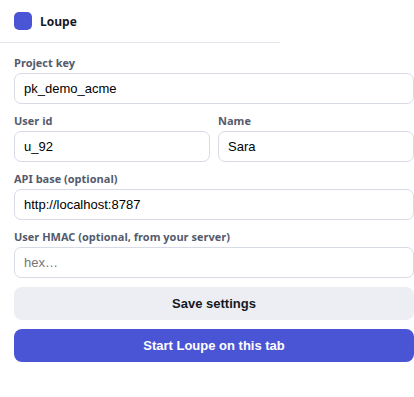

# Identity, access and privacy in Loupe

This page explains how each Loupe backend decides who a user is, what that user may do, what a comment captures from the page, and where that data ends up. It is written for developers who install Loupe and for reviewers who assess it. It describes Loupe 0.14.1.

It contains no procedures. To set things up, follow the how-to guides linked in each section.

## Contents

- [Three backends, three identity models](#three-backends-three-identity-models)
- [Who is the user](#who-is-the-user)
- [Why userHmac is computed on the server](#why-userhmac-is-computed-on-the-server)
- [Who may do what](#who-may-do-what)
- [What a comment captures](#what-a-comment-captures)
- [What never leaves the page](#what-never-leaves-the-page)
- [Where data is stored](#where-data-is-stored)
- [Extension permissions](#extension-permissions)
- [Agents and navigation consent](#agents-and-navigation-consent)
- [Related pages](#related-pages)

## Three backends, three identity models

The widget, also called the SDK, never decides who the user is. It sends what the host page gives it, and the backend decides whether to believe it. Loupe has three backends, and each one answers that question differently:

- **The local server** (`@loupekit/server`) trusts a signature. The host app signs the user id with the project secret.

  A *project* is the unit Loupe scopes comments to. Its *project key* is a public id, such as `pk_demo_acme`, that the widget sends with every request. Its *project secret* is a server-side value that never reaches the browser. On the local server, the seed script creates a demo project and prints both (`packages/server/seed.ts:7-8,14-15`); see [Run the local server, Step 2: Create the demo project](../how-to/run-local-server.md#step-2-create-the-demo-project). The Laravel package has no project secret of its own: its project key is `config('loupe.project_key')` (env `LOUPE_PROJECT_KEY`, default `app`, `packages/laravel/config/loupe.php:47`). On Hub, the project secret is the `psk_…` value.
- **The Laravel package** (`loupekit/laravel`) trusts the Laravel session. The signed-in user is the identity.
- **Loupe Hub** trusts the sending project. A project signs each request with its own secret, and Hub checks the reporter's email against the organization.

Without the SDK's `apiBase` option (the backend base URL, see the [SDK reference](../reference/sdk.md)), the widget uses no backend at all. It keeps comments in the browser's `localStorage`, and there is no identity check (`packages/sdk/src/app.ts:376-378`).

## Who is the user

### Local server: `X-Loupe-User` plus `X-Loupe-Hmac`, or the admin key

Every API request names a project, either as `projectKey` or, for blob uploads, as the `X-Loupe-Project` header. The server then accepts one of two credentials (`packages/server/auth.ts:29-43`):

| Mode | Headers | Check |
|---|---|---|
| Admin | `X-Loupe-Admin` | Equals the project secret. |
| User | `X-Loupe-User` and `X-Loupe-Hmac` | `X-Loupe-Hmac` equals hex HMAC-SHA256 of the user id, keyed with the project secret. |

Both comparisons are constant-time (`packages/server/auth.ts:9-13`). A request with neither credential gets `401 invalid or missing credentials`. A missing project key gets `400`, and an unknown one gets `404` (`packages/server/auth.ts:30-32,42`).

The SDK sends `X-Loupe-User` on every request and adds `X-Loupe-Hmac` only when you pass `userHmac` (`packages/sdk/src/http-adapter.ts:20-21`). Because the server has no unsigned user mode, a widget pointed at the local server without `userHmac` cannot read or write anything.

The admin key is the project secret itself. The local dashboard and the MCP server use it: the dashboard reads it from `?key=` and keeps it in `localStorage` under `loupe_admin` (`packages/dashboard/app.ts:32-33,98`), and the MCP server reads it from `LOUPE_ADMIN_KEY` (`packages/mcp/index.ts:93,98`).

### Laravel: session guards and `describeUser`

The Laravel package does not use `X-Loupe-User` or `X-Loupe-Hmac`. The widget it renders sends the CSRF token and uses `credentials: 'same-origin'`, so the browser's session cookie authenticates each call (`packages/laravel/resources/views/widget.blade.php:6-14`).

On the server, identity comes from these steps:

These keys live in `config/loupe.php`, which you publish into your app first; see [Authorize who can use Loupe in Laravel](../how-to/laravel-authorize.md).

1. **Guards.** The package tries each guard in `config('loupe.guards')` (env `LOUPE_GUARDS`, `packages/laravel/config/loupe.php:75`) in order. An empty list means the app's default guard. The first signed-in user wins (`packages/laravel/src/Loupe.php:45-77`). The `loupe.auth` middleware applies the same list to the routes.
2. **Description.** `describeUser()` turns that user into `{id, name, email}`. By default `id` is the auth identifier, `name` falls back to the email and then to `User` (`packages/laravel/src/Loupe.php:99-120`). Set `config('loupe.user_resolver')` (`packages/laravel/config/loupe.php:132`) to change it, for example to attribute an impersonation session to the admin.
3. **Identity check on store.** When the widget creates a comment, the package compares `author.id` in the body with `describeUser()['id']`. A mismatch gets `403 cannot post as another user` (`packages/laravel/src/Http/Controllers/CommentController.php:92-97`). Replies ignore the body's author and always use the signed-in user (`packages/laravel/src/Http/Controllers/ThreadController.php:51-63`).

Access is a separate question from identity. Two abilities, `use` and `admin`, are decided in this order (`packages/laravel/src/Loupe.php:173-195`):

1. No user: denied.
2. A closure in `config('loupe.authorize.use')` or `config('loupe.authorize.dashboard')`, in every environment.
3. A closure registered with `Loupe::useWhen()` or `Loupe::adminWhen()`.
4. In the `local` environment, any signed-in user, while `allow_in_local` is `true` (the default, `packages/laravel/config/loupe.php:106`).
5. The `loupe:use` or `loupe:admin` gate. The package defines both to deny until your app redefines them (`packages/laravel/src/LoupeServiceProvider.php:66-74`).

To set these up, see [Authorize who can use Loupe in Laravel](../how-to/laravel-authorize.md).

### Hub: the email in a signed payload, checked against the organization

Hub never sees a browser. A Laravel app sends each new comment to Hub as `POST /v1/issues`, signed with its project secret (`psk_…`). Hub shows that value when you create a project; see [Manage Hub organizations and projects](../how-to/hub-manage-projects.md). The signature is hex HMAC-SHA256 over `<timestamp>.<raw body>`, sent in `X-Loupe-Signature` with `X-Loupe-Project` and `X-Loupe-Timestamp` (`packages/hub/index.ts:154-171`). A timestamp more than 300 seconds from Hub's clock is refused (`packages/hub/crypto.ts:19,24-35`).

The reporter is the `user.email` field inside that signed body. The Laravel package fills it from `describeUser()`, and does not send the comment at all when the user has no email (`packages/laravel/src/Support/Hub.php:107-114`). Hub then accepts the reporter only if one of these is true (`packages/hub/store.ts:151-155`):

- The email's domain, the text after the last `@`, equals the organization's allowed domain exactly. `sara@acme.com` matches `acme.com`; `sara@acme.com.example.net` does not.
- The email is an explicit member of the organization, with any role.

Otherwise Hub answers `403 user not in organization` and forwards nothing (`packages/hub/index.ts:214`). A missing or invalid email gets `400 user.email required` first (`packages/hub/index.ts:207`).

So Hub trusts the sending app to report its own user honestly. The project secret proves which app sent the ticket; it does not prove who the person was.

The Hub dashboard is a different identity path. People sign in with Google. Hub verifies the ID token's signature, issuer, expiry and audience, and requires `email_verified` (`packages/hub/google.ts:14-23`). The session lives in an `HttpOnly; Secure; SameSite=Lax` cookie named `hub_session` (`packages/hub/index.ts:14,94`).

## Why userHmac is computed on the server

`userHmac` is HMAC-SHA256 of `user.id`, keyed with the project secret (`packages/sdk/src/types.ts:97-101`, `packages/server/auth.ts:5-7`). Three reasons put that computation on your server:

- **The key must stay secret.** The project secret is also the admin key. Any code that runs in the browser can be read, so a page that computes the HMAC itself has already published the admin key.
- **The signature binds one id.** The browser receives a value that is valid only for the id it was computed for. If someone edits `user.id` in the page, the signature no longer matches and the server answers `401`.
- **Your server already knows the user.** The host app has authenticated the visitor through its own login. Signing the id at render time turns that existing trust into something the Loupe server can check, without Loupe needing access to your user database.

The computation is one call to Node's `crypto` module, the same one the server runs to check it:

```js
import { createHmac } from "node:crypto";

const userHmac = createHmac("sha256", "<PROJECT_SECRET>").update("<USER_ID>").digest("hex");
```

`<PROJECT_SECRET>` is the project secret and `<USER_ID>` is the same string you pass as `user.id`. To pass the result to the widget, see the `userHmac` option in the [SDK reference](../reference/sdk.md).

The local server's seed script prints a ready-made HMAC for the demo user, which is the same computation (`packages/server/seed.ts:3,16`).

The Laravel package does not need `userHmac`: the session already proves who the user is.

## Who may do what

The table summarizes what each backend allows, as the code enforces it today.

| Action | Local server | Laravel package | Loupe Hub |
|---|---|---|---|
| Read comments | Any request with a valid user HMAC or the admin key for that project (`packages/server/index.ts:495-498`). | A signed-in user who passes `use` (`packages/laravel/routes/loupe.php:27-42`). | Hub stores no comments. |
| Create a comment | Users only as their own id, else `403` (`packages/server/index.ts:519`). The admin key may post as anyone. A `POST` with an existing comment id replaces that comment (`packages/server/index.ts:513-520`). | Only as the signed-in identity, else `403` (`packages/laravel/src/Http/Controllers/CommentController.php:95-97`). A `POST` with an existing comment id replaces that comment and sets its author to the caller (`packages/laravel/src/Http/Controllers/CommentController.php:111-112,127-139`). | A project signs `POST /v1/issues`; the reporter must be a member or in the allowed domain. |
| Change a comment (`PATCH`) | Any authenticated caller, on any comment in the project (`packages/server/index.ts:537-563`). | Any user who passes `use`, on any comment in the project (`packages/laravel/src/Http/Controllers/CommentController.php:159-209`). | Status and message updates come only from the source or destination project of that ticket (`packages/hub/index.ts:263-314`). |
| Reply | Any authenticated caller. The server takes `author` from the request body and does not compare it with the HMAC user (`packages/server/index.ts:187-197`). | The author is always the signed-in user. | Relayed between the two projects that share the ticket. |
| Delete another person's comment | Any authenticated caller (`packages/server/index.ts:564-567`). | Only a user who passes `admin` (`packages/laravel/src/Http/Controllers/CommentController.php:219-225`). | Not applicable. Nothing in Hub deletes organizations or projects either. |
| Dashboard | The local dashboard sends the admin key from `?key=`. Integration settings are admin-only (`packages/server/index.ts:276`). | `/{path}/dashboard` needs `admin` (`packages/laravel/routes/loupe.php:46-48`). | Any Google account with a verified email can sign in and create an organization. Members can view; only owners change settings (`packages/hub/index.ts:344-359`). |
| MCP | `@loupekit/mcp` calls the API with the admin key, so an agent has full access to the project. | `php artisan mcp:start loupe` is a local stdio server that reads the database directly (`packages/laravel/routes/ai.php:9`). The command comes from the Laravel MCP package, which your app must install; see [Connect MCP clients](../how-to/connect-mcp-clients.md). Anyone who can run Artisan has full access. | No MCP server. |

Two consequences follow:

- On the local server, the HMAC proves who **creates** a comment. It does not restrict who edits, replies to, or deletes it. Treat every holder of a valid HMAC for a project as a trusted collaborator. On both backends, a create request that reuses an existing comment id replaces that comment, so a caller who names themselves as author can overwrite another person's comment.
- An MCP client holds the project secret on the local server, or database access on Laravel. Give it to an agent only on a machine you trust with that access.

## What a comment captures

The widget panel has four tools (`packages/sdk/src/app.ts:705-718`). **Inspect** makes an *element comment*, pinned to one element. **Region** makes a *region comment*, which covers a rectangle you drag. **Record** records a video of a dragged rectangle. **Note** drops a page-level note with no element and no screenshot. Each tool then opens the *composer*, the form where you type a comment. For a walkthrough, see [Pin your first comment](../tutorials/first-comment-local.md); for every option, see the [SDK reference](../reference/sdk.md).

When a user submits the composer, the widget builds one comment object (`packages/sdk/src/app.ts:2694-2723`). It can contain the following.

### Anchor

The anchor describes the element so the pin can find it again after a redeploy (`packages/shared/src/index.ts:154-164`, `packages/sdk/src/fingerprint.ts`):

| Field | Content |
|---|---|
| `tag` | The element's tag name. |
| `cssPath`, `xpath` | Paths to the element. |
| `testid` | `data-testid`, `data-test`, or a stable `id`. |
| `text` | The element's text, up to 120 characters. |
| `attrs` | `role`, `aria-label`, `name`, `type`, `alt`, `href`, `placeholder`, `title`, each up to 200 characters. |
| `nthOfType` | Its position among siblings of the same tag. |
| `rect`, `viewport` | Its box and the window size at capture time. |

`text` and `attrs` are copied from the page. If an element shows personal data in its text or its `href`, that data is in the anchor.

### Element context

For element comments, and region comments that have an element under their centre, the widget sends that element's `outerHTML`, cut at 6,000 characters, plus 19 computed style values (`packages/sdk/src/capture.ts:4-13`, `packages/sdk/src/app.ts:2684-2687`). A region comment with no element under it sends a short generated note about the rectangle instead (`packages/sdk/src/app.ts:2689-2690`):

`display`, `position`, `width`, `height`, `margin`, `padding`, `color`, `background-color`, `font-size`, `font-weight`, `font-family`, `border`, `border-radius`, `box-shadow`, `flex`, `grid-template-columns`, `text-align`, `line-height`, `opacity`.

The HTML includes the element's attributes and its children's text. This is what an agent reads to propose a fix.

### Images and recordings

- **Screenshot.** An element comment includes a PNG of the element, and a region comment a PNG of the dragged rectangle, when the composer's **Attach screenshot** checkbox is checked. It is checked by default (`packages/sdk/src/app.ts:2598-2604,2663,2679`).
- **Recording.** **Record**, a toolbar button in the widget panel, records a region of the screen as WebM, for up to 20 seconds (`packages/sdk/src/app.ts:145,2410`). The browser asks the user to share the screen first.
- **Attachments.** Files the user picks, up to 10 per comment, images up to 10 MB and videos up to 25 MB (`packages/sdk/src/app.ts:147,150-151`). They are uploaded as the user chose them.

### Viewport

Every comment carries `viewport: { w, h, v, touch, coarse, gdm }` (`packages/sdk/src/app.ts:2714-2721`):

| Field | Meaning |
|---|---|
| `w`, `h` | Window width and height. |
| `v` | The SDK version. |
| `touch` | Whether the device looks like a phone or tablet. |
| `coarse` | Whether `(pointer: coarse)` matches. |
| `gdm` | Whether the browser offers screen sharing (`getDisplayMedia`). |

These fields help tell a stale bundle or a device quirk from a real bug. The widget does not send the user agent string.

### Other fields

The comment also holds the page path and query (`url`), the author (`id`, `name`, and `email` if the host passed one), title, body, priority, change type and creation time.

The widget sends the raw path and query, exactly as `location.pathname + location.search` (`packages/sdk/src/app.ts:381,2697`). Tracking parameters are dropped only when the backend stores the comment: the local server and the Laravel package both normalize the URL (`packages/server/store.ts:117`, `packages/laravel/src/Http/Controllers/CommentController.php:101`). Normalizing keeps the path and query but drops tracking parameters such as `utm_*`, `fbclid`, `gclid` and `msclkid`, as well as `key` and `api` (`packages/shared/src/index.ts:390-418`). So those values still leave the page in the request body. Offline mode never normalizes: it stores the comment, and keys it in `localStorage`, under the raw URL (`packages/sdk/src/store.ts:11-13,46-50`).

## What never leaves the page

### Elements marked `data-loupe-redact`

Mark any element that shows sensitive data with the `data-loupe-redact` attribute:

```html
<div class="card-number" data-loupe-redact>4242 •••• •••• 4242</div>
```

Loupe handles it in every built-in image capture:

- **Element screenshots** skip the element entirely when rendering (`packages/sdk/src/capture.ts:54`).
- **Region screenshots** paint its rectangle solid `#0f0f14` before the PNG is encoded (`packages/sdk/src/capture.ts:106,269`).
- **Extension screenshots** paint the same rectangles over the real pixels from the browser before the PNG is encoded (`packages/extension/content.src.ts:60,71,91`).

Redaction applies to images only. It does not apply to:

- **Recordings.** The browser records the screen, and the code applies no redaction to the video.
- **Element context.** If you comment on an element that **contains** a redacted child, that child's markup is part of the parent's `outerHTML`.
- **The anchor.** The anchor's `text` is the element's whole text content, including redacted descendants, and its `attrs` are read with no redaction check (`packages/sdk/src/fingerprint.ts:21,183-194`).
- **The redacted element itself, if you comment on it.** Neither the anchor nor the element context checks `data-loupe-redact`, so that element's own `outerHTML` and text are sent (`packages/sdk/src/fingerprint.ts:14-23`, `packages/sdk/src/capture.ts:12-21`).
- **Attachments**, which the user chooses.

If you supply your own `captureScreenshot`, `captureRegion` or `captureRecording`, redaction is your code's responsibility.

### The widget itself

The widget renders inside a shadow root on `#loupe-root` (`packages/sdk/src/app.ts:528`). The built-in captures filter that node out, so the panel, pins and composer never appear in their screenshots (`packages/sdk/src/capture.ts:51-56,121`).

The extension's captures work differently. They crop real pixels from the visible tab (`packages/extension/content.src.ts:55-77`, `packages/extension/background.js:46`), and nothing hides `#loupe-root` first. The element shot is taken while the composer is open and saving, and the region shot starts after the composer opens (`packages/sdk/src/app.ts:2653,2663,2387-2389`). So an extension screenshot can include Loupe's own panel, pins or composer wherever they overlap the cropped area.

## Where data is stored

### Offline mode: `localStorage` per origin

Without `apiBase`, comments stay in the browser, in `localStorage` of the page's origin (`packages/sdk/src/store.ts`):

| Key | Content |
|---|---|
| `loupe:<projectKey>:<url>` | Comments for one page. |
| `loupe:msgs:<threadId>` | Replies in a thread. |
| `loupe:rxn:<threadId>` | Reactions in a thread. |

Images are stored inline as data URLs, and offline attachments are limited to 3,000,000 bytes (`packages/sdk/src/store.ts:58`). Nothing is sent anywhere. Anyone else, or any other script, with access to that origin's storage can read it.

The widget also keeps settings in the same storage, whether or not a backend is set: `loupe:dock` for panel state and `loupe:project:<projectKey>` for environments and the local AI URL, the address of an OpenAI-compatible server the user saves in the panel for the Generate pane (`packages/sdk/src/app.ts:1874,1891,3149,3960-3964`; see `localAi` in the [SDK reference](../reference/sdk.md)).

### Local server: database and blob directory

Comments, replies, reactions and notifications go to Postgres when `DATABASE_URL` is set (`packages/server/db.ts:18`). Otherwise they go to PGlite, a Postgres database embedded in the server process, in `LOUPE_PG_DIR`, by default `packages/server/data/pg` (`packages/server/db.ts:26`). Screenshots, recordings and attachments go to files in `LOUPE_BLOB_DIR`, by default `packages/server/data/blobs` (`packages/server/blobs.ts:11`). See [Local server reference](../reference/server.md).

### Laravel: your database and a filesystem disk

Comments live in your app's database, in the `loupe_comments` table by default, with replies, reactions, notifications and activity in their own tables. Files go to the disk named by `loupe.disk` (env `LOUPE_DISK`, default `public`) under `loupe.blob_path` (default `loupe/screenshots`) (`packages/laravel/config/loupe.php:172-173`, `packages/laravel/src/Http/Controllers/BlobController.php:48-50`).

With the default `public` disk, if your app has a `storage` link, the same files are also reachable through your web server's `/storage` path. Choose a private disk if that matters to you; the package serves files through its own route either way.

### Blob URLs are public, unguessable and cached forever

Uploads are named with a random UUID and an extension (`packages/server/index.ts:490`, `packages/laravel/src/Http/Controllers/BlobController.php:48`). Reading one needs no credentials on either backend (`packages/server/index.ts:473-480`, `packages/laravel/routes/loupe.php:18`), and the response carries `Cache-Control: public, max-age=31536000, immutable` (`packages/server/index.ts:480`, `packages/laravel/src/Http/Controllers/BlobController.php:74`).

What this means for you:

- Anyone who holds a blob URL can open it, without signing in. Share comment payloads with that in mind.
- The protection is that the URL cannot be guessed, not that it is private.
- Browsers and proxies may keep a copy for up to a year. Deleting the file does not remove those copies.

When Hub forwards a ticket, it passes the `issue` object through unchanged, so the media URLs keep pointing at the sender's blob route (`packages/hub/index.ts:208,220-227`).

## Extension permissions

The browser extension asks for four permissions and nothing else: `activeTab`, `scripting`, `storage` and `contextMenus` (`packages/extension/manifest.json:6-11`). It declares no host permissions, no `tabs` permission, no `<all_urls>`, no content scripts and no web-accessible resources, and a test keeps it that way (`packages/extension/test/manifest.test.ts:14-18,40-43`).

Least privilege shapes how it behaves:

- **Nothing runs until you act.** No script is injected when a page loads. Loupe enters a tab only after **Start Loupe on this tab** in the popup, or a click on one of its right-click menu entries. `activeTab` grants access to that tab for that action only.
- **Screenshots use the visible tab.** The service worker calls `chrome.tabs.captureVisibleTab`, which returns the visible viewport, not the whole page (`packages/extension/background.js:46`). Redacted rectangles are painted over before upload.
- **A per-site hide.** **Show / hide Loupe on this page** stores the origin in `hiddenSites` and removes Loupe from the tab (`packages/extension/background.js:66-79`). On a hidden site, Loupe does not start, even from the popup, until you show it again from the same menu (`packages/extension/content.src.ts:25-31`).
- **No network calls of its own.** The extension bundles the same SDK as the widget, so its comment requests go only to the API base you set (`packages/extension/content.js:3776-3883`). The only other request is to a local AI server, if you save one in the panel. With no API base it runs in offline mode, in the page origin's `localStorage`.

The popup stores the project key, user id, name, API base and optional HMAC in `chrome.storage.local` (`packages/extension/popup.js:5,23`).



To install it, see [Use the browser extension](../how-to/browser-extension.md). For every setting, see the [Browser extension reference](../reference/extension.md).

## Agents and navigation consent

An agent can ask the page to open another URL through `Loupe.requestNavigation(url, { reason, requester })` (`packages/sdk/src/index.ts:66`). The widget never navigates on its own:

- It shows a consent card with **Stay here** and **Go there** (`packages/sdk/src/app.ts:4032`).
- The page navigates only after the user clicks **Go there** (`packages/sdk/src/app.ts:4041-4046`).
- Only absolute `http:` and `https:` URLs are accepted. A `javascript:`, `data:` or `file:` URL is ignored (`packages/shared/src/consent.ts:46-53`).
- A second request replaces the first, so an agent cannot queue a chain of redirects (`packages/sdk/src/app.ts:3944-3947`, `packages/shared/src/consent.ts:56-75`).


## Related pages

- [Authorize who can use Loupe in Laravel](../how-to/laravel-authorize.md)
- [Run the local server](../how-to/run-local-server.md)
- [Connect MCP clients](../how-to/connect-mcp-clients.md)
- [Manage Hub organizations and projects](../how-to/hub-manage-projects.md)
- [SDK reference](../reference/sdk.md)
- [How Loupe Hub works](hub.md)
- [Architecture](../ARCHITECTURE.md)
