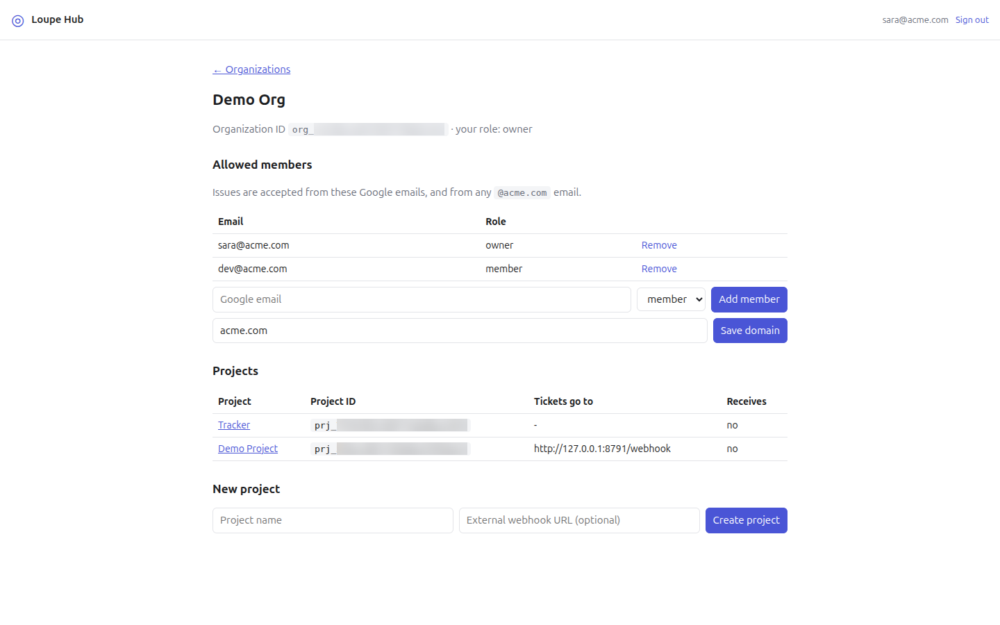
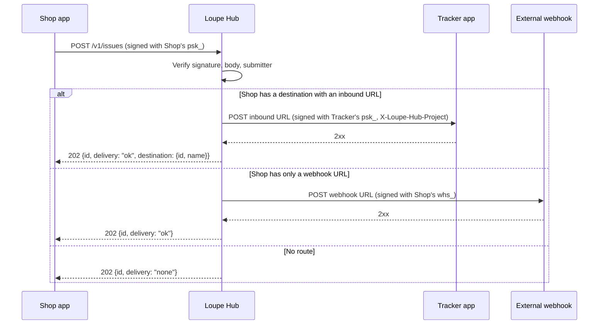

# How Loupe Hub works

This page explains what Loupe Hub does, how it routes a ticket from one app to another, how the two apps stay in step afterwards, and what Hub does and does not do to protect that traffic. It is written for architects and security reviewers deciding whether to adopt Hub. It describes Loupe 0.14.1. Two behaviors are new in 0.14.1 and are marked **0.14.1**.

For exact request shapes, headers and error codes, see the [Loupe Hub reference](../reference/hub.md). For step-by-step tasks, see the how-to guides listed in [Related pages](#related-pages).

## Contents

- [What Hub is for](#what-hub-is-for)
- [Concepts](#concepts)
- [Routing](#routing)
- [Two-way sync](#two-way-sync)
- [Why delivery is synchronous](#why-delivery-is-synchronous)
- [Security model](#security-model)
- [Trade-offs](#trade-offs)
- [Related pages](#related-pages)

## What Hub is for

A team often runs several apps, and feedback filed in one of them belongs to another. A reviewer pins a comment on the storefront, but the fix is tracked in the team's ticket tracker app. Hub moves that comment, called a *ticket* once it leaves the app it was filed in, from the app where it was written to the app that should handle it.

Hub is a small, separate server. It knows which apps belong to which organization, which people may file tickets, and where each app's tickets go. It does not store tickets. It verifies each incoming ticket, forwards it, and records the outcome of the delivery.

Hub only routes between apps of the same organization. A project can never send tickets to a project in another organization (`packages/hub/store.ts:208`).

## Concepts

| Term | Meaning |
|---|---|
| **Organization** | The top-level group in Hub. It holds members, an optional allowed domain, and projects. Its ID starts with `org_` (`packages/hub/store.ts:73`). |
| **Owner** | A member with the `owner` role. Only owners can change anything: members, the allowed domain, projects, URLs, routes and secrets (`packages/hub/index.ts:358-360`). The person who creates an organization becomes its first owner (`packages/hub/store.ts:79`). Hub refuses to remove the last owner (`packages/hub/store.ts:136-142`). |
| **Member** | A person listed in the organization by email, with the `member` role. A member can view the organization and project pages but cannot change them (`packages/hub/index.ts:407-408`, `:448-449`). |
| **Allowed domain** | An optional email domain, such as `acme.com`. Anyone whose email address ends in exactly `@acme.com` may *submit* tickets, without being a listed member (`packages/hub/store.ts:151-154`). These people cannot sign in to see the organization, because the dashboard only shows organizations where the email is an explicit member (`packages/hub/store.ts:90-98`). |
| **Project** | One app connected to Hub. Its ID starts with `prj_` (`packages/hub/store.ts:164`). |
| **Project secret** | A per-project secret that starts with `psk_`. The app uses it to sign what it sends to Hub, and Hub uses it to sign what it delivers *to* that app. The app stores it as `LOUPE_PROJECT_SECRET` (`packages/hub/index.ts:433`; `packages/laravel/config/loupe.php:191`). |
| **Webhook signing secret** | A second per-project secret that starts with `whs_`. Hub uses it only to sign deliveries to the project's external webhook (`packages/hub/index.ts:238`). Every project has one, even without a webhook URL (`packages/hub/store.ts:164`). |
| **Inbound URL** | The address where a project receives tickets and updates from other projects, for example `https://tracker.example.com/loupe/v1/hub/inbound`. The Projects table on the organization page shows a project that has one as **Receives: yes** (`packages/hub/views.ts:85`; `packages/hub/store.ts:219`). |
| **Webhook URL** | An optional URL for a system that is not a Loupe app. The dashboard labels it **External webhook URL (optional)** (`packages/hub/views.ts:106`, `:164`). Hub uses it only when the project has no destination with an inbound URL (`packages/hub/index.ts:229-241`). |
| **Destination** | The project that a project's tickets go to. It must be in the same organization, must not be the project itself, and must have an inbound URL (`packages/hub/store.ts:201-212`). |
| **Delivery** | One attempt by Hub to hand a ticket to a destination or webhook, with up to three tries. Its ID starts with `dlv_`. Hub records each ticket delivery with its status, HTTP status, attempt count and last error (`packages/hub/index.ts:244-254`). |
| **Stage** | A ticket's status in a Loupe app: one of `queue`, `todo`, `in_progress`, `in_review` or `resolved`, in board order (`packages/laravel/src/Support/Stages.php:14`). |
| **Reply URL** | The address where the *sending* app wants to hear back about a ticket it filed. The sending app includes it with each ticket (`packages/laravel/src/Support/Hub.php:118-126`). Hub stores it with the delivery and uses it for updates that travel back to the sender (`packages/hub/index.ts:243`, `:301`). |

## Routing

When an app sends a ticket, Hub checks three things in order: the request signature, the shape of the body, and whether the person who filed it may submit to this organization (`packages/hub/index.ts:196-214`). A person who is neither a member nor on the allowed domain is refused with `403`, and nothing is forwarded.

Hub then wraps the ticket in an *envelope*: the JSON body Hub sends, which names the source project and organization, the user who filed the ticket, and the original issue (`packages/hub/index.ts:220-227`). It then picks a route (`packages/hub/index.ts:229-241`):

1. **Destination project.** If the project has a destination and that destination has an inbound URL, Hub delivers there, signed with the *destination's* project secret.
2. **Webhook fallback.** Otherwise, if the project has a webhook URL, Hub delivers there, signed with the *source's* webhook signing secret. Use this to feed a system that is not a Loupe app.
3. **Nowhere.** Otherwise Hub answers that there was no delivery, and records nothing.

The example below shows a project called Shop whose tickets go to a project called Tracker.

Why a destination is signed with its own secret: the receiving app already holds its project secret to talk to Hub, so it needs no extra secret to receive. The Laravel receiver checks the signature against its own `LOUPE_PROJECT_SECRET` and checks that the `X-Loupe-Hub-Project` header names its own project (`packages/laravel/src/Http/Middleware/VerifyHubSignature.php:14-19`, `:49-57`).

On the receiving app, the ticket lands in the first stage, `queue`, shown as the board's **Queue** column, with a `source` field that says which project and organization sent it (`packages/laravel/src/Http/Controllers/InboundTicketController.php:75`; `packages/laravel/src/Support/Stages.php:14`, `:18`). The receiver ignores a ticket ID it already has and answers `202` again, so Hub's retries do not create duplicates (`InboundTicketController.php:52-55`). Screenshots are not copied: the ticket keeps pointing at the sending app's blob URL, the public route `v1/blobs/{id}` that serves its screenshots (`InboundTicketController.php:90-91`; `packages/laravel/routes/loupe.php:18`).

Changing routes has side effects that the dashboard applies for you. If you clear a project's inbound URL, every project that sent tickets to it loses that destination (`packages/hub/store.ts:185-192`).

## Two-way sync

After a project-to-project delivery, both apps hold a copy of the ticket. Hub keeps the copies in step through *updates*: an app posts an update for a ticket ID, and Hub forwards it to the other app (`packages/hub/index.ts:263-314`).

### The receiver owns the status

The app that received the ticket is the one doing the work, so its status is the one that counts. When the ticket's status changes there, the Laravel package sends the new stage to the sender, with optional words of its own, such as a label, a reference like `TCK-42`, and a link (`packages/laravel/src/Support/Relay.php:60-72`). The sender shows these on the ticket and moves its own card to the same stage (`Relay.php:114-128`).

A status change made on the *sending* side stays local. The listener only relays a status change for a ticket the app received (`Relay.php:67`, `:172-176`).

### Messages relay both ways

A reply written on either side goes to the other side (`Relay.php:74-95`). The receiving app stores it with an `origin` that names the project it came from, and shows it as written "from" that project (`Relay.php:145-159`).

### Applied quietly, never echoed

An update that arrives from Hub is applied inside a "quiet" block. While that block runs, the listeners that would relay a status change or a message do nothing (`Relay.php:31-45`, `:67`, `:77`, `:113`). A received message also carries an `origin`, and messages with an origin are never relayed (`Relay.php:77`). Without this, an update would bounce between the two apps indefinitely.

### De-duplicated by message ID

Each relayed message keeps the ID it had in the app where it was written. If a message with that ID already exists, the receiver answers that it is a duplicate and stores nothing (`Relay.php:142-144`). Retries are therefore safe.

### Why webhook-path tickets cannot receive updates

Hub finds the two sides of a ticket by looking up a *successful project-to-project* delivery of that ticket ID (`packages/hub/store.ts:249-264`). A delivery to an external webhook has no destination project, so it never matches. Hub answers `404 unknown ticket` to an update for such a ticket (`packages/hub/index.ts:292-293`). Hub also stores a reply URL only for project-to-project deliveries (`packages/hub/index.ts:242-243`). An external webhook is a one-way feed.

If a ticket ID has more than one such delivery, Hub picks the newest one in which the calling project took part, as sender or destination (`packages/hub/store.ts:258`). If the calling project took part in none of them, Hub refuses the update with `403` (`packages/hub/index.ts:294`).

## Why delivery is synchronous

Hub has no queue. When an app posts a ticket or an update, Hub delivers it before it answers (`packages/hub/index.ts:236-238`, `:311`). Each delivery makes up to three attempts, each with a 10-second timeout, with waits of 1 and 4 seconds between them (`packages/hub/webhook.ts:7-9`, `:166-209`). In the worst case the caller waits about 35 seconds.

This keeps Hub simple. It needs no worker process, and the caller learns the outcome in the same request. The cost is that Hub's own capacity is tied up while a slow receiver times out.

Hub answers `202` even when delivery failed. The body says `"delivery": "failed"` (`packages/hub/index.ts:256-260`). The sender must read the body, not only the status code.

The Laravel package is designed around this wait:

- It sends from a job, not from the request that created the comment. With the `sync` queue driver, the job runs after the response has been sent, so the person filing feedback never waits on Hub. With any other driver, a queue worker runs it (`packages/laravel/src/Support/Hub.php:144-156`).
- The job's HTTP timeout is 45 seconds, to cover Hub's own retries, and the job runs only once (`packages/laravel/src/Jobs/SendToHub.php:31-34`).
- The job records the outcome on the comment itself, in its `forwarded` field: `ok`, `none`, `failed`, `rejected` when Hub refused it, or `unreachable` when Hub could not be reached (`SendToHub.php:63-98`). The widget, the feedback panel the SDK adds to the app, shows this as a *chip*: a small label on the comment in the comments list. See [Find comments](../how-to/use-the-widget.md#find-comments).

## Security model

### Signed requests in both directions

Every request between an app and Hub is signed with HMAC-SHA256, a keyed hash, over the string `<timestamp>.<raw body>` (`packages/hub/crypto.ts:7-10`).

| Direction | Headers | Secret |
|---|---|---|
| App to Hub | `X-Loupe-Project`, `X-Loupe-Timestamp`, `X-Loupe-Signature` | the sending project's secret (`packages/hub/index.ts:159-171`) |
| Hub to app | `X-Loupe-Hub-Delivery`, `X-Loupe-Hub-Timestamp`, `X-Loupe-Hub-Signature`, and `X-Loupe-Hub-Project` for project deliveries | the receiving project's secret, or the source's webhook secret for webhooks (`packages/hub/webhook.ts:183-190`) |

Secrets are per project, so a leaked secret exposes one project, not the organization. Hub compares signatures in constant time (`packages/hub/crypto.ts:12-16`). Each retry gets a fresh timestamp and signature but keeps the same delivery ID (`packages/hub/webhook.ts:178-187`).

### Freshness window, no replay cache

A timestamp more than 300 seconds away from Hub's clock, in either direction, is refused (`packages/hub/crypto.ts:19`, `:31-32`). The Laravel receiver applies the same 300-second window (`VerifyHubSignature.php:26`, `:52`).

Hub does not remember which signed requests it has already seen. A captured request can be replayed within the window. The Laravel receiver limits the effect: a repeated ticket ID or message ID is ignored (`InboundTicketController.php:52-55`; `Relay.php:142-144`). A replayed status update is applied again. It sets the same stage, but it also notifies the ticket's author again, writes another activity entry, and resets the time stored on the ticket's remote status (`packages/laravel/src/Support/Relay.php:122`, `:125-133`).

### Secrets are stored in plain text

Hub stores project secrets and webhook secrets in plain text (`packages/hub/db.ts:69-71`). This is deliberate: Hub must *sign* deliveries with them, so it cannot keep only a hash. Protect the Hub database as you would protect the secrets themselves.

Hub shows each secret once, on the page that created or rotated it, with the warning "Copy now. These secrets are shown only once." (`packages/hub/views.ts:126`; `packages/hub/index.ts:430-436`, `:474-480`). Rotation replaces the old value at once, with no overlap period (`packages/hub/store.ts:225-231`), so update the app's configuration in the same change.

### Dashboard sign-in

The dashboard uses Google sign-in. Hub verifies the Google ID token on the server, which checks Google's signature, the issuer, the expiry and that the token was issued for this Hub. It then requires an email address marked as verified (`packages/hub/google.ts:16-23`). Any Google account with a verified email can sign in and create an organization; sign-in alone grants access to nothing else (`packages/hub/index.ts:341-347`).

A non-member who asks for an organization or project gets `404`, not `403`, so the page does not confirm that it exists (`packages/hub/index.ts:341-356`).

### Session cookie

After sign-in, Hub sets a cookie named `hub_session`, signed with `HUB_SESSION_SECRET` and valid for 7 days (`packages/hub/crypto.ts:46-52`; `packages/hub/index.ts:337`). Its attributes are `Path=/; HttpOnly; Secure; SameSite=Lax` (`packages/hub/index.ts:93-95`). Because the cookie is `Secure`, run Hub behind HTTPS. In production, Hub refuses to start without `HUB_SESSION_SECRET` (`packages/hub/index.ts:22-28`, `:524`).

### Cross-site request forgery

Every dashboard `POST`, including sign-in, must carry an `Origin` header whose host equals the `Host` header. A missing `Origin` is refused (`packages/hub/index.ts:106-118`, `:319`, `:378`). This works on top of `SameSite=Lax`. If you put Hub behind a reverse proxy, the proxy must forward the original `Host`.

### Response headers

Every HTML page carries a Content Security Policy (`packages/hub/index.ts:66-75`):

- Scripts and styles load from Hub itself and from Google's sign-in client. Inline scripts and styles are also allowed (`'unsafe-inline'`).
- Frames and network requests are limited to Hub and Google's sign-in client.
- Images load from Hub, from `data:` URLs and from any `https:` origin.
- No other site can frame Hub's pages (`frame-ancestors 'none'`), and forms submit only to Hub (`form-action 'self'`).

 Pages also send `X-Content-Type-Options: nosniff`, `Referrer-Policy: same-origin` and `Cache-Control: no-store` (`packages/hub/index.ts:77-86`). All values in pages are HTML-escaped (`packages/hub/views.ts:4`).

### Who can do what

| Person | Sign in | View org and projects | Change anything | Submit tickets |
|---|---|---|---|---|
| Owner | Yes | Yes | Yes | Yes |
| Member | Yes | Yes | No | Yes |
| Allowed-domain user, not a member | Yes | No | No | Yes |
| Anyone else with a verified Google email | Yes | No | No | No |

Sources: `packages/hub/index.ts:214`, `:341-360`; `packages/hub/store.ts:151-154`.

Hub trusts the sending app to say who filed a ticket. It checks that the email it is given is allowed, not that the person proved it. The Laravel package sends the email of the signed-in user who wrote the comment, and does not forward comments from users without an email (`packages/laravel/src/Http/Controllers/CommentController.php:151-152`; `packages/laravel/src/Support/Hub.php:107-112`).

### Refusing private addresses (0.14.1)

The webhook URL and inbound URL come from dashboard users, and the reply URL comes from the sending app. Without a check, any of them could point Hub at its own loopback port, the cloud metadata server or the private network.

Hub resolves the host of every URL it delivers to and refuses the connection if any resolved address is in one of these ranges (`packages/hub/webhook.ts:54-91`):

| Family | Refused ranges |
|---|---|
| IPv4 | `0.0.0.0/8`, `10.0.0.0/8`, `127.0.0.0/8`, `100.64.0.0/10` (carrier-grade NAT), `169.254.0.0/16` (link-local, including cloud metadata), `172.16.0.0/12`, `192.0.0.0/16` (covers `192.0.0.0/24` and `192.0.2.0/24`), `192.168.0.0/16`, `198.18.0.0/15`, and everything from `224.0.0.0` up (multicast, `240.0.0.0/4` and broadcast) |
| IPv6 | `::`, `::1`, `fc00::/7`, `fe80::/10`, `ff00::/8` |
| IPv4 inside IPv6 | Only the IPv4-mapped form (`::ffff:a.b.c.d`) and the NAT64 form (`64:ff9b::a.b.c.d`). The embedded IPv4 address is checked against the IPv4 list |

An address Hub cannot parse is refused. Other reserved ranges are not refused, for example `198.51.100.0/24` and `203.0.113.0/24` (TEST-NET-2 and TEST-NET-3), `2001:db8::/32`, `100::/64`, IPv4-compatible addresses such as `::127.0.0.1`, and 6to4 addresses such as `2002:7f00:1::1`. The check runs inside the connection's own DNS lookup, so the address that is checked is the address that is dialled. A host that answers with a public address first and a private one later, a technique called *DNS rebinding*, is still refused (`packages/hub/webhook.ts:38-51`, `:99-112`). Hub never follows redirects, so a public URL cannot redirect it to a private one (`packages/hub/webhook.ts:192`, `:113-116`).

Setting `HUB_ALLOW_PRIVATE_URLS=1` turns the whole address check off: Hub then posts with a plain `fetch` to any URL, so every private, link-local and metadata address becomes reachable (`packages/hub/webhook.ts:52`, `:119`). Use it only for local development. Do not set it in production.

This behavior shipped in 0.14.1 (`CHANGELOG.md:16-26`). Hub 0.14.0 does not include it.

### Pinning the reply URL (0.14.1)

A reply URL is only kept when it looks like the Loupe package's receiver: an `http` or `https` URL whose path ends in `/v1/hub/inbound`, with no username or password. If the sending project has an inbound URL registered in the dashboard, the reply URL must also have the same origin (`packages/hub/index.ts:138-150`). Hub checks again before each update, so a stored reply URL that no longer matches is not used (`packages/hub/index.ts:299-302`).

This behavior shipped in 0.14.1 (`CHANGELOG.md:27-31`). Hub 0.14.0 does not include it.

### What Hub does not provide

Plan for these gaps before you adopt Hub:

- **No rate limiting.** No request path counts or throttles calls (`packages/hub/index.ts:486-520`).
- **No audit log.** Hub's database has four tables: organizations, members, projects and deliveries (`packages/hub/db.ts:47-85`). The only log-like write is `recordDelivery`, which records ticket deliveries (`packages/hub/store.ts:236-243`). Dashboard changes, sign-ins, secret rotations and updates are not recorded (`packages/hub/index.ts:304-313`).
- **No deletion.** No route or store function deletes an organization or a project (`packages/hub/index.ts:400-481`).
- **No backups.** Hub takes no backups and has no export command. By default it uses an embedded PGlite database in `packages/hub/data/pg`, or in `HUB_PG_DIR`, on Hub's own disk (`packages/hub/db.ts:25-35`). With `DATABASE_URL` set, it uses that Postgres database (`packages/hub/db.ts:18-23`). Back up whichever one you use. For the Google Cloud deployment, see [Self-host Loupe Hub](../how-to/hub-self-host.md#operate-it).
- **No CORS.** Hub sends no cross-origin headers, so browsers cannot call its API directly. Only servers can (`packages/hub/index.ts:61-64`).

## Trade-offs

| Choice | What you gain | What you give up |
|---|---|---|
| Hub forwards and does not store tickets | Little data at rest in Hub; each app keeps its own tickets | Hub cannot resend a ticket later or show its content |
| Synchronous delivery, no queue | No worker to run; the caller knows the outcome at once | Callers wait up to about 35 seconds; a slow receiver ties up Hub |
| `202` even when delivery failed | Hub's answer always means "request accepted" | Callers must read the `delivery` field |
| Per-project secrets, signed both ways | A leak affects one project; receivers need no extra secret | Secrets are stored in plain text so Hub can sign |
| Timestamp window without a replay cache | No shared state to keep | Replays within 300 seconds are possible; receivers must de-duplicate |
| Receiver owns status | One source of truth for a ticket's progress | The sender cannot move a shared ticket's status for both sides |
| Updates only for project-to-project tickets | Clear ownership of each shared ticket | Webhook-fed systems get a one-way feed |
| Allowed domain for submitters | Everyone at `acme.com` can file feedback without being listed | Anyone with an address on that domain can submit |

## Related pages

- [Loupe Hub reference](../reference/hub.md): the signed API, headers, errors and environment variables.
- [Route tickets between two projects with Loupe Hub](../tutorials/hub-two-projects-local.md): try routing on your machine.
- [Self-host Loupe Hub](../how-to/hub-self-host.md): deploy Hub on a server you control.
- [Manage Hub organizations and projects](../how-to/hub-manage-projects.md): add members, create projects and rotate secrets.
- [Connect apps to Hub](../how-to/hub-connect-apps.md): configure apps to send and receive tickets.
- [Verify Hub webhook signatures](../how-to/verify-hub-webhooks.md): check that a delivery came from your Hub.
- [Laravel package](../LARAVEL.md): the receiver, events and Hub configuration keys.
- [Architecture](../ARCHITECTURE.md): how Hub fits with the other packages.
