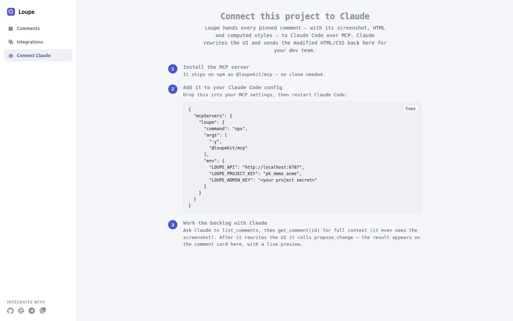

# Connect Claude Code and other MCP clients

This guide shows you how to give Claude Code, or any other MCP client, access to your Loupe comments. When you finish, you can ask the agent to list feedback, read one comment with its screenshot, and send a proposed fix back to Loupe.

The Model Context Protocol (MCP) is a protocol that lets an AI agent call tools that a separate program, the MCP server, provides. Loupe ships two MCP servers. Pick the one that matches where your comments live:

| Server | Use it when | Tools | How it reads comments |
|---|---|---|---|
| `@loupekit/mcp` (Node) | You run the Loupe server (`npm start`, port 8787 by default) | 19 | Calls the Loupe server's HTTP API with your project secret |
| The Laravel package's `loupe` server | Your app uses `loupekit/laravel` | 4 | Reads your app's database directly |

The Node server also starts a local *bridge*: a small HTTP server on `127.0.0.1` that the widget and the Claude Code hooks talk to. The optional procedures in this guide use it.

**Contents**

- [Before you begin](#before-you-begin)
- [Procedure A: Connect the Node server to Claude Code](#procedure-a-connect-the-node-server-to-claude-code)
- [Procedure B: Connect the Node server to another MCP client](#procedure-b-connect-the-node-server-to-another-mcp-client)
- [Procedure C: Connect the Laravel server](#procedure-c-connect-the-laravel-server)
- [Optional: Stream agent activity with hooks](#optional-stream-agent-activity-with-hooks)
- [Optional: Let Claude open pull requests](#optional-let-claude-open-pull-requests)
- [Optional: Chat from the page](#optional-chat-from-the-page)
- [Optional: Disable the bridge](#optional-disable-the-bridge)
- [Verify](#verify)
  - [Verify the Node server](#verify-the-node-server)
  - [Verify the Laravel server](#verify-the-laravel-server)
- [Troubleshooting](#troubleshooting)
- [Next steps](#next-steps)

## Before you begin

For the Node server (procedures A and B), you need:

- **Node.js.** The `npx` setup does not require a specific version. The clone workaround in procedure A runs a TypeScript file directly, which needs Node.js 24 or later.
- **A running Loupe server.** See [Run the local server](run-local-server.md). Note its base URL, for example `http://localhost:8787`.
- **The project key and the project secret.** The project secret is the value the server accepts in the `X-Loupe-Admin` header. For the demo project created by `npm run seed`, the key is `pk_demo_acme` and the secret is printed as `admin key`. Its default is `sk_demo_acme_0f3b9c`, unless you set `LOUPE_DEMO_SECRET` before seeding.
- **An MCP client.** This guide uses Claude Code. To install it and get the `claude` command, see [Set up Claude Code](https://code.claude.com/docs/en/setup).

For the Laravel server (procedure C), you need:

- **The Laravel package installed and migrated.** See [Install the Laravel package](laravel-install.md).
- **Shell access** to a machine that holds the app and can reach its database.

## Procedure A: Connect the Node server to Claude Code

Claude Code reads project-scoped MCP servers from a file named `.mcp.json` in the root of your project.

1. Open your project in a terminal, and create or open `.mcp.json` in its root directory.

2. Add a `loupe` entry under `mcpServers`:

   ```json
   {
     "mcpServers": {
       "loupe": {
         "command": "npx",
         "args": ["-y", "@loupekit/mcp"],
         "env": {
           "LOUPE_API": "<API_URL>",
           "LOUPE_PROJECT_KEY": "<PROJECT_KEY>",
           "LOUPE_ADMIN_KEY": "<PROJECT_SECRET>"
         }
       }
     }
   }
   ```

   Replace the placeholders:

   - `<API_URL>`: the base URL of your Loupe server, for example `http://localhost:8787`. If you leave `LOUPE_API` out, the server uses `http://localhost:8787`.
   - `<PROJECT_KEY>`: your project key, for example `pk_demo_acme`.
   - `<PROJECT_SECRET>`: your project secret, for example `sk_demo_acme_0f3b9c` for the demo project. Keep this file out of version control if it holds a real secret.

   > [!IMPORTANT]
   > The published `@loupekit/mcp` 0.14.0 package fails at start with `ERR_MODULE_NOT_FOUND` for `@loupekit/shared`. Its compiled entry imports `@loupekit/shared`, but the package lists it only as a development dependency, so `npx` does not install it. Until a fixed release is published, run the server from a clone of the repository instead:
   >
   > 1. Clone and build the shared package:
   >
   >    ```bash
   >    git clone https://github.com/mohamed-ashraf-elsaed/loupe.git
   >    cd loupe
   >    npm install
   >    npm run build:shared
   >    ```
   >
   > 2. In `.mcp.json`, replace `command` and `args` with:
   >
   >    ```json
   >    "command": "node",
   >    "args": ["<ABSOLUTE_PATH_TO_CLONE>/packages/mcp/index.ts"]
   >    ```
   >
   >    `<ABSOLUTE_PATH_TO_CLONE>` is the full path of the `loupe` directory you cloned, for example `/home/sara/src/loupe`. Node 24 runs the TypeScript entry directly. Keep the `env` block unchanged.

   The local dashboard shows the same configuration, already filled in with your API URL and project key, on its **Connect Claude** page. To copy it, open `<API_URL>/dashboard/` (for example `http://localhost:8787/dashboard/`), click **Connect Claude** in the left navigation, then click **Copy**.

   

   The copied snippet differs from a working 0.14.0 configuration in two ways. After you paste it, fix both:

   - It always uses `"command": "npx"` and `"args": ["-y", "@loupekit/mcp"]`. Until a fixed release is published, replace `command` and `args` with the clone values from the note above.
   - Its `LOUPE_ADMIN_KEY` is the literal text `<your project secret>`. Replace it with your project secret, or every tool fails with `401`.

3. Save `.mcp.json`, then start Claude Code from the same project directory:

   ```bash
   claude
   ```

   You should see Claude Code ask whether to trust the project's MCP servers.

4. Approve `loupe`.

5. In Claude Code, run `/mcp`.

   You should see `loupe` listed as connected.

Continue with [Verify](#verify).

## Procedure B: Connect the Node server to another MCP client

The Node server uses the stdio transport: the client starts it as a child process and talks to it over standard input and output. Any MCP client that can launch a stdio server can use it.

1. Open your client's MCP server configuration. Its file name and format depend on the client.

2. Add a server with the same three parts as in [Procedure A](#procedure-a-connect-the-node-server-to-claude-code):

   | Part | Value |
   |---|---|
   | Command | `npx` (or `node` for a clone, see the note in procedure A) |
   | Arguments | `-y`, `@loupekit/mcp` (or `<ABSOLUTE_PATH_TO_CLONE>/packages/mcp/index.ts`) |
   | Environment | `LOUPE_API`, `LOUPE_PROJECT_KEY`, `LOUPE_ADMIN_KEY` |

3. Restart the client, or reload its MCP servers.

   You should see a server that offers 19 tools, starting with `list_comments` and `get_comment`.

## Procedure C: Connect the Laravel server

The Laravel package registers a local (stdio) MCP server named `loupe` with four tools. It reads comments from your app's database, so it needs no Loupe server and no project secret. Its routes file is loaded only when the `laravel/mcp` package is installed.

1. In your Laravel app's root directory, install `laravel/mcp`:

   ```bash
   composer require laravel/mcp:^0.8 --dev
   ```

   Drop `--dev` if the machine that runs the agent installs production dependencies only.

2. Confirm that the server starts:

   ```bash
   php artisan mcp:start loupe
   ```

   The command waits for input on stdin. Press `Ctrl+C` to stop it.

3. Add the server to your MCP client. For Claude Code, add this entry to `.mcp.json` in your project's root:

   ```json
   {
     "mcpServers": {
       "loupe": {
         "command": "php",
         "args": ["<ABSOLUTE_PATH_TO_APP>/artisan", "mcp:start", "loupe"]
       }
     }
   }
   ```

   `<ABSOLUTE_PATH_TO_APP>` is the full path of your Laravel app, for example `/home/sara/src/shop`. Artisan loads the app, its `.env` and its database connection from that directory.

4. Restart Claude Code and run `/mcp`.

   You should see `loupe` listed as connected.

The Laravel server's tools take their names from their class names. With `laravel/mcp` 0.8 these are `list-comments`, `get-comment`, `propose-change` and `update-status`. They do the same jobs as the Node tools `list_comments`, `get_comment`, `propose_change` and `update_status`. The optional procedures below apply to the Node server only.

## Optional: Stream agent activity with hooks

Claude Code *hooks* are commands that Claude Code runs on events such as a tool call or a new prompt. Loupe's hooks send these events to the bridge, so you can watch what the agent does on a live page.

1. In Claude Code, ask:

   ```text
   Install the Loupe agent hooks.
   ```

   Claude calls the `install_agent_hooks` tool. It adds Loupe hooks for `SessionStart`, `UserPromptSubmit`, `PreToolUse`, `PostToolUse`, `SubagentStop`, `Notification` and `SessionEnd` to `$HOME/.claude/settings.json`. Before it writes, it copies the existing file to `$HOME/.claude/settings.json.loupe-backup`. It leaves other hook entries untouched.

   You should see a reply that starts with `Installed into` and names the settings file and the hook script. If the settings file already existed, the reply also names the backup on a `Backup:` line. If the hooks are already installed and current, the reply is `Already installed and current — nothing to change` instead.

2. Restart Claude Code so the hooks take effect.

3. Ask Claude for the dashboard address:

   ```text
   Give me the Loupe activity dashboard URL.
   ```

   Claude calls `get_dashboard_url`. With the default bridge port the address is `http://127.0.0.1:9800/monitor`.

4. Open that address in a browser, then give Claude a task.

   You should see the **Loupe · agent activity** page fill with tool calls, sessions and touched files.

   

To write the hooks to a different settings file, ask Claude to pass a `path` to `install_agent_hooks`, or set `LOUPE_CLAUDE_SETTINGS` in the server's `env`.

## Optional: Let Claude open pull requests

The `create_pr_for_thread` tool commits a fix to GitHub and opens a pull request for the comment, which Loupe calls a *thread*. Every fix for a repository accumulates as its own commit on one branch, `loupe/fixes`, under one pull request titled `Feedback Fixes`. Its body keeps a table of the fixes.

1. Give the server a GitHub token, in one of two ways:

   - Add `GITHUB_TOKEN` to the `env` block of the `loupe` server. Use a fine-grained personal access token with **Contents** and **Pull requests** set to **Read and write** on the repository.

     ```json
     "env": {
       "LOUPE_API": "<API_URL>",
       "LOUPE_PROJECT_KEY": "<PROJECT_KEY>",
       "LOUPE_ADMIN_KEY": "<PROJECT_SECRET>",
       "GITHUB_TOKEN": "<GITHUB_TOKEN>"
     }
     ```

   - Or sign in with the GitHub CLI on the same machine. The server reads the token from `gh auth token` when `GITHUB_TOKEN` is not set:

     ```bash
     gh auth login
     ```

2. Restart Claude Code if you changed `.mcp.json`.

3. Ask Claude to fix a comment and open a pull request, naming the repository:

   ```text
   Fix comment <COMMENT_ID> in acme/web and open a pull request.
   ```

   `<COMMENT_ID>` is the id that `list_comments` prints after `#`.

   You should see a reply with the pull request URL, the branch `loupe/fixes`, the commit and an outcome of `created`, `appended` or `restarted`. The comment card shows the pull request number.

## Optional: Chat from the page

The widget's Chat tab sends messages from the page to the agent through the bridge. It is experimental and off by default.

Before you start, check these prerequisites:

- **A page that embeds the SDK** and calls `Loupe.init()`. See [Add Loupe to a page with a script tag](embed-script-tag.md).
- **The page is served from `localhost`, `127.0.0.1` or `[::1]`.** The bridge answers cross-origin requests only from those hosts and from `chrome-extension://` origins. It refuses every other origin, so a page on a host such as `shop.example.com` cannot reach it and chat never connects.

1. In the page that embeds the SDK, pass the bridge address and turn on chat in `init()`:

   ```js
   Loupe.init({
     projectKey: "<PROJECT_KEY>",
     user: { id: "u_92", name: "Sara" },
     apiBase: "<API_URL>",
     bridge: "http://127.0.0.1:9800",
     chat: true,
   });
   ```

2. Reload the page and open the Chat tab.

   You should see the tab enabled instead of dimmed. Messages you send reach the agent the next time it calls any Loupe tool, or when it calls `get_companion_messages`.

## Optional: Disable the bridge

If you do not need hooks, chat or presence, turn the bridge off. The comment tools keep working.

1. Add `LOUPE_BRIDGE_PORT` with the value `0` to the server's `env` block:

   ```json
   "LOUPE_BRIDGE_PORT": "0"
   ```

2. Restart Claude Code.

   You should see `bridge=disabled` at the end of the server's start-up line.

## Verify

### Verify the Node server

Use these steps if you followed procedure A or B.

1. Quit Claude Code, or any other client that runs the `loupe` server. A running client's copy of the server holds bridge port 9800, and a second copy started now waits about 7.5 seconds, then starts without a bridge.

2. Start the Node server by hand, with the same environment as your client configuration, to see its start-up line on standard error. This example uses the demo project's values; replace them with your own:

   ```bash
   LOUPE_API=http://localhost:8787 LOUPE_PROJECT_KEY=pk_demo_acme LOUPE_ADMIN_KEY=sk_demo_acme_0f3b9c npx -y @loupekit/mcp
   ```

   Use `node <ABSOLUTE_PATH_TO_CLONE>/packages/mcp/index.ts` in place of `npx -y @loupekit/mcp` if you run from a clone. You should see:

   ```text
   [loupe-mcp] connected · project=pk_demo_acme · api=http://localhost:8787 · bridge=http://127.0.0.1:9800
   ```

   If the line ends with `bridge=disabled` and you see `[loupe] bridge port 9800 is busy after 6 attempts — continuing without it` above it, another process still holds the port. See [Troubleshooting](#troubleshooting).

3. Press `Ctrl+C` to stop the server, then start Claude Code again.

4. Ask Claude:

   ```text
   List my Loupe comments.
   ```

   You should see Claude call `list_comments` and reply with a line such as `3 comment(s):`, followed by one entry per comment: its stage, priority, change type, id, title and request, then a line with the target element, page and author. The reply ends with `Use get_comment(id) for the full element context.` If the project has no matching comments, you see `No comments match.`

### Verify the Laravel server

Use these steps if you followed procedure C.

1. In Claude Code, run `/mcp`.

   You should see `loupe` listed as connected.

2. Ask Claude:

   ```text
   List my Loupe comments.
   ```

   You should see Claude call `list-comments` and receive JSON with a `count` field and a `comments` array. Each entry holds fields such as `id`, `status`, `priority`, `changeType`, `title`, `body` and `url`. If the project has no comments, `count` is `0`.

## Troubleshooting

| Symptom | Cause | Fix |
|---|---|---|
| The server exits at start with `ERR_MODULE_NOT_FOUND` for `@loupekit/shared`. | The published `@loupekit/mcp` 0.14.0 package does not declare `@loupekit/shared` as a runtime dependency. | Run the server from a clone, as the note in [procedure A](#procedure-a-connect-the-node-server-to-claude-code) describes. |
| A tool fails with an error such as `GET /v1/comments?projectKey=pk_demo_acme → 401`. | `LOUPE_ADMIN_KEY` is missing or is not the project secret. The server answers 401 to a wrong `X-Loupe-Admin` value. | Set `LOUPE_ADMIN_KEY` to the project secret, then restart the client. |
| A tool fails with `→ 404`, for example `GET /v1/comments?projectKey=pk_demo_acme → 404` or `GET /v1/comments/<COMMENT_ID> → 404`. | `LOUPE_PROJECT_KEY` names a project the server does not know, or the comment id does not exist. | Use a key that exists, for example `pk_demo_acme` after `npm run seed`. For a comment id, run `list_comments` and copy an id it prints after `#`. |
| The log shows `[loupe] bridge port 9800 is busy after 6 attempts — continuing without it`. | Another process, often a second Loupe MCP server, holds port 9800. The server retries 5 times, 1.5 seconds apart, then runs without a bridge. | Stop the other process, or set `LOUPE_BRIDGE_PORT` to a free port. The comment tools work either way. |
| `get_dashboard_url` replies `The activity dashboard is not running`. | The bridge did not start, or `LOUPE_BRIDGE_PORT` is `0`. | Free the port or remove `LOUPE_BRIDGE_PORT`, then restart the client. |
| The `get_recent_events` tool always fails. | A known defect in 0.14.0: the tool's handler reads a variable before it is defined. | Use `get_activity_summary` or `get_files_touched` instead, or open the `/monitor` page. |
| `create_pr_for_thread` replies `No GitHub token is configured, so I cannot open a pull request.` | Neither `GITHUB_TOKEN`, `GH_TOKEN` nor `gh auth token` gave a usable token. A value that looks like a placeholder is ignored. | Follow [Let Claude open pull requests](#optional-let-claude-open-pull-requests). |
| `install_agent_hooks` replies `Could not install: settings file is not valid JSON`. | The settings file has a syntax error, so Loupe refuses to overwrite it. | Fix the JSON in `$HOME/.claude/settings.json`, then ask again. |
| `php artisan mcp:start loupe` fails with `Command "mcp:start" is not defined.` | `laravel/mcp` is not installed. Without it the `mcp:start` command does not exist, and the package does not load its MCP routes. | Run `composer require laravel/mcp:^0.8 --dev` in the app's root directory, then run `php artisan mcp:start loupe` again. |
| The Chat tab is enabled, but messages never reach the agent and the browser console shows a CORS error for `http://127.0.0.1:9800`. | The page is served from a host other than `localhost`, `127.0.0.1` or `[::1]`. The bridge refuses requests from every other origin. | Serve the page from `localhost` or `127.0.0.1`. See [Chat from the page](#optional-chat-from-the-page). |
| Claude Code does not list `loupe` in `/mcp`. | `.mcp.json` is not in the directory where you started Claude Code, or you declined the trust prompt. | Start Claude Code from the project root and approve the server. |

## Next steps

- [MCP server reference](../reference/mcp.md): every tool, environment variable and bridge route.
- [Run the local server](run-local-server.md): start the API and dashboard that the Node server reads.
- [Install the Laravel package](laravel-install.md): set up the app that the Laravel server reads.
