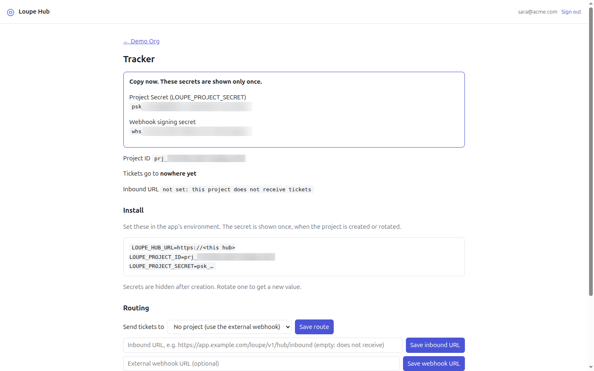
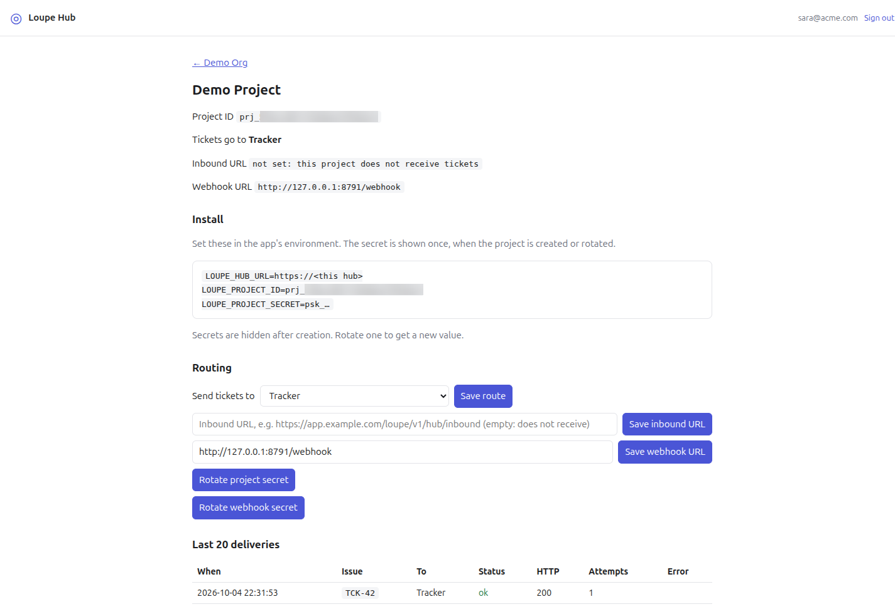
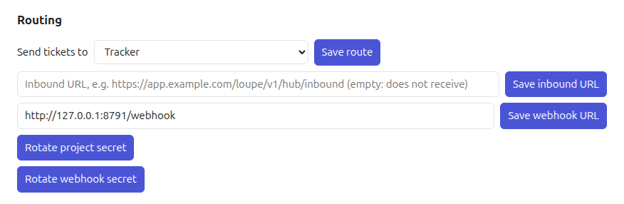

# Manage Hub organizations and projects

This guide shows you how to use the Loupe Hub dashboard to create an organization, control who belongs to it, create one project per app, and decide where each project's tickets go.

Loupe Hub groups apps into **organizations**. An organization holds **members** and **projects**. A project stands for one app that sends tickets to Hub, receives tickets from Hub, or both. A **ticket** is a Loupe comment that Hub carries from one project to another project or to an external webhook.

Three kinds of people use an organization:

| Who | How they get access | What they can do |
|---|---|---|
| **Owner** | Creates the organization, or an owner adds them with the role `owner`. | View the organization and its projects, and change everything on this page. |
| **Member** | An owner adds them with the role `member`. | View the organization and project pages. They cannot change anything. |
| **Domain-allowed user** | Their email ends in the organization's allowed domain. | Submit tickets from a connected app. They do not see the organization in the dashboard. |

Every change in this guide is owner-only. A member sees the organization and project pages without the forms that make changes: **Add member**, **Save domain**, **Remove**, **New project**, **Routing** and the rotate buttons. If a member's browser still sends one of these forms, for example from a page loaded before an owner changed their role, Hub answers `Only an organization owner can do that`.

## Contents

- [Prerequisites](#prerequisites)
- [Sign in](#sign-in)
- [Create an organization](#create-an-organization)
- [Add or remove members](#add-or-remove-members)
- [Allow everyone at a domain to submit](#allow-everyone-at-a-domain-to-submit)
- [Create a project](#create-a-project)
- [Connect an app](#connect-an-app)
- [Receive tickets](#receive-tickets)
- [Route tickets to another project](#route-tickets-to-another-project)
- [Send tickets to an external webhook](#send-tickets-to-an-external-webhook)
- [Rotate a secret](#rotate-a-secret)
- [Read deliveries](#read-deliveries)
- [Verify](#verify)
- [Troubleshooting](#troubleshooting)
- [Next steps](#next-steps)

## Prerequisites

You need:

- **A running Loupe Hub** that you can open in a browser, for example `https://hub.example.com`. To run your own, see [Self-host Loupe Hub](hub-self-host.md).
- **Hub served over HTTPS.** Hub marks its session cookie `Secure`, so the browser does not keep it over plain HTTP. Without HTTPS you choose your Google account and land back on **Sign in**.
- **`GOOGLE_CLIENT_ID` set on that Hub.** Hub signs people in with Google only. Without this variable the sign-in page cannot show the Google button.
- **`<HUB_URL>` listed as an Authorized JavaScript origin** on that Google OAuth client, of type **Web application**. Without it, Google refuses the sign-in with an `origin_mismatch` error. See [Create the Google OAuth client](hub-self-host.md#create-the-google-oauth-client).
- **A Google account with a verified email address.**
- **For each app you connect:** an app that runs the Loupe Laravel package. See [Install the Laravel package](laravel-install.md).
- **For each app that sends tickets:** a running queue worker (`php artisan queue:work`), or `QUEUE_CONNECTION=sync` in the app's `.env`. On any other queue connection the package queues each ticket as a job, and without a worker the ticket never reaches Hub.

In the steps below, replace these placeholders:

| Placeholder | Meaning | Example |
|---|---|---|
| `<HUB_URL>` | The address you open Hub at. | `https://hub.example.com` |
| `<APP_HOST>` | The public host name of an app that receives tickets. | `tracker.example.com` |
| `<PROJECT_ID>` | A project's ID, shown on its page: `prj_` followed by 24 hexadecimal characters. | `prj_000000000000000000000000` (fake) |
| `<PROJECT_SECRET>` | A project's secret, shown once: `psk_` followed by 32 letters, digits, `-` or `_`. | `psk_AAAAAAAAAAAAAAAAAAAAAAAAAAAAAAAA` (fake) |

## Sign in

1. Open `<HUB_URL>` in your browser.

   You should see a page titled **Sign in** with the text "Sign in with your Google account to manage organizations and projects." and a **Sign in with Google** button.

   

2. Click the Google button and choose your account.

   You should land on the **Organizations** page. Your email and a **Sign out** link appear in the top right corner. If you do not belong to any organization yet, the page says "You are not a member of any organization yet." above the **New organization** form.

Any Google account with a verified email can sign in, and anyone who signs in can create an organization. Signing in does not give access to an existing organization; an owner has to add you. Your session lasts seven days.

## Create an organization

1. On the **Organizations** page, find the **New organization** form.
2. In **Name**, type the organization's name, for example `Acme`. The name can be up to 100 characters.
3. Optional: in **Allowed email domain (optional), e.g. acme.com**, type a domain such as `acme.com`. See [Allow everyone at a domain to submit](#allow-everyone-at-a-domain-to-submit) for what it does. You can set it later.
4. Click **Create**.

   You should see the organization's page. It shows the **Organization ID**, `your role: owner`, and your email in the **Allowed members** table with the role `owner`.

The **Organizations** page lists every organization you belong to, with **Your role** beside each one.


## Add or remove members

Members are identified by their Google email. An email is stored in lower case, so `Sara@Acme.com` and `sara@acme.com` are the same member.

### Add a member

1. Open the organization from the **Organizations** page.
2. Under **Allowed members**, type the person's address in **Google email**, for example `dev@acme.com`.
3. In the role select, choose `member` or `owner`.
4. Click **Add member**.

   You should see the email in the **Allowed members** table with the role you chose.


### Change a member's role

Add the same email again with the new role. Hub updates the existing entry instead of creating a second one.

1. Type the member's email in **Google email**.
2. Choose the new role.
3. Click **Add member**.

   You should see the same email once in the table, with the new role.

> **Warning:** Hub does not stop you from demoting the last owner. If the only owner changes their own role to `member`, the organization has no owner left, and nobody can add members, change the domain, or change any project. Add a second owner before you change your own role.

### Remove a member

1. In the **Allowed members** table, click **Remove** next to the email.

   You should see the email disappear from the table.

Hub refuses to remove the last owner. If you try, Hub keeps them and shows `An organization needs at least one owner`. This check covers removal only; see the warning under [Change a member's role](#change-a-members-role). To hand over ownership, add the new owner first, then remove the old one.

## Allow everyone at a domain to submit

An allowed domain lets anyone whose email ends in that domain submit tickets from a connected app, without adding each person as a member. These users cannot open the organization in the dashboard.

1. Open the organization.
2. In the field **Allowed domain, e.g. acme.com (empty to clear)**, type the domain, for example `acme.com`. A leading `@` is removed for you.
3. Click **Save domain**.

   You should see the sentence under **Allowed members** change to "Issues are accepted from these Google emails, and from any `@acme.com` email."

To stop accepting the domain, clear the field and click **Save domain**.

The match is exact. Hub compares the text after the last `@` in the email with the domain:

| Email | Allowed domain `acme.com` | Accepted? |
|---|---|---|
| `sara@acme.com` | matches | Yes |
| `sara@ACME.com` | matches, because emails are lower-cased | Yes |
| `sara@eu.acme.com` | does not match | No, unless `sara@eu.acme.com` is a member |
| `sara@acme.com.example.net` | does not match | No |

Members can always submit, whatever their email domain.

## Create a project

Create one project for each app that sends or receives tickets.

1. Open the organization.
2. Under **New project**, type a name in **Project name**, for example `Tracker`. The name can be up to 100 characters.
3. Optional: in **External webhook URL (optional)**, enter an `http://` or `https://` URL. See [Send tickets to an external webhook](#send-tickets-to-an-external-webhook).
4. Click **Create project**.

   You should see the project's page with a card that says **Copy now. These secrets are shown only once.** The card holds two values:

   - **Project Secret (LOUPE_PROJECT_SECRET)**, starting with `psk_`. The app uses it to sign its requests to Hub, and Hub uses it to sign the tickets it delivers to this project.
   - **Webhook signing secret**, starting with `whs_`. Hub uses it to sign deliveries to this project's external webhook.

   

5. Copy both values to a password manager or your app's secret store now.

Hub never shows these values again. If you lose one, [rotate it](#rotate-a-secret) to get a new value.

Hub has no way to delete a project or an organization from the dashboard.

## Connect an app

The project page has an **Install** block with the three environment variables the Laravel package reads.



1. Open the project's page.
2. Copy the **Install** block into the app's `.env` file, and fill in the two values the block does not show:

   ```dotenv
   LOUPE_HUB_URL=<HUB_URL>
   LOUPE_PROJECT_ID=<PROJECT_ID>
   LOUPE_PROJECT_SECRET=<PROJECT_SECRET>
   ```

   - `<HUB_URL>`: the address of this Hub. The block shows it as `https://<this hub>`.
   - `<PROJECT_ID>`: the **Project ID** on the page. The block fills it in for you.
   - `<PROJECT_SECRET>`: the `psk_` value you copied when you created the project or last rotated it. The block shows `psk_…` only.

3. Reload the app's configuration so it reads the new values:

   - If the app caches its configuration, as most production deployments do, rebuild the cache:

     ```bash
     php artisan config:cache
     ```

   - Otherwise, clear any stale cache:

     ```bash
     php artisan config:clear
     ```

4. Check that the app sees the project ID:

   ```bash
   php artisan tinker --execute="echo config('loupe.hub.project_id');"
   ```

   You should see your project ID, for example `prj_000000000000000000000000`. If the output is empty, the app does not read the new `.env` values yet.

The package sends each new comment to Hub, and only when all three values are set. Edits to a comment are not sent. For the full app-side setup, see [Connect apps to Hub](hub-connect-apps.md).

## Receive tickets

A project receives tickets only after you give it an **inbound URL**: the address where Hub posts tickets for this project. With the Laravel package's default `loupe` route prefix, that address is `https://<APP_HOST>/loupe/v1/hub/inbound`. If you set `LOUPE_PATH` in the app, replace `/loupe` with your value. See the `path` option in the [Laravel package reference](../LARAVEL.md#configuration).

1. Open the project's page.
2. In the field whose placeholder reads **Inbound URL, e.g. https://app.example.com/loupe/v1/hub/inbound (empty: does not receive)**, enter the URL, for example:

   ```text
   https://tracker.example.com/loupe/v1/hub/inbound
   ```

3. Click **Save inbound URL**.

   You should see the **Inbound URL** line near the top of the page show your URL, instead of `not set: this project does not receive tickets`. On the organization page, the project's **Receives** column changes to `yes`.

The receiving app must hold this project's own ID and secret in its `.env` (see [Connect an app](#connect-an-app)), because Hub signs each ticket with that secret.

To stop receiving, clear the field and click **Save inbound URL**. Clearing it also clears the route of every project that sent tickets to this one, so those projects fall back to their external webhook, or to nowhere.

## Route tickets to another project

You can send one project's tickets to another project in the same organization. For example, a shop app can send its tickets to an issue tracker app.

1. Make sure the destination project has an inbound URL. See [Receive tickets](#receive-tickets).
2. Open the **source** project's page.
3. Under **Routing**, open the **Send tickets to** select.

   The select lists only the other projects in this organization that have an inbound URL. A project that does not receive tickets is not offered.

   

4. Choose the destination, for example `Tracker`.
5. Click **Save route**.

   You should see **Tickets go to Tracker** near the top of the page. On the organization page, the **Tickets go to** column shows `Tracker` for this project.

To remove the route, choose **No project (use the external webhook)** and click **Save route**.

If Hub refuses the route, it shows one of these messages:

| Message | Cause |
|---|---|
| `That project does not exist` | The chosen project was not found. |
| `Tickets can only go to a project in the same organization` | The destination belongs to another organization. |
| `A project cannot send tickets to itself` | You chose the source project as its own destination. |
| `That project has no inbound URL, so it cannot receive tickets` | The destination has no inbound URL. |

## Send tickets to an external webhook

Instead of another project, a project can send its tickets to any HTTP endpoint you run, such as a bridge to a third-party tracker.

1. Open the project's page.
2. In **External webhook URL (optional)**, enter an `http://` or `https://` URL.
3. Click **Save webhook URL**.

   You should see a **Webhook URL** line with your URL near the top of the page.

Hub uses the webhook only when the project has no destination project. With a destination set, every ticket goes to the destination. To send tickets to the webhook again, choose **No project (use the external webhook)** under **Send tickets to**. With neither a destination nor a webhook, the page shows **Tickets go to nowhere yet** and Hub accepts tickets without delivering them.

Hub signs each webhook delivery with the project's **webhook signing secret**. To check the signature in your endpoint, see [Verify Hub webhook signatures](verify-hub-webhooks.md).

To remove the webhook, clear the field and click **Save webhook URL**.

## Rotate a secret

Rotate a secret when it leaks, when someone who knew it leaves, or when you lost it.

1. Open the project's page.
2. Click **Rotate project secret** or **Rotate webhook secret**.

   You should see a card that says **Copy now. These secrets are shown only once.** with **New Project Secret (LOUPE_PROJECT_SECRET)** or **New webhook signing secret**.

3. Copy the new value.
4. Update every place that uses it:

   | You rotated | Update |
   |---|---|
   | Project secret (`psk_`) | `LOUPE_PROJECT_SECRET` in every app connected to this project. |
   | Webhook signing secret (`whs_`) | The secret your external webhook uses to verify signatures. |

The old value stops working at once. There is no overlap period: until you update the app, its requests to Hub fail the signature check, and it rejects tickets Hub signs with the new secret. Plan the rotation for a moment when you can update the app right away.

## Read deliveries

The **Last 20 deliveries** table at the bottom of a project page shows the 20 newest tickets this project **sent**, newest first. It does not show tickets the project received; read those on the sending project's page. It also does not list status changes or replies that travel between apps after a ticket is delivered.

| Column | Meaning |
|---|---|
| **When** | The time Hub recorded the delivery, in UTC. |
| **Issue** | The ticket ID from the sending app. |
| **To** | The destination project's name, `webhook` for the external webhook, or the destination's project ID if that project is no longer in the organization. |
| **Status** | `ok` if the receiver answered with a 2xx status, otherwise `failed`. |
| **HTTP** | The last HTTP status the receiver returned, or `-` when no response came back. |
| **Attempts** | How many times Hub tried. Hub tries up to three times. |
| **Error** | The last error, for example `HTTP 500` or `timeout after 10000ms`. Empty on success. |

A ticket that Hub accepted with no destination and no webhook does not appear in the table.

## Verify

To check that an organization and its projects are set up:

1. Open the organization page. In the **Projects** table, check that:
   - each receiving project shows `yes` under **Receives**;
   - each sending project shows the destination name or its webhook URL under **Tickets go to**, not `-`.
2. In a connected app, sign in as a user who is a member or on the allowed domain, and leave a comment with the widget. For the steps, see [Use the Loupe widget](use-the-widget.md). The app must have a running queue worker, or `QUEUE_CONNECTION=sync`.

   You should see your comment in the widget's panel.

3. Open the sending project's page.

   You should see a new row at the top of **Last 20 deliveries** with **Status** `ok`.

## Troubleshooting

| Symptom | Cause | Fix |
|---|---|---|
| The sign-in page says `GOOGLE_CLIENT_ID is not configured on this server.` | The Hub server has no `GOOGLE_CLIENT_ID`. | Ask the person who runs Hub to set it and restart Hub. See [Self-host Loupe Hub](hub-self-host.md). |
| Sign-in fails with `sign-in rejected: email not verified` | The Google account's email is not verified. | Verify the email address with Google, then sign in again. |
| Google shows an `origin_mismatch` error after you click the Google button | `<HUB_URL>` is not an Authorized JavaScript origin of the Google OAuth client. | Add `<HUB_URL>`, with no trailing slash, under **Authorized JavaScript origins**. See [Create the Google OAuth client](hub-self-host.md#create-the-google-oauth-client). |
| After you choose an account, you land back on **Sign in** | Hub is served over plain HTTP, so the browser drops the `Secure` session cookie. | Serve Hub over HTTPS through a TLS-terminating proxy. See [Self-host Loupe Hub](hub-self-host.md). |
| `Organization not found` or `Project not found` | You are not a member of that organization. Hub answers the same way for an organization that does not exist, so non-members learn nothing. | Ask an owner to add your email under **Allowed members**. A domain-allowed user also sees this message, because the domain grants ticket submission only. |
| `Only an organization owner can do that` | You are a `member`, and the action is owner-only. | Ask an owner to make the change, or to give you the `owner` role. |
| `Bad origin` | The browser sent the form without an `Origin` header that matches the Hub host, for example through a proxy that rewrites the host. | Open Hub at its own address and submit the form again. If it persists, check the proxy forwards the original `Host` header. |
| `Name is required` or `Project name is required` | The name field was empty. | Enter a name and submit again. `Name is required` comes from the **Organizations** page and appears on a separate `400` error page: click **Home** and fill in the form again. |
| `Allowed domain is not a valid domain` | The domain has characters other than letters, digits, hyphens and dots, or no dot. | Enter a bare domain such as `acme.com`, with no `https://` and no path. If you were creating an organization, Hub shows this on a separate `400` error page: click **Home** and fill in the form again. |
| `Enter a valid email` | The text in **Google email** is not an email address. | Enter a full address such as `dev@acme.com`. |
| `An organization needs at least one owner` | You tried to remove the last owner. | Add another owner first, then remove this one. |
| `Webhook URL must be an http(s) URL` or `Inbound URL must be an http(s) URL` | The URL does not start with `http://` or `https://`, cannot be parsed, or is longer than 2000 characters. | Enter a full URL, for example `https://tracker.example.com/loupe/v1/hub/inbound`. |
| A project is missing from the **Send tickets to** select | That project has no inbound URL, or it belongs to another organization. | Set the destination's inbound URL first. See [Receive tickets](#receive-tickets). |
| A route disappeared | Someone cleared the destination project's inbound URL, which clears every route pointing at it. | Set the inbound URL again, then set the route again. |
| **Status** `failed` with **Error** `HTTP 401` | The receiving app rejected the signature, usually because its `LOUPE_PROJECT_SECRET` is out of date after a rotation, or its `LOUPE_PROJECT_ID` is another project's. | Put the receiving project's current ID and secret in that app's `.env`. If you lost the secret, rotate it. |
| **Status** `failed` with **Error** `HTTP 503` | The receiving app has no Hub settings. The Laravel package answers 503 when `LOUPE_HUB_URL`, `LOUPE_PROJECT_ID` or `LOUPE_PROJECT_SECRET` is missing. | Set all three in the receiving app. See [Connect an app](#connect-an-app). |
| **Error** `refused: <host> resolves to a private address (<ip>)` | Hub 0.14.1 and later refuse to deliver to loopback, private, link-local and other non-public addresses. | Use a public URL. For local development only, start Hub with `HUB_ALLOW_PRIVATE_URLS=1`. Never set it on a public Hub. |
| No row appears in **Last 20 deliveries** after a comment | One of these: (1) the project has no destination and no webhook, so Hub accepted the ticket without delivering it; (2) the app queues Hub jobs and no queue worker is running; (3) the comment's author is neither a member nor on the allowed domain, so Hub answered `403 user not in organization`; (4) the app user has no email, so the package did not send the comment; (5) the app's Hub settings are missing or wrong. | (1) Set a route or a webhook. (2) Run `php artisan queue:work`, or set `QUEUE_CONNECTION=sync`. (3) Add the author as a member, or set the allowed domain. The app records the rejection on the comment's `forwarded` field and in its Activity feed. (4) Give the user an email; the app logs `[loupe] not sending comment to Hub: the user has no email`. (5) Check the three `LOUPE_` values and the app's log. |

## Next steps

- [Connect apps to Hub](hub-connect-apps.md): configure the Laravel package to send and receive tickets.
- [Verify Hub webhook signatures](verify-hub-webhooks.md): check that a webhook delivery came from your Hub.
- [How Loupe Hub works](../explanation/hub.md): why routing, membership and signing work the way they do.
- [Loupe Hub reference](../reference/hub.md): every route, permission and error message.
