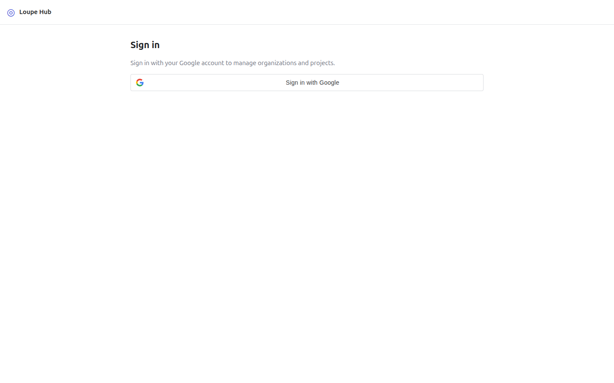
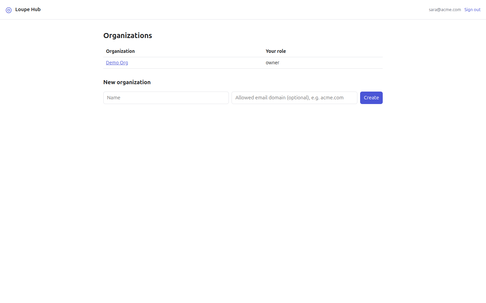

# Self-host Loupe Hub

This guide shows you how to run Loupe Hub on infrastructure you control. Loupe Hub is the service that holds organizations and projects and routes tickets between Loupe installs. A *Loupe install* is an app that runs the Loupe SDK or the Laravel package and sends its tickets to Hub. For the concepts, see [How Loupe Hub works](../explanation/hub.md).

You can deploy Hub to Google Cloud with the bundled scripts, or run it on any host that has Node 24.

Hub is not published to npm. The `@loupekit/hub` package is private, so you run it from a checkout of the Loupe repository.

**Contents**

- [Prerequisites](#prerequisites)
- [Create the Google OAuth client](#create-the-google-oauth-client)
- [Deploy to Google Cloud from zero](#deploy-to-google-cloud-from-zero)
- [Deploy code changes](#deploy-code-changes)
- [Run on any host](#run-on-any-host)
- [Verify](#verify)
- [Troubleshooting](#troubleshooting)
- [Operate it](#operate-it)
- [Next steps](#next-steps)

## Prerequisites

You need:

- **A checkout of the Loupe repository.** Every command below runs from the repository root.
- **For Google Cloud:**
  - The [Google Cloud CLI](https://cloud.google.com/sdk/docs/install) (`gcloud`).
  - A Google account with enough access:
    - **For a new project:** permission to create projects, and to link a billing account to them (for example the Billing Account User role on the billing account).
    - **For an existing project:** the scripts also enable APIs, add IAM bindings, create a VM and connect over IAP SSH. Use the Owner role on the project, or Editor plus Project IAM Admin and IAP-secured Tunnel User.
  - A Google Cloud billing account. You need its ID only when the project does not have billing enabled yet.
  - A domain name you control. This is optional: without one, the scripts use a free wildcard DNS name.
- **For any other host:** Node 24, a reverse proxy that terminates TLS, and a public DNS name for the host.
- **For sign-in:** a Google account that can open the Google Cloud console, to create an OAuth client.

The commands use these placeholders:

| Placeholder | Meaning | Example |
|---|---|---|
| `<GCP_PROJECT_ID>` | The Google Cloud project to create or reuse. Project IDs are globally unique, so pick one that nobody else uses. | `acme-loupe-hub` |
| `<BILLING_ACCOUNT_ID>` | Your billing account ID | `XXXXXX-XXXXXX-XXXXXX` |
| `<YOUR_GOOGLE_ACCOUNT>` | The account `gcloud` acts as | `sara@acme.com` |
| `<HUB_DOMAIN>` | The host name Hub is served on | `hub.example.com` |
| `<GOOGLE_CLIENT_ID>` | The OAuth Web client ID you create. An *OAuth client* is the record in Google Cloud that lets an app ask Google to sign people in; its client ID identifies Hub to Google. | `000000000000-example.apps.googleusercontent.com` |
| `<SESSION_SECRET>` | A random key that signs the session cookie (any host only) | the output of `openssl rand -hex 32` |
| `<RUN_USER>` | The operating system user that runs Hub (any host only) | `loupehub` |
| `<REPO_DIR>` | The absolute path of your Loupe checkout (any host only) | `/opt/loupe` |
| `<DATABASE_URL>` | A PostgreSQL connection string (any host only) | `postgresql://loupehub@/loupehub?host=/var/run/postgresql` |
| `<PG_DIR>` | Where the embedded database stores its files, when you do not use PostgreSQL (any host only) | `/var/lib/loupe-hub/pg` |

## Create the Google OAuth client

Hub signs people in with Google. It needs an OAuth client of type **Web application** whose authorized JavaScript origin is your Hub URL. You create it in the Google Cloud console; there is no gcloud command for this step.

You need `<HUB_DOMAIN>` for step 4:

- **On Google Cloud with your own domain**, use that domain.
- **On Google Cloud without a domain**, run [the provisioning script](#deploy-to-google-cloud-from-zero) first without `GOOGLE_CLIENT_ID`, then use the domain from its last line. Come back here afterwards.
- **On any other host**, use the public host name your reverse proxy serves.

1. In the Google Cloud console, select a project in the project picker. Any project works. On Google Cloud, select `<GCP_PROJECT_ID>` so that everything for Hub stays in one project.
2. Open **Google Auth Platform > Branding**. Enter an app name, for example `Loupe Hub`, a user support email, and a developer contact email. Save.
3. Open **Audience** and choose who can sign in:
   - **Internal**, if you use Google Workspace and only people in your Workspace organization use Hub.
   - **External**, then keep the app in **Testing** and add each person who signs in as a test user.

   > **Warning:** Do not publish an External app unless you want anyone to sign in. Hub accepts any Google account whose email is verified (`packages/hub/google.ts:21`), and any signed-in person can create an organization (`packages/hub/index.ts:390-397`). The Audience setting is the only control over who reaches the dashboard.

4. Open **Clients** and click **Create client**. For **Application type**, choose **Web application**. Under **Authorized JavaScript origins**, add `https://<HUB_DOMAIN>`, with no trailing slash. You do not need a redirect URI.
5. Click **Create**. The console shows the new client ID. Copy it; it ends in `.apps.googleusercontent.com`.
6. Give the client ID to Hub:
   - **On Google Cloud before you provision**, pass it as `GOOGLE_CLIENT_ID` in [step 2](#deploy-to-google-cloud-from-zero).
   - **On Google Cloud after you provision**, write it into `/etc/loupe-hub.env` on the VM and restart Hub:

     ```bash
     CLOUDSDK_ACTIVE_CONFIG_NAME=loupe-hub gcloud compute ssh loupe-hub --tunnel-through-iap --command \
       "sudo sed -i 's|^GOOGLE_CLIENT_ID=.*|GOOGLE_CLIENT_ID=<GOOGLE_CLIENT_ID>|' /etc/loupe-hub.env && sudo systemctl restart loupe-hub"
     ```

     Hub itself prints no output for this command. Use the same command to change the client ID later. You can also pass `GOOGLE_CLIENT_ID=<GOOGLE_CLIENT_ID>` to `provision.sh` again; it updates the same line.
   - **On any other host**, set `GOOGLE_CLIENT_ID` when you [start Hub](#run-on-any-host).

## Deploy to Google Cloud from zero

The scripts in `packages/hub/deploy/` are safe to run again: a re-run creates nothing twice and deletes nothing. A re-run is not free of side effects, though:

- It restarts PostgreSQL (`packages/hub/deploy/setup-vm.sh:52`) and Hub (`packages/hub/deploy/deploy.sh:27`), so Hub is briefly unavailable.
- If the VM `loupe-hub` runs as a service account other than `loupe-hub-vm`, it stops the VM, switches the account and starts it again, about one minute of downtime (`packages/hub/deploy/provision.sh:85-91`).
- It enables the APIs, adds the IAM bindings and sets the gcloud configuration's project, zone and region again each time. These calls do not check first, but repeating them changes nothing.

### 1. Create an isolated gcloud configuration

The scripts use only the gcloud configuration named `loupe-hub`. Your other configurations stay untouched.

1. Create the configuration without activating it:

   ```bash
   gcloud config configurations create loupe-hub --no-activate
   ```

   You should see output like `Created [loupe-hub].`

2. Set the account in that configuration:

   ```bash
   CLOUDSDK_ACTIVE_CONFIG_NAME=loupe-hub gcloud config set account <YOUR_GOOGLE_ACCOUNT>
   ```

   You should see output like `Updated property [core/account].`

3. Sign in with that account, so the configuration has credentials:

   ```bash
   CLOUDSDK_ACTIVE_CONFIG_NAME=loupe-hub gcloud auth login <YOUR_GOOGLE_ACCOUNT>
   ```

   A browser opens. Approve access. You should see output like `You are now logged in as [<YOUR_GOOGLE_ACCOUNT>].` If the account already has credentials in gcloud, you can skip this step.

### 2. Run the provisioning script

1. Run `provision.sh` with your project and billing account:

   ```bash
   GCP_PROJECT=<GCP_PROJECT_ID> \
   BILLING_ACCOUNT=<BILLING_ACCOUNT_ID> \
   HUB_DOMAIN=<HUB_DOMAIN> \
   GOOGLE_CLIENT_ID=<GOOGLE_CLIENT_ID> \
   bash packages/hub/deploy/provision.sh
   ```

   `BILLING_ACCOUNT`, `HUB_DOMAIN` and `GOOGLE_CLIENT_ID` are optional:

   - Leave out `BILLING_ACCOUNT` only if the project already has billing enabled.
   - Leave out `HUB_DOMAIN` to use the default domain.
   - Leave out `GOOGLE_CLIENT_ID` if you have not [created the OAuth client](#create-the-google-oauth-client) yet; you can add it later.

   The script prints a `==` header for each stage. It does the following, in order:

   | Stage | What it creates or changes |
   |---|---|
   | Project | Creates the project `<GCP_PROJECT_ID>` (display name "Loupe Hub") if it is missing, and links it to `<BILLING_ACCOUNT_ID>` if billing is not enabled. Sets the configuration's project, zone (`us-central1-a`) and region (`us-central1`), and enables the Compute, IAP and IAM APIs. |
   | Network | Creates the VPC `loupe-hub-net` with custom subnets, and the subnet `loupe-hub-net-us-central1` on `10.20.0.0/24`. The VPC is separate, so it has no default open SSH rule. |
   | Firewall | Creates `loupe-hub-web`, which allows TCP 80 and 443 from anywhere, and `loupe-hub-ssh-iap`, which allows TCP 22 only from Google Identity-Aware Proxy (IAP) at `35.235.240.0/20`. Both apply to VMs tagged `loupe-hub`. |
   | Static IP | Reserves the external IPv4 address `loupe-hub-ip` in the Standard network tier, and prints it. |
   | Service account | Creates `loupe-hub-vm`, and grants it only the `roles/logging.logWriter` and `roles/monitoring.metricWriter` roles. The VM runs as this account instead of the default compute account. |
   | VM | Creates the VM `loupe-hub`: `e2-micro`, Debian 12, a 30 GB `pd-standard` boot disk, the static IP, the `loupe-hub-vm` service account with the `cloud-platform` scope, and Shielded VM (secure boot, vTPM and integrity monitoring). On a re-run, if the existing VM runs as a different service account, the script stops the VM, switches the account and starts it again (about one minute of downtime; the static IP is kept). |
   | SSH | Prints `waiting for SSH over IAP…` and tries SSH through IAP up to 30 times, 10 seconds apart. If every try fails, the script does not stop here; it fails at the next stage. |
   | VM setup | Copies `setup-vm.sh`, `loupe-hub.service` and `Caddyfile` to the VM and runs `setup-vm.sh` as root. See the next table. |
   | Code | Runs `deploy.sh`, which ships the code and starts Hub. See [Deploy code changes](#deploy-code-changes). |

   The static IP and the VM are billable resources.

   `setup-vm.sh` installs and configures the VM:

   | Item | What it does |
   |---|---|
   | Swap | Adds a 1 GB `/swapfile`, because an `e2-micro` has 1 GB of RAM. |
   | Packages | Installs `curl`, CA certificates, `gnupg`, the Debian keyrings, `apt-transport-https` and `unattended-upgrades`. |
   | Node 24 | Installs Node 24 from NodeSource. |
   | PostgreSQL 16 | Installs PostgreSQL 16 from the PostgreSQL apt repository and makes it listen on `localhost` only. |
   | Caddy | Installs Caddy, the web server that obtains and renews the HTTPS certificate. |
   | System user and database | Creates the system user `loupehub` (home `/opt/loupe-hub`, no login shell), a PostgreSQL role `loupehub`, and a database `loupehub` it owns, then restarts PostgreSQL. Hub connects over the Unix socket with *peer authentication*: PostgreSQL trusts the operating system user name, so the `loupehub` user logs in as the `loupehub` role with no database password. |
   | `/etc/loupe-hub.env` | Writes the environment file once, owned by root with mode `0600`. It sets `NODE_ENV=production`, `HOST=127.0.0.1`, `PORT=8790`, `DATABASE_URL`, a generated `HUB_SESSION_SECRET` (from `openssl rand -hex 32`) and `GOOGLE_CLIENT_ID`. Later runs never rotate the session secret, and update `GOOGLE_CLIENT_ID` only when you pass one. |
   | systemd unit | Installs and enables `loupe-hub.service`, which runs `node index.ts` as `loupehub` from `/opt/loupe-hub`, restarts on failure, and runs with a read-only system and code directory. |
   | Caddyfile | Writes `/etc/caddy/Caddyfile` for your domain and reloads Caddy. |

   When the script finishes, the last line is:

   ```text
   Loupe Hub: https://<HUB_DOMAIN>
   ```

   If you did not set `HUB_DOMAIN`, the domain is the VM's IP address with dots replaced by dashes, followed by `.sslip.io`. For example, for the address `203.0.113.10` the domain is `203-0-113-10.sslip.io`. sslip.io is a public wildcard DNS service that resolves that name to the IP address, so HTTPS works with no DNS setup.

2. If you set your own `HUB_DOMAIN`, create a DNS `A` record that points `<HUB_DOMAIN>` at the static IP address the script printed. Then check that the name resolves:

   ```bash
   dig +short <HUB_DOMAIN>
   ```

   You should see the static IP address. Caddy obtains the certificate once the name resolves to the VM. If you did not set `HUB_DOMAIN`, skip this step.

3. If you did not pass `GOOGLE_CLIENT_ID`, [create the OAuth client](#create-the-google-oauth-client) now, and set it on the VM as its step 6 shows.

## Deploy code changes

Run `deploy.sh` every time you change the Hub code or pull a new version:

```bash
GCP_PROJECT=<GCP_PROJECT_ID> bash packages/hub/deploy/deploy.sh
```

The script:

1. Packs only the runtime files: `package.json`, the top-level `*.ts` files and `tools/`. It leaves out tests, local data, `node_modules` and `deploy/`.
2. Copies the archive to the VM over IAP.
3. Extracts it to `/opt/loupe-hub.new` and runs `npm install --omit=dev`.
4. Deletes `/opt/loupe-hub.old`, moves the current release to `/opt/loupe-hub.old`, moves the new release to `/opt/loupe-hub`, and restarts the `loupe-hub` service.
5. Polls `http://127.0.0.1:8790/v1/health` on the VM, up to 20 times, one second apart.

When the health check passes, you should see:

```text
{"ok":true}
deploy: ok
```

If the health check fails 20 times, the script prints the last 50 lines of the service log (`journalctl -u loupe-hub -n 50`) and exits with status 1.

Hub applies database schema changes itself every time it starts, so you do not run a separate migration step.

## Run on any host

You can run Hub without Google Cloud on any host with Node 24. Node 24 runs Hub's TypeScript files directly, so there is no build step. These steps assume a Linux host with systemd, and Caddy as the reverse proxy.

1. Install the dependencies from the repository root:

   ```bash
   npm install
   ```

2. [Create the Google OAuth client](#create-the-google-oauth-client) for `https://<HUB_DOMAIN>`, and keep the client ID.

3. Generate a session secret and keep it. Hub signs the session cookie with it, so changing it signs everyone out.

   ```bash
   openssl rand -hex 32
   ```

   You should see a 64-character hexadecimal string. Use it as `<SESSION_SECRET>`.

4. Choose a database:

   - **(a) PostgreSQL.** Create a role named after `<RUN_USER>` and a database it owns. These commands mirror `setup-vm.sh`:

     ```bash
     sudo -u postgres psql -c 'CREATE ROLE <RUN_USER> LOGIN'
     sudo -u postgres createdb -O <RUN_USER> loupehub
     ```

     You should see `CREATE ROLE`. `createdb` prints nothing when it succeeds. Use `postgresql://<RUN_USER>@/loupehub?host=/var/run/postgresql` as `<DATABASE_URL>`. This connects over the Unix socket with peer authentication, so Hub must run as the operating system user `<RUN_USER>`. `/var/run/postgresql` is the socket directory on Debian and Ubuntu.
   - **(b) Embedded database.** Without `DATABASE_URL`, Hub uses PGlite, an embedded PostgreSQL that stores its files in a directory. Create that directory and give it to `<RUN_USER>`:

     ```bash
     sudo install -d -o <RUN_USER> -m 700 <PG_DIR>
     ```

     The command prints nothing when it succeeds. Back up `<PG_DIR>` yourself.

5. Start Hub in the foreground, as `<RUN_USER>`, to check the settings.

   With PostgreSQL:

   ```bash
   NODE_ENV=production \
   HUB_SESSION_SECRET=<SESSION_SECRET> \
   GOOGLE_CLIENT_ID=<GOOGLE_CLIENT_ID> \
   DATABASE_URL=<DATABASE_URL> \
   node packages/hub/index.ts
   ```

   You should see:

   ```text
   [hub] Postgres via DATABASE_URL
   [hub] Loupe Hub on http://127.0.0.1:8790
   ```

   With the embedded database:

   ```bash
   NODE_ENV=production \
   HUB_SESSION_SECRET=<SESSION_SECRET> \
   GOOGLE_CLIENT_ID=<GOOGLE_CLIENT_ID> \
   HUB_PG_DIR=<PG_DIR> \
   node packages/hub/index.ts
   ```

   You should see:

   ```text
   [hub] embedded Postgres (PGlite) at <PG_DIR>
   [hub] Loupe Hub on http://127.0.0.1:8790
   ```

   Press `Ctrl+C` to stop Hub before the next step.

   The variables this guide sets:

   | Variable | Required | What it does |
   |---|---|---|
   | `NODE_ENV` | Recommended (production) | With `production`, Hub refuses to start without `HUB_SESSION_SECRET`. Without it, a missing `HUB_SESSION_SECRET` silently becomes a random per-process key, so every restart signs everyone out. |
   | `HUB_SESSION_SECRET` | Yes, when `NODE_ENV=production` | The key that signs the session cookie. Outside production, the default is a random value per process, so every restart signs everyone out. |
   | `GOOGLE_CLIENT_ID` | Yes, to sign in | The OAuth Web client ID. Without it, sign-in is off. |
   | `DATABASE_URL` | No | A PostgreSQL connection string. Without it, Hub uses PGlite. |
   | `HUB_PG_DIR` | No | Where PGlite stores its files when `DATABASE_URL` is unset. The default is `packages/hub/data/pg`, relative to the Hub code. |

   `HOST` and `PORT` default to `127.0.0.1` and `8790`. Leave `HOST` at `127.0.0.1` so only the proxy can reach Hub. For every variable, its type and default, see [Loupe Hub reference: Environment variables](../reference/hub.md#environment-variables).

   Do not set `HUB_ALLOW_PRIVATE_URLS` in production. In 0.14.1 and later, the value `1` lets Hub deliver to private and loopback addresses, which is meant for local development only.

6. Run Hub under systemd, so it restarts after a crash or reboot. Start from the bundled unit:

   ```bash
   sudo cp packages/hub/deploy/loupe-hub.service /etc/systemd/system/loupe-hub.service
   ```

   Then edit `/etc/systemd/system/loupe-hub.service`. The bundled unit is written for the Google Cloud VM, so change these lines:

   | Line | Change it to | Why |
   |---|---|---|
   | `User=loupehub`, `Group=loupehub` | `<RUN_USER>` and its group | The user that owns the checkout, and the database role for peer authentication. |
   | `WorkingDirectory=/opt/loupe-hub` | `<REPO_DIR>/packages/hub` | `ExecStart` runs `node index.ts` from this directory. |
   | `ReadOnlyPaths=/opt/loupe-hub` | `<REPO_DIR>` | Keeps the code read-only for the service. |
   | `ExecStart=/usr/bin/node index.ts` | the path of your Node 24 binary, if it is not `/usr/bin/node` | Check it with `command -v node`. |
   | `Requires=postgresql.service`, and `postgresql.service` in `After=` | remove both, with the embedded database | The unit otherwise refuses to start without a local PostgreSQL service. |
   | *(new line)* | `ReadWritePaths=<PG_DIR>`, with the embedded database | `ProtectSystem=strict` makes the rest of the file system read-only. |

   `ProtectHome=true` hides `/home` from the service, so keep `<REPO_DIR>` and `<PG_DIR>` outside `/home`.

7. Write the environment file the unit reads, `/etc/loupe-hub.env`, and make it readable by root only. With PostgreSQL:

   ```bash
   sudo install -m 600 /dev/null /etc/loupe-hub.env
   sudo tee /etc/loupe-hub.env >/dev/null <<'ENV'
   NODE_ENV=production
   HOST=127.0.0.1
   PORT=8790
   HUB_SESSION_SECRET=<SESSION_SECRET>
   GOOGLE_CLIENT_ID=<GOOGLE_CLIENT_ID>
   DATABASE_URL=<DATABASE_URL>
   ENV
   ```

   With the embedded database, replace the `DATABASE_URL` line with `HUB_PG_DIR=<PG_DIR>`. The commands print nothing when they succeed.

8. Enable and start the service:

   ```bash
   sudo systemctl daemon-reload
   sudo systemctl enable --now loupe-hub
   systemctl status loupe-hub
   ```

   You should see `Active: active (running)`.

9. Put a reverse proxy that terminates TLS in front of Hub. It is required, for two reasons:
   - The session cookie is marked `Secure`. On a public host name, browsers send it only over HTTPS.
   - Every dashboard form and the sign-in request must carry an `Origin` header whose host equals the `Host` header Hub receives. Configure the proxy to pass the original `Host` header through.

   This is the bundled `packages/hub/deploy/Caddyfile`, with the domain filled in. Put it in `/etc/caddy/Caddyfile` and reload Caddy:

   ```caddy
   <HUB_DOMAIN> {
   	encode gzip
   	request_body {
   		max_size 6MB
   	}
   	reverse_proxy 127.0.0.1:8790
   }
   ```

   ```bash
   sudo systemctl reload caddy
   ```

   Caddy obtains and renews the HTTPS certificate and redirects HTTP to HTTPS on its own. Its `reverse_proxy` passes the original `Host` header by default.

10. Cap request bodies at the proxy. Hub accepts tickets up to 5,000,000 bytes (`packages/hub/index.ts:15`). The `request_body` block in the Caddyfile above already allows 6 MB. If you use another proxy, set its body limit a little above 5 MB.

11. Allow TCP ports 80 and 443 through the host firewall. Caddy needs port 80 to obtain the certificate and to redirect HTTP to HTTPS, and port 443 to serve Hub.

12. Check Hub through the proxy:

    ```bash
    curl https://<HUB_DOMAIN>/v1/health
    ```

    You should see `{"ok":true}`.

## Verify

1. Check the health endpoint:

   ```bash
   curl https://<HUB_DOMAIN>/v1/health
   ```

   You should see:

   ```json
   {"ok":true}
   ```

   This also proves that the HTTPS certificate was issued.

2. On Google Cloud, check the service on the VM:

   ```bash
   CLOUDSDK_ACTIVE_CONFIG_NAME=loupe-hub gcloud compute ssh loupe-hub --tunnel-through-iap --command 'systemctl is-active loupe-hub'
   ```

   You should see `active`. On any other host, run `systemctl is-active loupe-hub` on the host.

3. Open `https://<HUB_DOMAIN>/` in a browser. You should see the **Sign in** page with a **Sign in with Google** button.

   

4. Click **Sign in with Google** and choose your account. You should see the heading **Organizations**, the text `You are not a member of any organization yet.`, and a **New organization** form.

   

## Troubleshooting

| Symptom | Cause | Fix |
|---|---|---|
| `provision.sh` or `deploy.sh` stops with `GCP_PROJECT: set GCP_PROJECT`. | `GCP_PROJECT` is not set. | Pass `GCP_PROJECT=<GCP_PROJECT_ID>` before `bash`. |
| `provision.sh` stops with `BILLING_ACCOUNT: set BILLING_ACCOUNT to link billing`. | The project has no billing enabled, and you did not pass `BILLING_ACCOUNT`. | Run it again with `BILLING_ACCOUNT=<BILLING_ACCOUNT_ID>`. |
| `provision.sh` fails at `gcloud projects create` during the `== project` stage. | The project ID is taken by somebody else, or your account cannot create projects. Project IDs are globally unique. | Pick another `<GCP_PROJECT_ID>`, or reuse a project you have access to. |
| `provision.sh` fails at the first `gcloud` call, asking you to log in. | The `loupe-hub` configuration has no credentials. | Run `CLOUDSDK_ACTIVE_CONFIG_NAME=loupe-hub gcloud auth login <YOUR_GOOGLE_ACCOUNT>`. |
| `gcloud config configurations create loupe-hub` fails because the configuration already exists. | You created it before. | Skip that step, and continue with the next one. |
| `provision.sh` prints `waiting for SSH over IAP…`, then fails at `gcloud compute scp`. | SSH through IAP never came up. The script tries 30 times and then moves on without stopping. | Check that the firewall rule `loupe-hub-ssh-iap` exists, and that your account has the IAP-secured Tunnel User role. Then run `provision.sh` again. |
| `curl https://<HUB_DOMAIN>/v1/health` fails with a TLS or certificate error. | Caddy has not obtained a certificate yet: the DNS name does not point at the IP address, or ports 80 and 443 are blocked. | Check `dig +short <HUB_DOMAIN>`, and wait until it shows the IP address. Then read the Caddy log: `sudo journalctl -u caddy` on the host, or over `gcloud compute ssh loupe-hub --tunnel-through-iap` on Google Cloud. |
| Hub exits at startup with `HUB_SESSION_SECRET is required in production`. | `NODE_ENV` is `production` and `HUB_SESSION_SECRET` is not set. | Set `HUB_SESSION_SECRET` to the output of `openssl rand -hex 32`. On the Google Cloud VM, check that `/etc/loupe-hub.env` contains it. |
| The sign-in page shows `GOOGLE_CLIENT_ID is not configured on this server.` A sign-in request answers `503` with `{"error":"GOOGLE_CLIENT_ID not configured"}`. | `GOOGLE_CLIENT_ID` is empty. | [Create the OAuth client](#create-the-google-oauth-client) and set `GOOGLE_CLIENT_ID`, then restart Hub. |
| The Google button does not complete sign-in, and the browser console shows an error from Google about the origin. | `https://<HUB_DOMAIN>` is not an authorized JavaScript origin of the client. | In **Google Auth Platform > Clients**, add the exact origin, with `https://` and no trailing slash. |
| The sign-in page shows `sign-in rejected: email not verified`. | The Google account's email address is not verified. | Sign in with an account whose email Google has verified. |
| The sign-in page shows another `sign-in rejected: …` message. | Hub could not verify the Google ID token, for example because it was issued for a different client ID. | Check that the `GOOGLE_CLIENT_ID` on the server is the client whose origin you configured, then restart Hub. |
| Sign-in or a dashboard form answers `403` with `Bad origin` (or `{"error":"bad origin"}`). | The request's `Origin` host does not match the `Host` header Hub receives. A proxy that rewrites `Host`, or a browser that sends no `Origin`, causes this. | Make the proxy forward the original `Host` header, and open Hub on the same host name the proxy serves. |
| You sign in but land back on the sign-in page. | The session cookie is `Secure`, so the browser does not send it over plain HTTP on a public host name. | Open Hub over `https://`. On your own machine, `http://localhost` works, because browsers treat it as secure. |
| `systemctl status loupe-hub` shows `failed`. | A setting in the unit or in `/etc/loupe-hub.env` is wrong, for example a path hidden by `ProtectHome=true` or a read-only PGlite directory. | Run `sudo journalctl -u loupe-hub -n 50` and fix the line it names. Then run `sudo systemctl restart loupe-hub`. |
| `deploy.sh` prints log lines and exits with status 1. | Hub did not answer `/v1/health` within 20 seconds after the restart. | Read the printed `journalctl` lines for the error. A missing session secret, an unreachable database or a code error shows there. Fix it and run `deploy.sh` again. |

For more symptoms, see [Troubleshooting: Hub](../troubleshooting.md#hub).

## Operate it

Know these limits before you rely on Hub:

- **Sign-in is open to every allowed Google account.** Hub has no allow-list of its own. Anyone who passes the OAuth client's audience can sign in and create organizations. Keep the app in **Testing** with explicit test users, or choose **Internal** for a Google Workspace organization.
- **No backups.** On Google Cloud, the database lives only on the VM's disk. Set up disk snapshots or `pg_dump` yourself.
- **No rollback command.** `deploy.sh` keeps the previous release at `/opt/loupe-hub.old` on the VM, but no script restores it. To roll back, move the directories back by hand and restart the `loupe-hub` service, or deploy the previous code.
- **No deletion.** Hub has no way to delete an organization or a project.
- **No rate limiting.** Hub does not limit how often a client calls it.

## Next steps

- [Manage Hub organizations and projects](hub-manage-projects.md): add members, create projects, and rotate secrets.
- [Route tickets between apps with Loupe Hub](hub-connect-apps.md): connect your apps to the Hub you just deployed.
- [Loupe Hub reference](../reference/hub.md): every environment variable, endpoint and limit.
- [How Loupe Hub works](../explanation/hub.md): organizations, routing, and two-way sync.
- [Route tickets between two projects with Loupe Hub](../tutorials/hub-two-projects-local.md): try Hub on your machine first.
