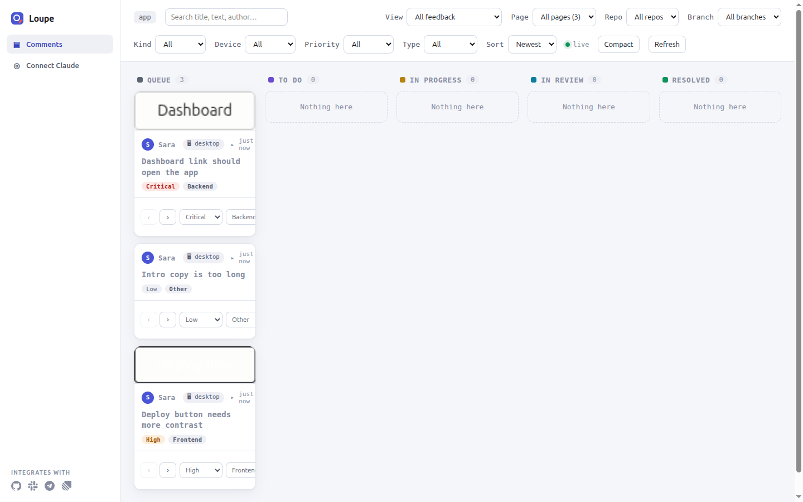

# Install Loupe in a Laravel app

This guide shows you how to add the Loupe Laravel package, `loupekit/laravel`, to an existing Laravel app. When you finish, signed-in users see the Loupe widget on your pages, and you can triage their comments on a dashboard inside your app. To *triage* a comment is to review it, set its priority and move it through the board's stages until it is resolved.

The package stores comments in your app's own database and authenticates requests with your existing session and CSRF token. It needs no separate Loupe server and no API keys.

**Contents**

- [Before you begin](#before-you-begin)
- [Steps](#steps)
  - [Install the package](#install-the-package)
  - [Create the tables](#create-the-tables)
  - [Add the widget to your layout](#add-the-widget-to-your-layout)
  - [Load a page with the widget](#load-a-page-with-the-widget)
  - [Open the dashboard](#open-the-dashboard)
  - [Grant access before you deploy](#grant-access-before-you-deploy)
- [Optional: Use a different URL prefix or domain](#optional-use-a-different-url-prefix-or-domain)
- [Optional: Serve assets from a different host](#optional-serve-assets-from-a-different-host)
- [Optional: Use multiple guards](#optional-use-multiple-guards)
- [Optional: Call the Loupe API on another subdomain](#optional-call-the-loupe-api-on-another-subdomain)
- [Optional: Connect Claude Code](#optional-connect-claude-code)
- [Verify](#verify)
- [Troubleshooting](#troubleshooting)
- [Next steps](#next-steps)

## Before you begin

You need:

- **Laravel 11, 12 or 13.** The package requires the `illuminate/*` components at `^11.0|^12.0|^13.0`.
- **PHP 8.2 or later.** Laravel 13 itself needs PHP 8.3 or later.
- **An authentication system with a route named `login`.** Loupe shows the widget only to a signed-in user, and its routes sit behind your app's authentication. Laravel 11 and later ship no authentication scaffolding, so a new app has no `login` route. Without one, the dashboard answers with a 403 error instead of redirecting you to a sign-in page. [Laravel Breeze](https://laravel.com/docs/starter-kits) is one way to add it; step 3 shows how.
- **A database connection that works.** The `DB_*` settings in your `.env` file must point at a database that `php artisan migrate` can write to. Loupe creates its tables there.
- **Composer**, and a terminal open in your app's root directory.

If you use your config cache in development, run `php artisan config:cache` again after every `.env` change in this guide. Laravel reads `.env` only when the config is not cached.

## Steps

### Install the package

1. Install the package with Composer:

   ```bash
   composer require loupekit/laravel
   ```

   You should see Composer finish with `INFO  Discovering packages.`, followed by a line for each package, including `loupekit/laravel ..... DONE`. Laravel discovers the package's service provider, `Loupekit\Loupe\LoupeServiceProvider`, automatically, so you do not register it by hand.

2. Run the install command:

   ```bash
   php artisan loupe:install
   ```

   You should see output like this:

   ```text
   INFO  Installing Loupe….

   Published config ........................................ DONE
   Published migration ..................................... DONE
   Published assets ........................................ DONE
   Published dashboard provider ............................ DONE
   Registered LoupeServiceProvider ......................... DONE

   INFO  Loupe installed. Next steps:

     1. Run php artisan migrate
     2. Add @loupeWidget before </body> in your layout
     3. Edit app/Providers/LoupeServiceProvider.php to authorize users
     4. Visit /loupe/dashboard
   ```

   If your app has no `login` route, a warning appears between `Registered LoupeServiceProvider` and `Loupe installed. Next steps:`:

   ```text
   WARN  This app has no [login] route, so nobody can sign in — and Loupe only shows the widget to authenticated users. Add auth before expecting it to appear:

       composer require laravel/breeze --dev
       php artisan breeze:install
     …or sign someone in your own way, then open the dashboard as that user.
   ```

   The command did four things:

   - It published four groups of files. Each group has a *publish tag*, the name that `php artisan vendor:publish --tag=<TAG>` uses to copy that group into your app:

     | Publish tag | What it copies | Where it lands |
     |---|---|---|
     | `loupe-config` | The config file | `config/loupe.php` |
     | `loupe-migrations` | The migrations | `database/migrations/` |
     | `loupe-assets` | The widget and dashboard JavaScript bundles | `public/vendor/loupe/` |
     | `loupe-provider` | An authorization provider for your app | `app/Providers/LoupeServiceProvider.php` |

   - It added `App\Providers\LoupeServiceProvider::class` to `bootstrap/providers.php`. It adds the line once; running the command again does not duplicate it.
   - It warned you if your app has no `login` route.
   - It printed the next steps.

   To overwrite files that a previous install already published, run `php artisan loupe:install --force`.

3. If you saw the `WARN` line, add authentication. Skip this step if your app already has a `login` route. To use Laravel Breeze:

   ```bash
   composer require laravel/breeze --dev
   php artisan breeze:install
   ```

   `breeze:install` asks which stack to install (for example `Blade with Alpine`), whether you want dark mode or other optional features, and which testing framework you prefer. Any answer works with Loupe. The command then installs and builds the front-end assets itself, so it needs Node.js and npm.

   You should see the command finish without errors. Run `php artisan route:list --name=login`; you should see a route named `login`. You do not need to run `php artisan loupe:install` again: the install already published every file, and the missing route only produced a warning.

### Create the tables

4. Run the migrations:

   ```bash
   php artisan migrate
   ```

   You should see 13 Loupe migrations run, from `2024_01_01_000000_create_loupe_comments_table` to `2024_01_01_000012_create_loupe_notifications_table`. If you added Breeze in step 3, this also creates the `users` table if it does not exist yet. If the command fails, see [Troubleshooting](#troubleshooting).

### Add the widget to your layout

5. Open the Blade layout that wraps your pages, for example `resources/views/layouts/app.blade.php`.
6. Add the `@loupeWidget` directive just before the closing `</body>` tag. A *Blade directive* is a keyword that starts with `@` and that Laravel's template engine replaces with generated output when it renders the view.

   ```blade
       @loupeWidget
     </body>
   </html>
   ```

   The directive writes a `<script>` tag that loads the widget bundle, and a call to `Loupe.init()` with the signed-in user, your project key, the API URL and the CSRF token. The *project key* is the name that scopes this app's comments. It is the `project_key` config key, set by `LOUPE_PROJECT_KEY`, and it defaults to `app`.

   The directive writes nothing when one of these is true:

   - Loupe is disabled (`LOUPE_ENABLED=false`). This also removes all of Loupe's routes.
   - Nobody is signed in.
   - The signed-in user is not authorized to use Loupe. See [step 8](#load-a-page-with-the-widget) for who is authorized by default.

   You check the result in step 11.

### Load a page with the widget

7. Make sure your `.env` file has `APP_ENV=local`.
8. Set `APP_URL` in `.env` to the exact URL you open the app at. Loupe builds the URL of the widget script from `APP_URL`, not from the address in your browser. For example, if you use `php artisan serve`:

   ```dotenv
   APP_URL=http://127.0.0.1:8000
   ```

   A new Laravel app has `APP_URL=http://localhost`. If you leave that value and open `http://127.0.0.1:8000`, the browser requests the script from `http://localhost` and gets a 404 error. Then clear the cached config:

   ```bash
   php artisan config:clear
   ```

   You should see `INFO  Configuration cache cleared successfully.`

   In the `local` environment, any signed-in user may use the widget and the dashboard. The config key `allow_in_local` controls this, and it is `true` by default. It has no environment variable; to change it, edit `config/loupe.php` as described in [Turn off the local shortcut](laravel-authorize.md#turn-off-the-local-shortcut). This shortcut does not apply if you set an `authorize` closure in `config/loupe.php` or register rules in code: those decide in every environment. See [Use a closure in config](laravel-authorize.md#use-a-closure-in-config). In every other environment, access is denied until you grant it in step 14.

9. Start your app, for example:

   ```bash
   php artisan serve
   ```

   You should see `Server running on [http://127.0.0.1:8000].`

10. Sign in to your app. If the app has no users yet, create one first, for example on the `/register` page that Breeze adds.
11. Open a page that uses the layout from step 5, then view the page source.

    You should see a script tag whose URL starts with your `APP_URL` and contains `vendor/loupe/sdk/loupe.js?v=`, followed by a call to `window.Loupe.init`. On the page, you should see the Loupe launcher, a round button near the edge of the page.

    

    If the script tag is there but the launcher is not, see the 404 row in [Troubleshooting](#troubleshooting).

12. Click the launcher.

    You should see the Loupe panel open. To leave your first comment, follow [Use the Loupe widget](use-the-widget.md).

### Open the dashboard

13. Go to `/loupe/dashboard` in your app, for example `http://127.0.0.1:8000/loupe/dashboard`. The first part of the path comes from `LOUPE_PATH`, which defaults to `loupe`.

    You should see the triage board, with one column per stage: Queue, To Do, In Progress, In Review and Resolved. Comments that users leave through the widget appear as cards.

    

### Grant access before you deploy

14. Outside the `local` environment, the package denies everyone by default. Before you deploy to staging or production, decide who may use the widget and who may open the dashboard. The installer published `app/Providers/LoupeServiceProvider.php` for this. It defines two *abilities*, which are named Laravel authorization gates (`Gate::define`) that answer yes or no for a user:

    - `loupe:use` decides who sees the widget.
    - `loupe:admin` decides who can open the dashboard.

    Follow [Control who can use Loupe in Laravel](laravel-authorize.md) to fill them in.

## Optional: Use a different URL prefix or domain

All Loupe routes, the JSON API, the screenshot endpoint and the dashboard, sit under one prefix so they never collide with your own routes.

1. To change the prefix, set `LOUPE_PATH` in `.env`:

   ```dotenv
   LOUPE_PATH=feedback
   ```

   The dashboard then moves to `/feedback/dashboard`, and the widget calls `/feedback/v1/...`.

2. To register the routes on one domain only, set `LOUPE_DOMAIN`:

   ```dotenv
   LOUPE_DOMAIN=<DOMAIN>
   ```

   Replace `<DOMAIN>` with the host name, for example `admin.example.com`. Laravel then matches Loupe's routes only on that host.

3. Check the routes:

   ```bash
   php artisan route:list --name=loupe
   ```

   You should see every Loupe route under the new prefix, for example `feedback/v1/comments` and `feedback/dashboard`. If you set `LOUPE_DOMAIN`, the routes show that domain.

The widget builds its API URL from the host of the current page plus `LOUPE_PATH`. It does not use `LOUPE_DOMAIN`. If the pages that show the widget are on a different host from the Loupe routes, the widget needs extra setup: see [Call the Loupe API on another subdomain](#optional-call-the-loupe-api-on-another-subdomain).

## Optional: Serve assets from a different host

The widget and dashboard bundles live in `public/vendor/loupe/` on your app's own server. Loupe builds their URLs from `APP_URL`. It deliberately does not use Laravel's `asset()` helper or `ASSET_URL`, because a CDN host configured there usually does not have these files, and the widget would fail to load.

1. If you do serve `public/vendor/loupe/` from another origin, set `LOUPE_ASSET_URL` to that origin:

   ```dotenv
   LOUPE_ASSET_URL=<ASSET_ORIGIN>
   ```

   Replace `<ASSET_ORIGIN>` with the origin that serves the files, for example `https://static.example.com`.

2. Open a page that shows the widget and view the page source.

   You should see the script tag load `https://static.example.com/vendor/loupe/sdk/loupe.js?v=...`. Open that URL in the browser; you should see JavaScript, not a 404 error.

## Optional: Use multiple guards

A *guard* is Laravel's mechanism for deciding how a user is signed in, for example a session guard for the web. By default, Loupe identifies the user through your app's default guard. If your app signs different people in through different guards, for example customers through `web` and staff through `admin`:

1. List the guards in `LOUPE_GUARDS`, separated by commas:

   ```dotenv
   LOUPE_GUARDS=web,admin
   ```

   Loupe checks the guards in that order, and the first one with a signed-in user wins. A guard name that does not exist is skipped.

2. Sign in through the second guard only, for example as staff, and open a page with `@loupeWidget`.

   You should see the launcher, and the page source should contain a call to `window.Loupe.init` with that user's details.

## Optional: Call the Loupe API on another subdomain

By default, the widget calls the Loupe API on the same origin as the page: its API URL is the URL of the current request plus `LOUPE_PATH`, and it sends requests with `credentials: 'same-origin'`. No config key or environment variable changes this. Use this procedure only if the page and the Loupe routes are on different subdomains of one domain, for example `shop.example.com` and `admin.example.com`.

1. Publish the package views:

   ```bash
   php artisan vendor:publish --tag=loupe-views
   ```

   You should see the views copied to `resources/views/vendor/loupe/`.

2. Open `resources/views/vendor/loupe/widget.blade.php`.
3. Replace `apiBase: @json($apiBase),` with the Loupe API URL:

   ```blade
   apiBase: '<LOUPE_API_URL>',
   ```

   Replace `<LOUPE_API_URL>` with the origin of the Loupe routes plus `LOUPE_PATH`, for example `https://admin.example.com/loupe`.

4. Change `credentials: 'same-origin'` to `credentials: 'include'`:

   ```blade
   credentials: 'include',
   ```

5. Make the session cookie valid on both subdomains. Set `SESSION_DOMAIN` in `.env`:

   ```dotenv
   SESSION_DOMAIN=.example.com
   ```

6. Allow cross-origin requests with credentials. The Loupe package sends no CORS headers itself; Laravel's CORS middleware does. Publish Laravel's CORS config:

   ```bash
   php artisan config:publish cors
   ```

7. In `config/cors.php`, add the Loupe paths, list the page's origin, and allow credentials. Browsers reject credentials with the wildcard origin `*`, so name the origin:

   ```php
   'paths' => ['api/*', 'sanctum/csrf-cookie', 'loupe/*'],
   'allowed_origins' => ['https://shop.example.com'],
   'supports_credentials' => true,
   ```

   Use your own `LOUPE_PATH` in place of `loupe`, and your page's origin in place of `https://shop.example.com`.

8. Open a page on the first subdomain, open the browser's developer tools, and go to the **Network** tab. Open the Loupe panel.

   You should see requests to `<LOUPE_API_URL>/v1/comments` answer 200, and each response should have the headers `Access-Control-Allow-Origin: https://shop.example.com` and `Access-Control-Allow-Credentials: true`.

After you publish the views, your copy of `widget.blade.php` no longer changes when you upgrade the package. Compare it with the package's version after each upgrade.

## Optional: Connect Claude Code

The package includes a Model Context Protocol (MCP) server, registered as `loupe`. MCP is a protocol that lets an AI agent such as Claude Code call tools. Loupe's server gives the agent four tools: `list-comments`, `get-comment`, `propose-change` and `update-status`. It reads your app's database directly.

The server is registered only when the `laravel/mcp` package is installed.

1. Install `laravel/mcp`:

   ```bash
   composer require laravel/mcp:^0.8 --dev
   ```

   You should see Composer finish with `INFO  Discovering packages.` and a line `laravel/mcp ..... DONE`.

2. Start the server to check that it runs:

   ```bash
   php artisan mcp:start loupe
   ```

   The server talks over standard input and output, so it waits silently. Press `Ctrl+C` to stop it. If you see `Command "mcp:start" is not defined.`, see [Troubleshooting](#troubleshooting).

3. Add the server to Claude Code and check that it connects. Follow [Procedure C: Connect the Laravel server](connect-mcp-clients.md#procedure-c-connect-the-laravel-server).

## Verify

1. List Loupe's routes:

   ```bash
   php artisan route:list --name=loupe
   ```

   You should see routes named `loupe.comments.index`, `loupe.comments.store`, `loupe.blobs.store`, `loupe.hub.inbound` and `loupe.dashboard`, among others, all under your `LOUPE_PATH` prefix.

2. Sign in, open a page with `@loupeWidget`, and view the page source.

   You should see a script tag whose URL contains `vendor/loupe/sdk/loupe.js?v=`, followed by a call to `window.Loupe.init`.

3. Leave a comment through the widget, as described in [Comment on an element](use-the-widget.md#comment-on-an-element), then open `/loupe/dashboard`.

   You should see your comment as a card in the Queue column, with its screenshot.

## Troubleshooting

| Symptom | Cause | Fix |
|---|---|---|
| `php artisan migrate` fails with a database connection error. | The `DB_*` settings in `.env` do not point at a database that exists and accepts the configured user. | Fix `DB_CONNECTION`, `DB_HOST`, `DB_PORT`, `DB_DATABASE`, `DB_USERNAME` and `DB_PASSWORD`, run `php artisan config:clear`, then run `php artisan migrate` again. |
| The dashboard answers 403 with `Unauthenticated. This app has no [login] route to redirect to — sign in your own way, then open the Loupe dashboard.` | You are not signed in, and the app has no route named `login` to send you to. | Add authentication with a `login` route, for example with Laravel Breeze (step 3), then sign in. |
| A Loupe route answers 403 with `You are not authorized to use Loupe.` | You are signed in, but not authorized. Outside `local`, the `loupe:use` and `loupe:admin` abilities deny everyone until you change them. The dashboard needs `loupe:admin`. | Grant access as described in [Control who can use Loupe in Laravel](laravel-authorize.md). |
| The widget does not appear, and the page source has no `loupe.js` script tag. | `@loupeWidget` writes nothing when nobody is signed in, when the user is not authorized, or when `LOUPE_ENABLED=false`. | Sign in, check the user's authorization, and check that `LOUPE_ENABLED` is not `false`. |
| The page source has the `loupe.js` script tag, but the widget does not appear, and the browser console shows a 404 for `vendor/loupe/sdk/loupe.js`. | The assets were not published, or `APP_URL` or `LOUPE_ASSET_URL` points to a host that does not serve `public/vendor/loupe/`. A new app's `APP_URL=http://localhost` causes this when you browse to `http://127.0.0.1:8000`. | Set `APP_URL` to the URL you open the app at (step 8), run `php artisan config:clear`, and run `php artisan vendor:publish --tag=loupe-assets --force`. |
| A comment saves, but its screenshot does not load, and the browser shows a 404 for `<LOUPE_PATH>/v1/blobs/<ID>`. | Screenshots are written to the `public` filesystem disk by default (`LOUPE_DISK`), which is `storage/app/public` in a default Laravel app. If the web server cannot write there, the default disk fails without an error, and the file is never stored. | Give the web server's user write access to `storage/`, or set `LOUPE_DISK` to a disk it can write to. Then leave a new comment. |
| The version line in the widget's settings menu shows a highlighted `package v…` next to `Loupe v…`. | The installed package version differs from the published JavaScript bundle. The package was upgraded or changed, but its assets were not published again. | Run `php artisan vendor:publish --tag=loupe-assets --force`. |
| The log shows ``[loupe] loupe_comments is missing <COLUMNS> — run `php artisan migrate` to add it.`` (or `them`), where `<COLUMNS>` lists the missing columns. | A newer package version writes columns that your database does not have yet. Loupe saves the comment without them. | Run `php artisan migrate`. |
| `php artisan config:cache` fails with `the value at loupe.user_resolver is non-serializable`. | `user_resolver` in `config/loupe.php` is a closure. Cached config cannot hold closures. | Move the logic into an invokable class and set `'user_resolver' => App\Support\LoupeUserResolver::class` (use your own class name). |
| Saving a comment fails with HTTP 419. | Laravel rejected the CSRF token. The widget sends the token in the `X-CSRF-TOKEN` header, but the session that issued it did not reach the request. | Check that the page renders inside the `web` middleware group, and that the session cookie's domain (`SESSION_DOMAIN`) covers the host of the Loupe API. For subdomains, see [Call the Loupe API on another subdomain](#optional-call-the-loupe-api-on-another-subdomain). |
| `php artisan mcp:start loupe` fails with `Command "mcp:start" is not defined.` | `laravel/mcp` is not installed. For example, the machine ran `composer install --no-dev`, which skips the `--dev` requirement. | Run `composer require laravel/mcp:^0.8` without `--dev` on the machine where the agent runs. |
| `loupe:install` warns `Could not auto-register the provider.` | The app has no `bootstrap/providers.php`. | Add `App\Providers\LoupeServiceProvider::class` to your app's providers list by hand. |

## Next steps

- [Control who can use Loupe in Laravel](laravel-authorize.md): grant widget and dashboard access outside `local`.
- [Use the Loupe widget](use-the-widget.md): leave comments, replies and recordings.
- [Laravel package reference](../LARAVEL.md): every config key, route, event and Artisan command.
- [Connect apps to Hub](hub-connect-apps.md): send tickets from this app to another app through Loupe Hub.
- [Upgrade Loupe](upgrade.md): move to a new version and refresh assets and migrations.
