# Use the Loupe widget

This guide shows you how to leave feedback on a web page with the Loupe widget, follow the
conversation that comes after it, and adjust the widget to suit how you work. It is for
reviewers, QA engineers, designers and product managers. Developers can use it to learn the
widget's interface.

The **widget** is the Loupe panel and launcher that appear on a page after a developer adds
Loupe to it. A **comment** (also called a thread) is one piece of feedback. A comment can be
pinned to an element, to a dragged region, or to a spot on the page. A **pin** is the
numbered marker that shows where a comment sits on the page.

Each comment is in one **stage**, a step on the team's board:

| Stage | Meaning |
|---|---|
| **Queue** | New and not triaged yet. Every new comment starts here. |
| **To Do** | Accepted and waiting for someone to pick it up. |
| **In Progress** | Someone is working on it. |
| **In Review** | A fix is ready and waits for a person to approve it. |
| **Resolved** | Done and checked by a person. |

An **agent** is an AI coding assistant that a developer connects to Loupe. It can read
comments, propose changes and reply in the conversation. See
[Connect Claude Code and other MCP clients](connect-mcp-clients.md).

Each task below is self-contained. Read the one you need. Every control is listed in the
[Widget controls reference](../reference/widget-controls.md).

## Contents

- [Before you start](#before-you-start)
- [Open and close the panel](#open-and-close-the-panel)
- [Take or restart the tour](#take-or-restart-the-tour)
- [Comment on an element](#comment-on-an-element)
- [Comment on a region](#comment-on-a-region)
- [Leave a page note](#leave-a-page-note)
- [Record a short video](#record-a-short-video)
- [Hide sensitive content](#hide-sensitive-content)
- [Reply, mention and react](#reply-mention-and-react)
- [Resolve, reopen or delete](#resolve-reopen-or-delete)
- [Find comments](#find-comments)
- [Use the Home tab](#use-the-home-tab)
- [Review agent work](#review-agent-work)
- [Move and style the panel](#move-and-style-the-panel)
- [Hide and restore the launcher](#hide-and-restore-the-launcher)
- [Set project environments and a local AI](#set-project-environments-and-a-local-ai)
- [Watch agent activity](#watch-agent-activity)
- [Answer a navigation request](#answer-a-navigation-request)
- [Use Loupe on a phone](#use-loupe-on-a-phone)
- [When a pin moves after a redeploy](#when-a-pin-moves-after-a-redeploy)
- [Troubleshooting](#troubleshooting)
- [Next steps](#next-steps)

## Before you start

You need:

- A page where a developer has installed Loupe, or the local demo page described below.
- A desktop browser for every task except [Use Loupe on a phone](#use-loupe-on-a-phone).

Where your comments are saved depends on how the developer set Loupe up. A **backend** is a
server that stores comments for the whole team, such as the Laravel package or the local
server. With a backend, your team sees your comments. Without one, the widget runs in
**offline mode** and keeps comments in this browser only. The version line at the bottom of
**Settings** ends in `server` or `offline` so you can tell which.

### Try it on the local demo page

To practice on the demo page that ships with the repository, you need Node.js 24 with npm,
and git. The local server runs TypeScript files directly, which needs Node.js 24. For the
full walkthrough, see [Run the local server and dashboard](run-local-server.md).

1. Clone the repository and go into it:

   ```bash
   git clone https://github.com/mohamed-ashraf-elsaed/loupe.git
   cd loupe
   ```

2. Install, build, create the demo project, and start the server:

   ```bash
   npm install
   npm run build
   npm run seed
   npm start
   ```

   You should see:

   ```text
   [loupe] API + static on http://localhost:8787  (dashboard: /dashboard/ · demo: /demo/)
   ```

   To use another port, set `PORT`, for example `PORT=9000 npm start`.

3. Open `http://localhost:8787/demo/` in your browser.

   You should see the demo page with the Loupe launcher in a corner.

## Open and close the panel

The **launcher** is the round ◎ button in a corner of the page. It opens the panel and
gives you quick actions.


1. Click the launcher.

   The panel opens on the tab you last used, which is **Home** the first time. When the
   panel docks to the side, it pushes the page over so nothing is hidden behind it.

2. To close the panel, click **Close** (✕) in the panel header.

   The page returns to full width and the launcher appears again.

3. To move the launcher, press it and drag it at least 6 pixels to another spot, then
   release.

   You should see the launcher follow the pointer and stay where you drop it. The panel
   does not open, because a drag is not a click. The launcher keeps this spot after a
   reload.

4. Click the chevron (**Quick actions**) next to the launcher.

   You should see these actions:

   | Action | What it does |
   |---|---|
   | **Pin comment** | Opens the panel and turns on the Inspect tool. |
   | **Note** | Opens the panel and turns on the Note tool. |
   | **Markers** | Hides or shows the pins on this page. Your comments are kept. |
   | **Hide launcher** | Hides the launcher. See [Hide and restore the launcher](#hide-and-restore-the-launcher). |
   | **Connect Claude** | Opens the **Connect** tab, a tab a developer can add to show how to connect an agent. It appears only when the developer added that tab. |

   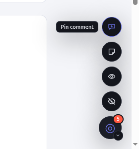

**Verify:** The panel opens and closes when you click the launcher and **Close**. After you
leave a comment, the launcher shows a badge with the comment count. With no comments, it
shows no badge.

If the launcher is missing, see [Troubleshooting](#troubleshooting) (**The launcher is
gone.**).

## Take or restart the tour

The tour is five short steps that point at the main parts of the panel. It starts by itself
the first time the widget loads with the panel open on a desktop-width screen (wider than
640 pixels). If it did not run, use **Settings** > **Restart tour**.

1. Load the page for the first time, or open **Settings** (the gear in the panel header)
   and click **Restart tour**.

   You should see the first step, **Home shows what needs you**, over the stat tiles.

   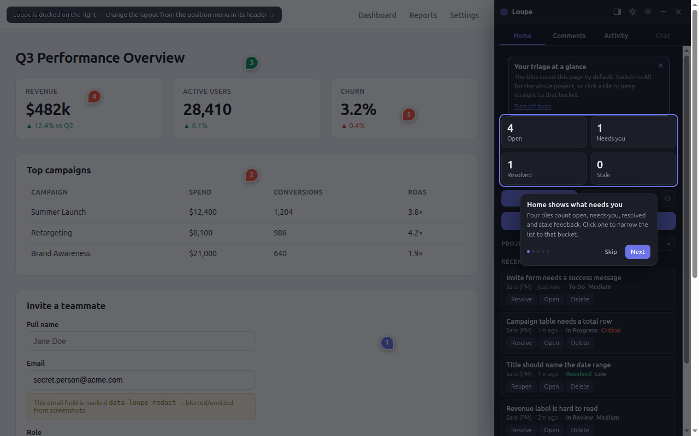

2. Click **Next** to go to the next step. The tour moves the panel to the right tab for
   each one:

   | Step | Title | Tab |
   |---|---|---|
   | 1 | Home shows what needs you | Home |
   | 2 | This page, or the whole project | Home |
   | 3 | Pin feedback anywhere | Comments |
   | 4 | Watch the work happen | Activity |
   | 5 | Make it yours | Activity |

   Click **Back** to return to the previous step.

3. On step 5, click **Done**.

   The tour closes. To stop earlier, click **Skip** on any step. After **Done** or
   **Skip**, the tour does not start by itself again.

**Verify:** The tour card is gone and the panel shows the **Activity** tab (or the tab you
were on when you clicked **Skip**).

If the tour never starts, see [Troubleshooting](#troubleshooting) (**The tour does not
start.**).

## Comment on an element

Use **Inspect** to attach feedback to one element, such as a button or a heading. Loupe
takes a screenshot of the element and remembers how to find it again.

1. Open the panel and go to the **Comments** tab.

2. Click **✛ Inspect**.

   The cursor changes to a crosshair.

3. Move the pointer over the page.

   The element under the pointer gets an outline and a label with its tag and id, for
   example `button#pay`.

   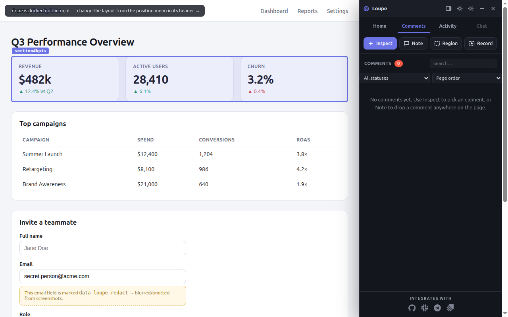

4. Click the element.

   The **composer** opens next to it. The composer is the small form where you write the
   comment.

5. In the first field, type a one-line title. The placeholder is
   **Title — one line: what's wrong, or what you need**.

6. In the second field, describe the change. The placeholder is
   **Describe what should change here…**.

   You must fill in both fields. **Comment** stays disabled until you do.

7. Optional: choose a **Priority** (Critical, High, Medium or Low). The default is
   **Medium**.

8. Optional: choose a **Change type** (Frontend, Backend, API or Other). The default is
   **Other**.

9. Optional: click **＋ Attach images / videos** and pick files.

   A comment holds at most 10 attachments. Each image can be up to 10 MB and each video up
   to 25 MB. If you go over a limit, the composer shows **Up to 10 files.** or
   `<FILE_NAME> is too large.`, where `<FILE_NAME>` is the file you picked.

10. Optional: click **🎤** and speak to dictate the description. The button is disabled when
    the browser has no speech recognition.

11. Leave **Attach screenshot** checked to include a screenshot of the element, or clear
    it to skip the screenshot.

    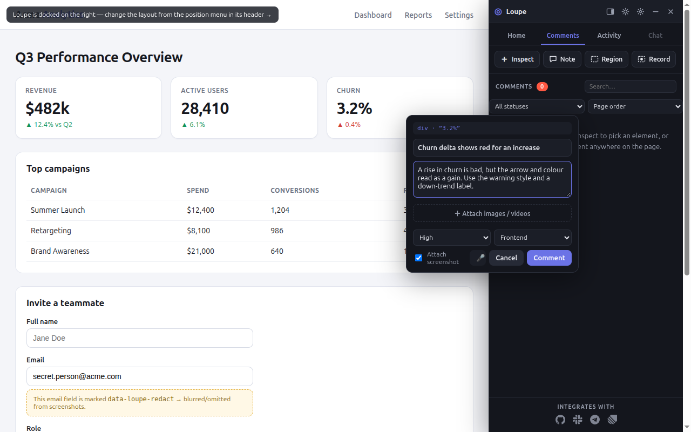

12. Click **Comment**.

    You should see a numbered pin on the element and the comment in the **Comments**
    list, in the **Queue** stage.

    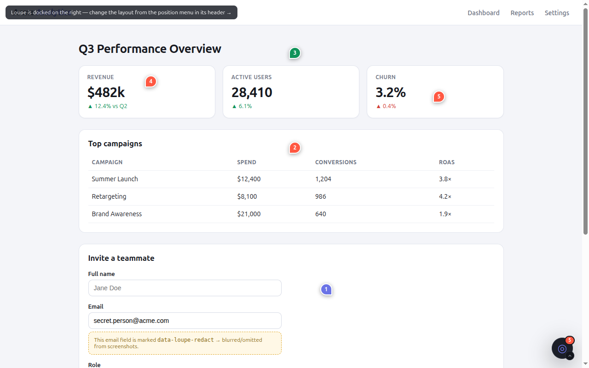

To leave without saving, click **Cancel** or press **Escape**.

**Other ways to start Inspect:** click **✛ Pin feedback on this page** on the **Home** tab,
or **Pin comment** in the launcher's quick actions.

**Verify:** The new pin is on the element, and the comment is in the list with your title.

If **Comment** stays disabled or an attachment is refused, see
[Troubleshooting](#troubleshooting).

## Comment on a region

Use **Region** when the problem covers an area rather than one element, such as a gap
between two sections.

1. On the **Comments** tab, click **Region**.

2. Press on the page and drag a rectangle over the area.

   You see the selection rectangle while you drag.

   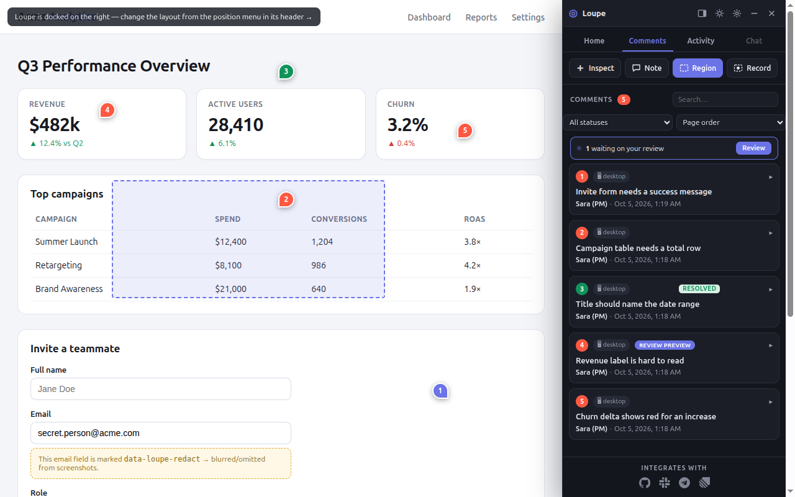

3. Release.

   The composer opens with a label such as **Region · 320×180 px**. The placeholder in the
   description field is **Describe the issue in this area…**.

4. Fill in the title and description.

5. Click **Comment**.

   You should see a pin on the area and the comment in the **Comments** list.

A drag smaller than 8 pixels in either direction is ignored as a stray click. Loupe anchors
the region to the smallest element that covers at least 60% of it, so the pin stays in
place when the layout changes.

On a touch device there is no drag. Scroll to the area first, then tap **Region**. Loupe
captures the visible screen and opens the composer with the screenshot attached.

**Verify:** The comment's screenshot shows the area you dragged.

If nothing happens after you release, see [Troubleshooting](#troubleshooting) (**Nothing
happens after a short drag with Region.**).

## Leave a page note

Use **Note** for feedback about the page as a whole, such as "This page needs a back
link". A note has no element and no screenshot.

1. On the **Comments** tab, click **Note**.

2. Click anywhere on the page.

   The composer opens with the label **Free note · anywhere on the page**. It has no
   **Attach screenshot** checkbox.

3. Fill in the title and the description (placeholder **Describe this note…**).

4. Click **Comment**.

   You should see a note pin at the spot you clicked, and the note in the **Comments**
   list.

**Other ways to start a note:** click **Note** in the launcher's quick actions.

**Verify:** The note is in the list and has no screenshot when you open it.

## Record a short video

Use **Record** to show a problem that only appears in motion, such as a flicker or an
animation that jumps.

**Prerequisites:** A desktop browser that supports screen sharing. If the browser cannot
share the screen, the **Record** button is not shown.

1. On the **Comments** tab, click **Record**.

2. Drag a rectangle over the area you want to record, then release.

3. When the browser asks what to share, choose this tab and allow it.

   A bar with **Recording… Stop** appears.

   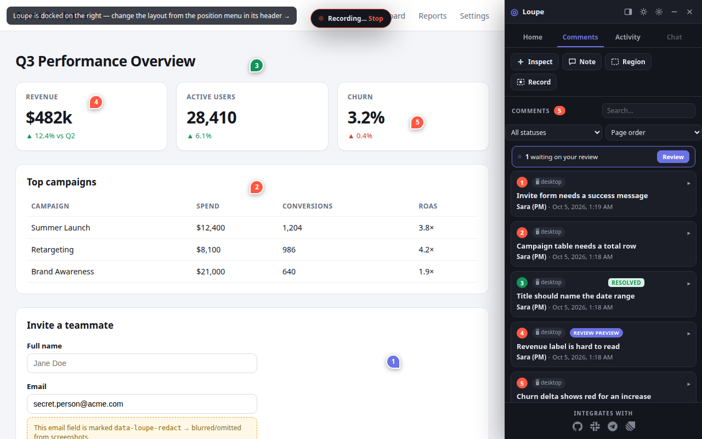

4. Reproduce the problem.

5. Click **Stop**.

   Recording also stops after 20 seconds, or when you end sharing in the browser.
   The composer opens with the label **⏺ Recording ·** followed by the size, and the
   placeholder **Describe the issue in this recording…**. The video is always attached,
   so there is no **Attach screenshot** checkbox.

6. Fill in the title and description.

7. Click **Comment**.

   You should see the comment in the list with a **⏺ recording** tag.

If you cancel the browser's share prompt, nothing is saved.

On a phone, browsers cannot record the screen from a web page, so **Record** is replaced by
**Video**. Record the screen with your phone's own screen recorder first, then tap
**Video** and pick the clip.

**Verify:** Open the comment. The video plays in its detail view.

If **Record** is missing or closes with no composer, see [Troubleshooting](#troubleshooting).

## Hide sensitive content

Loupe can keep some parts of a page out of screenshots, such as personal data or payment
details. You cannot turn this on from the widget. A developer marks those elements in the
page's HTML with the `data-loupe-redact` attribute:

```html
<div data-loupe-redact>Card ending 4242</div>
```

What happens to a marked element:

- In an element screenshot, the element is left out.
- In a region screenshot, its area is painted over in solid near-black before the image is
  saved.

**Verify:** Leave a region comment over a marked element. Its area in the screenshot is a
solid near-black box.

If you see private data in a screenshot preview, ask a developer to add the attribute to
that element.

## Reply, mention and react

Each comment has a conversation. Use it to answer questions, bring in teammates and
acknowledge updates.

1. In the **Comments** list, click a comment to open it.

   The comment expands and shows its screenshot or video, its attachments, the
   conversation, and a reply box.

2. Click the reply box (placeholder **Reply… use @ to mention**) and type your reply.

3. To mention someone, type `@` and the start of their name, then click a name in the
   suggestion list.

   Loupe inserts the name without spaces, for example `@SaraLee`. The mentioned person
   sees the mention on their **Home** tab.

4. Optional: click **📎** to attach an image or video.

5. Press **Enter**, or click **➤ Send**. To add a new line instead, press **Shift+Enter**.

   Your reply appears at once with **Sending…** under it. If it cannot be saved, it shows
   **Retry**. Click **Retry** to send it again.

6. To react to a message, click **＋** (**Add a reaction**) under it.

7. Choose one of 👍 🎉 👀 🙏 ❤️ 🚀.

   The reaction appears with a count. Hover it to see who reacted. Click your reaction
   again to remove it.

   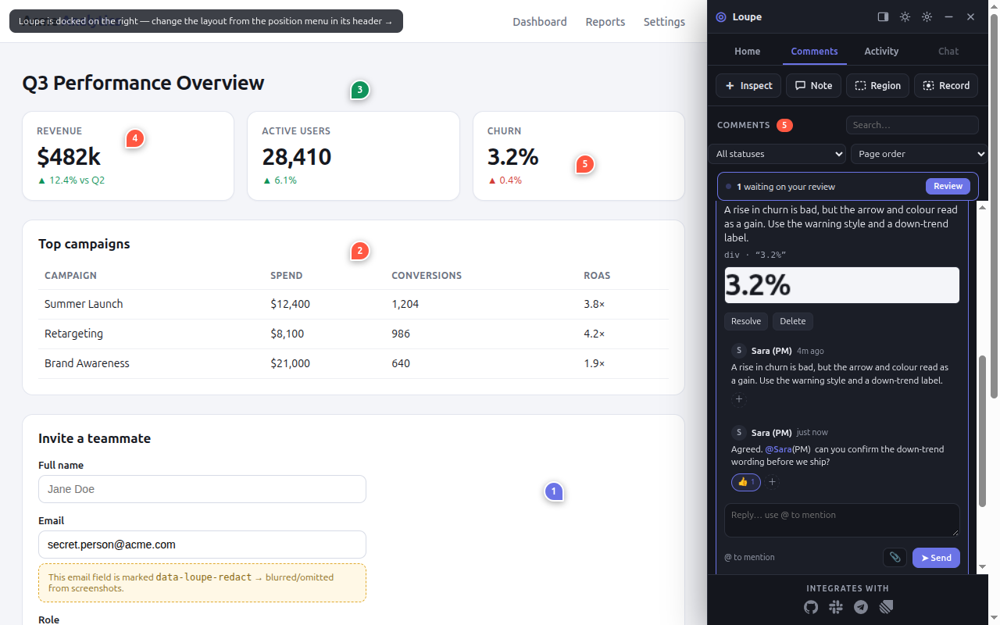

8. To share the thread somewhere else, click **Copy thread text**.

   The thread is copied to your clipboard as Markdown.

**Other ways to share:** click **Copy images** to copy up to 4 of the thread's images.

Messages from an agent carry an **agent** tag. Messages relayed from another project carry
a `from <PROJECT_NAME>` tag, where `<PROJECT_NAME>` is the project that sent them.

**Verify:** Your reply is in the conversation without **Sending…** or **Retry** under it.

If a reply shows **Retry**, see [Troubleshooting](#troubleshooting).

## Resolve, reopen or delete

Resolve a comment when the fix is done and checked. Only a person resolves a comment. An
agent can move a comment to **In Review**, but not close it.

**To resolve or reopen:**

1. Open the comment in the **Comments** list.

2. Click **Resolve**.

   The pin changes to the resolved style and the item shows a **resolved** badge.

3. To undo it, open the comment again and click **Reopen**.

   The comment goes back to the **Queue** stage.

You can also click **Resolve** or **Reopen** on a row in the **Home** tab's recent feed.

**To delete from the Comments list:**

1. Open the comment.

2. Click **Delete**.

   The comment is deleted at once.

**To delete from the Home tab:**

1. In the recent feed, click **Delete** on the row.

   The button changes to **Confirm delete**.

2. Click **Confirm delete** within 3 seconds.

   After 3 seconds the button goes back to **Delete**.

On a server-backed project, the server may only let the comment's author or an admin delete
it.

**Verify:** A resolved comment counts under **Resolved** on the **Home** tab. A deleted
comment is gone from the list and its pin is removed.

## Find comments

The **Comments** tab lists feedback and gives you tools to narrow it down.

1. On the **Home** tab, choose a **scope**, the set of comments the panel shows: **This
   page** for comments on the current page, or **All** for every page in the project.

2. Go to the **Comments** tab.

3. Type in **Search…** to match titles, descriptions and author names.

   You should see only the comments that match.

4. Use the status select to show one stage. The options are **All statuses**, **Queue**,
   **To Do**, **In Progress**, **In Review** and **Resolved**.

   You should see only the comments in that stage.

5. Use the order select: **Newest first**, **Oldest first** or **Page order**.

   You should see the list reorder. When you have not picked an order, **This page** lists
   comments in page order and **All** lists the newest first.

   The two date orders group comments under day headings: **Today**, **Yesterday**,
   **N days ago**, or a date. Click a heading to fold that day. Folded days open again
   when you reload the page.

   

Each item can carry chips that tell you more about it at a glance. Some chips come from
**Loupe Hub**, a separate server that routes comments, called tickets once they leave their
project, between the projects of one **organization** (a team's group of projects). See
[How Loupe Hub works](../explanation/hub.md) and [Route tickets between apps with Loupe Hub](hub-connect-apps.md).

| Chip | Meaning |
|---|---|
| 📱 mobile, ▦ tablet, 🖥 desktop | The screen width it was reported on: under 768 px, under 1024 px, or wider. |
| **⏺ recording** | The comment has a video. |
| `from <PROJECT>` | Another project in your organization sent this ticket here. It has no pin on this page. |
| `→ <DESTINATION>` | The ticket was sent on to another project or to a webhook. |
| `→ <DESTINATION> failed` | Sending it on failed. Hover for the error. |
| `→ <DESTINATION> · <REF> · <LABEL>` | The receiving project reported its status back, for example `→ Tracker · TCK-42 · In progress`. It links to the ticket when a URL is known. |
| **resolved** | The comment is resolved. |
| **moved** | Loupe cannot find the element any more. See [When a pin moves after a redeploy](#when-a-pin-moves-after-a-redeploy). |
| **Sent to agent**, **In PR**, **Review preview** | How far an agent's work on it has got. See [Review agent work](#review-agent-work). |
| `#<NUMBER>` | The pull request for the fix. It links to the PR when a URL is known. |
| **3/4** with a bar | Checks passed out of total on that pull request. |
| **Preview** | A link to a live preview of the fix. |
| page path | The page the comment is on. Shown in **All** scope when **Page paths** is on in **Settings**. |


The list refreshes about every 10 seconds while the tab is visible, so comments made by
others appear without a reload.

**Verify:** Clear the search and set the status select to **All statuses**. Every comment in
the scope is listed again.

## Use the Home tab

The **Home** tab is a summary of the feedback that needs attention.

1. Open the panel and click the **Home** tab.

   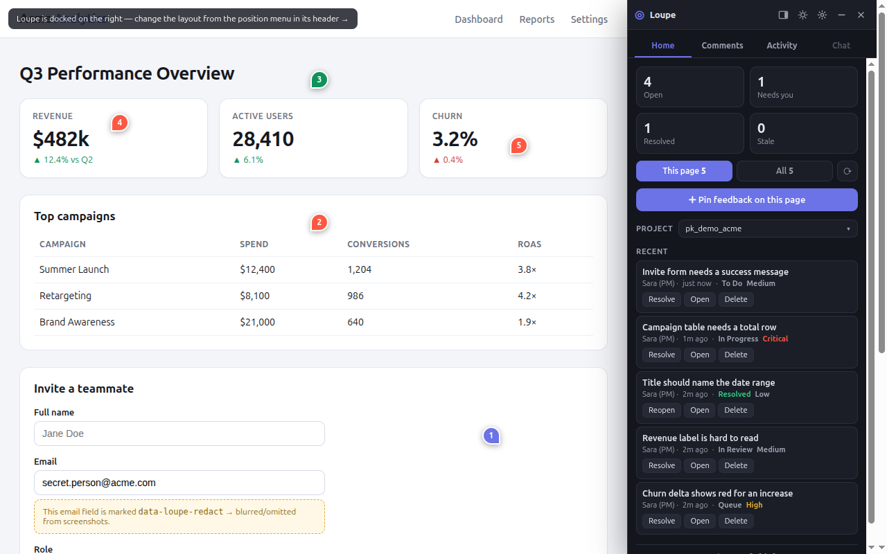

2. Read the four tiles:

   | Tile | Counts |
   |---|---|
   | **Open** | Comments that are not resolved. |
   | **Needs you** | Comments in **In Review**, waiting on a person to approve. |
   | **Resolved** | Resolved comments. |
   | **Stale** | Open comments created more than 7 days ago. |

   The tiles count the current scope: **This page** or **All**.

3. Click a tile.

   You should see the **Comments** tab filtered to that bucket. Click the same tile again
   to clear the filter.

4. Click **⟳** (**Refresh**).

   You should see the tiles and the recent feed update with any comments added since the
   panel last loaded them.

5. If someone mentioned you, a block appears with the number of mentions waiting and up to
   three of them. Click one to open its thread.

   **Other ways:** click **Mark as read** to clear them without opening them.

6. Read the recent feed. It shows the 8 newest comments in the scope, each with its author,
   age, stage and priority, and three buttons: **Resolve** (or **Reopen**), **Open** and
   **Delete**.

**Verify:** The **Open** and **Resolved** tiles add up to the number of comments in the
scope.

## Review agent work

When a developer connects an agent, the agent can propose a change, open a pull request,
and move the comment to **In Review**. Your job is to check the result and decide. To
connect an agent, a developer follows [Connect Claude Code and other MCP clients](connect-mcp-clients.md).

1. Look for the review strip at the top of the **Comments** list. It reads
   **N waiting on your review**, where N is the number of comments in **In Review**.

2. Click **Review** to show only those comments. Click **Show all** to go back.

3. Open a comment. A banner reading **Waiting on your review** appears at the top.

4. If the agent proposed a change, click **Show original** to see the original request
   beside the proposed change. Click **Hide original** to close it.

5. If the change is right, click **Approve**.

   The button reads **Approving…**, then the comment is resolved.

**Other choice:** if you want something else, click **Add comment** instead of **Approve**.
The composer opens on the same element. If the element is gone, the Note tool turns on so
you can leave a page note.

The **lifecycle chip** on each item is a short label that tells you where the agent's work
is:

| Chip | Meaning |
|---|---|
| **Sent to agent** | The agent has proposed a change. |
| **In PR** | A pull request exists for the fix. This chip wins over **Review preview**. |
| **Review preview** | The comment is in **In Review** and has no PR attached. |
| **Reviewed** | Resolved with a proposal or PR. Not shown as a chip, because the **resolved** badge already says it. |

**Generate a change yourself.** A **generator** is a function a developer sets up that
produces a proposed change for a comment. The **Generate pane** is where it shows.

1. On an open comment, click **✦ Generate a change**.

2. If you see **Request access to generate**, no generator is set up for you. Click it.

   The button changes to **Request sent**, and an owner can switch it on.

3. When a generator is set up, the pane shows the generated change over the screenshot.
   Drag the **Compare** slider (default 60%) to compare it with the original, click **‹**
   and **›** to step through versions, click **Undo** to remove one, or type in the field
   to **Refine** or **Revise** the result.

**Verify:** After **Approve**, the comment leaves the **N waiting on your review** count.

## Move and style the panel

1. To move the panel, click **Panel position** in the header and choose **Left**,
   **Bottom**, **Right** or **Float**.

   You should see the panel move to that side. In **Float**, the panel becomes a window
   over the page. Drag its header to move it and drag its corner to resize it. It is at
   least 280 × 220 pixels and at most 760 pixels wide. A floating panel does not push the
   page.

   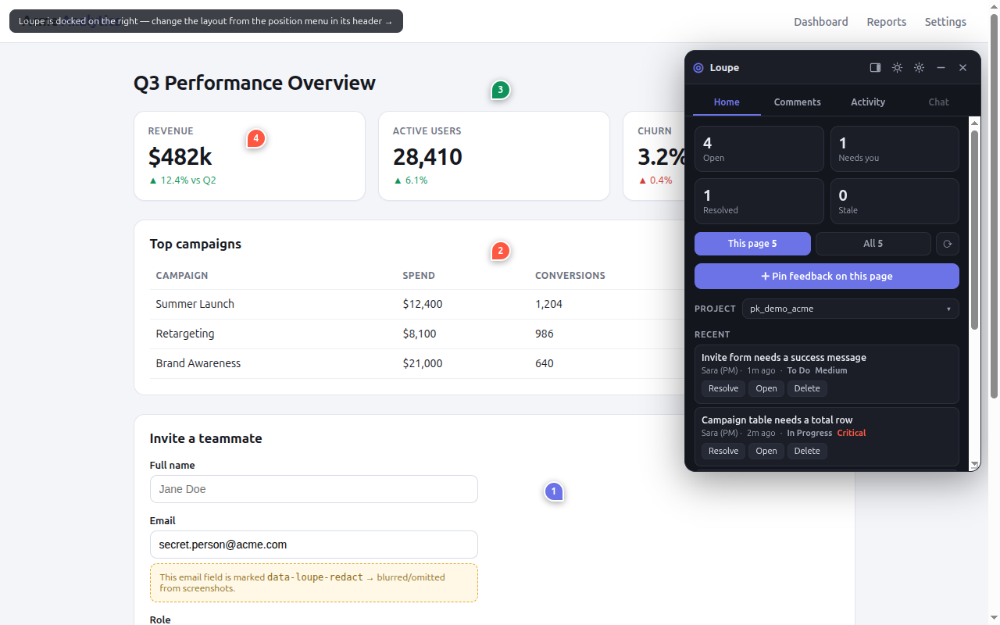

2. To switch between light and dark, click the theme button in the header
   (**Switch to light theme** or **Switch to dark theme**).

   You should see the panel change colors, and the button's label change to the other
   theme.

3. Open **Settings** (the gear).

   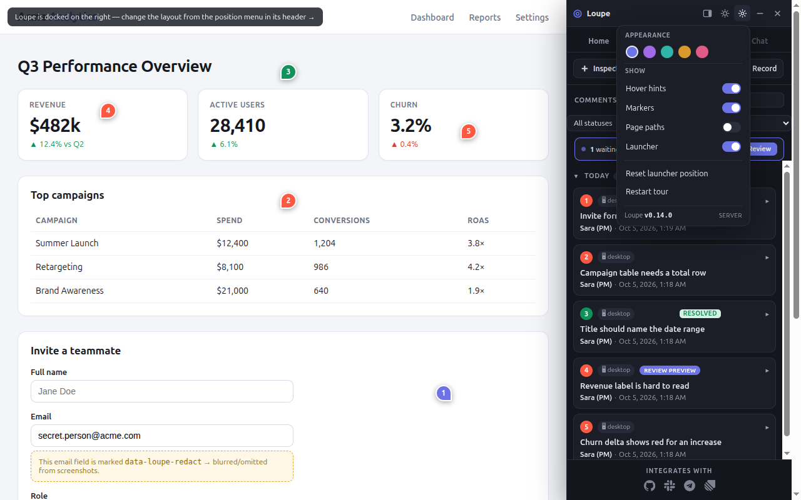

4. Click an accent dot: indigo, violet, teal, amber or rose.

   You should see the panel's accent color change at once.

5. Turn switches on or off:

   | Switch | Effect |
   |---|---|
   | **Hover hints** | Shows short hints the first time you open each tab. |
   | **Markers** | Shows the pins on the page. |
   | **Page paths** | Shows each comment's page path in **All** scope. |
   | **Launcher** | Shows the launcher while the panel is closed. |

6. To shrink the panel, click **Minimize**.

   You should see a one-line strip that reads ◎ **N** open on this page (or in this
   project, in **All** scope). Click the strip to bring the panel back.

**Verify:** Reload the page. Loupe keeps your position, theme, accent and switches in this
browser.

## Hide and restore the launcher

You can hide the launcher when it covers part of the page you are checking.

1. Click the chevron next to the launcher, then click **Hide launcher**.

   A message tells you how to bring it back: press **Alt+Shift+L** on a desktop, or tap the
   tab at the right edge of the screen on a touch device.

2. To bring it back, press **Alt+Shift+L**.

   You should see **Loupe launcher is back** (the name may differ if the developer renamed
   the widget). The same shortcut also hides it again.

**Other ways to bring it back:**

- On a touch device, tap the slim tab at the edge of the screen (**Show the launcher**).
- Open the panel, go to **Settings**, and turn **Launcher** on.

**To reset its position:** if you dragged the launcher somewhere awkward, open **Settings**
and click **Reset launcher position**. The launcher goes back to its corner. This option
appears only after you have moved the launcher.

**Verify:** The launcher is visible in its corner while the panel is closed.

## Set project environments and a local AI

The **project popover** holds settings for this project. They are stored in this browser
only, not shared with your team.

1. On the **Home** tab, click the project chip.

   The popover opens. Its **Organization** section shows where tickets go:
   `Tickets go to <PROJECT>` or **Tickets stay in this project**, where `<PROJECT>` is the
   project that receives them. Projects that can take tickets carry a **receives tickets**
   badge. If the project is not connected to Loupe Hub, the section says so. To connect it,
   see [Route tickets between apps with Loupe Hub](hub-connect-apps.md).

2. Under **Environments**, type the full URL of an environment, for example
   `https://staging.shop.example.com`, and click **Add**.

   You should see the URL in the list. If the URL is not valid you see
   **Enter a full http:// or https:// URL.** If it is already in the list you see
   **That environment is already listed.**

3. To remove an environment, click **✕** next to it.

4. Under **Local AI**, enter the URL of an OpenAI-compatible server and a model name. An
   **OpenAI-compatible server** is a local AI server, such as one at
   `http://localhost:11434`, that answers the same requests as the OpenAI API, including
   `GET /v1/models`.

5. Click **Save**.

   The Generate pane uses this server. If a field is empty you see
   **Enter a full http:// or https:// endpoint URL.** or **Enter a model name.**

6. Click **Test connection**.

   Loupe requests `<URL>/v1/models` and waits up to 4 seconds. You should see
   **Connected — N models available.** The other results are:

   | Message | Meaning |
   |---|---|
   | **Connected.** | The server answered but listed no models. |
   | `Connected, but no “<MODEL>” — it serves: …` | The server does not serve the model name you entered. It lists up to four it does serve. |
   | `Reachable, but it answered <STATUS>.` | The server answered with HTTP status `<STATUS>` instead of a model list. |
   | **Timed out. …** or **Could not reach it. …** | See [Troubleshooting](#troubleshooting). |

   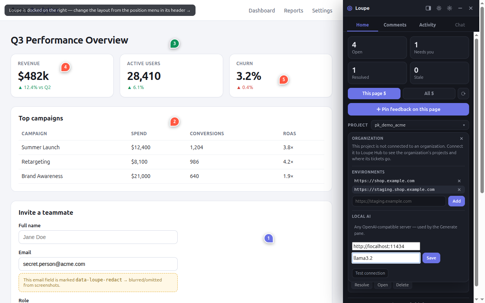

The **INTEGRATES WITH** row at the bottom of the **Comments** tab, with GitHub, Slack,
Telegram and Linear icons, is display only. Its icons say "coming soon" and do nothing
when clicked.

**Verify:** Close and reopen the popover. Your environments and local AI settings are still
there.

## Watch agent activity

The **Activity** tab shows what Loupe and any connected agent are doing.

1. Click the **Activity** tab.

   The status shows **Idle**, **Working** or **Error**, and **Live** when the server feed
   is reachable or **Offline** when it is not. The dot turns red after an error from the
   last 10 minutes.

   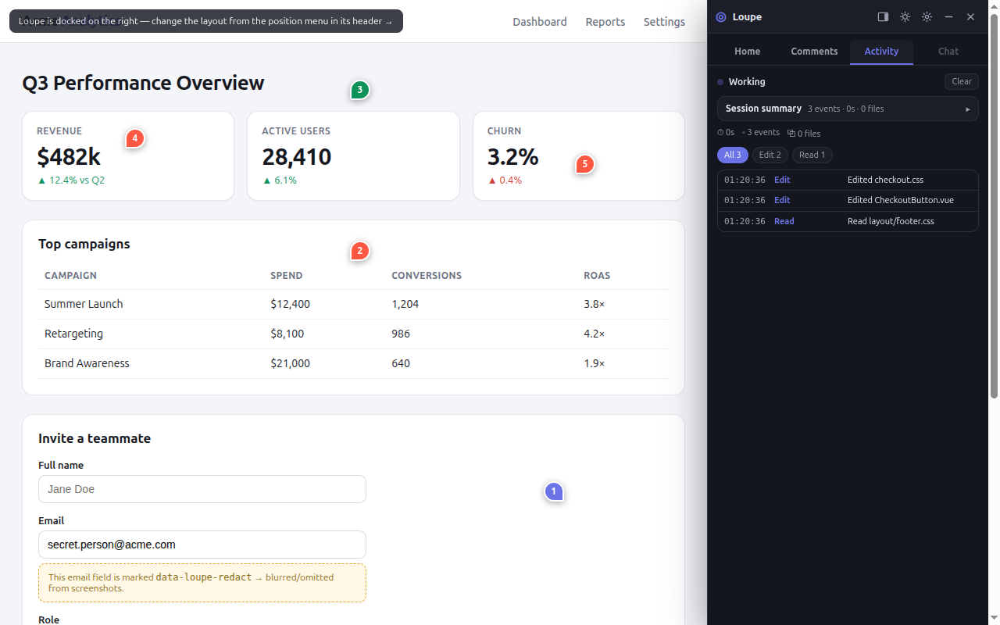

2. Click a kind chip, such as `comment.resolve`, to show only that kind. Each chip shows
   the kind and its count.

   Click **All** to clear the filter.

3. Scroll up to read older events. New events stop scrolling the feed while you read.
   Scroll back to the bottom to follow new events again.

If nothing feeds the tab yet, it shows **Monitor unavailable.** Your own actions, such as
creating or resolving comments, still appear here.

The tab keeps the latest 500 events and checks the server every 15 seconds while it is open.

**Verify:** Resolve a comment, then open the **Activity** tab. You see a
`comment.resolve` chip and the event in the feed.

## Answer a navigation request

An agent can ask to open another page, for example to show you a fix. The page never
changes without your answer.

1. When a request arrives, a card appears at the top of the panel. It shows who is asking,
   the URL and the reason.

   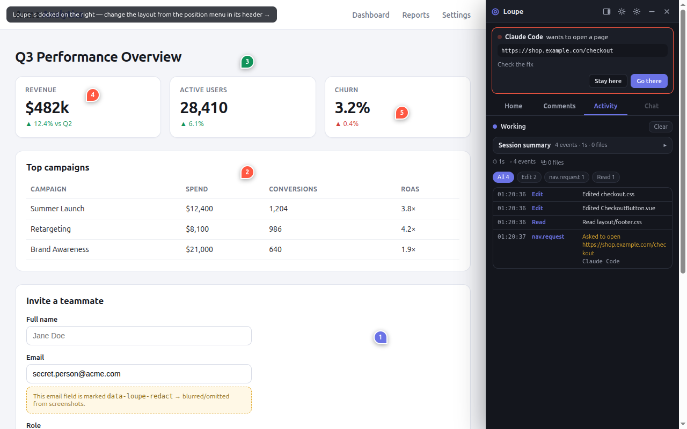

2. Click **Go there** to open the page.

   You should see the browser open that URL.

**Other choice:** click **Stay here** to decline. The card closes and the page stays.

Only `http://` and `https://` addresses are offered. A newer request replaces an older one
you have not answered.

**Verify:** The card is gone. After **Go there**, the browser shows the requested URL.
After **Stay here**, the **Activity** tab shows a `nav.deny` event.

## Use Loupe on a phone

On a screen 640 pixels wide or narrower, the widget changes its layout:

- The panel opens as a sheet from the bottom of the screen and lies over the page. It does
  not push the page aside, whatever position you chose.
- **Panel position** is hidden, and the panel cannot be resized.
- While a tool is on, the sheet shrinks to its header and tools so you can see the page.
- The composer opens as a bottom sheet.
- **Region** captures the visible screen, and **Record** is replaced by **Video** where
  the browser cannot record.
- The tour does not start by itself.

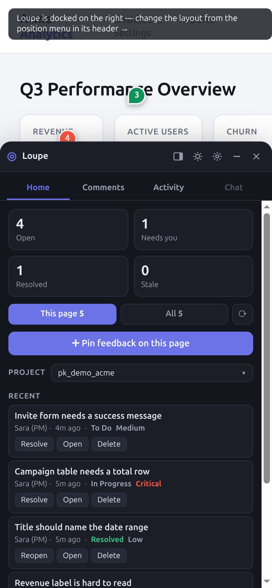

To leave feedback on a phone:

1. Tap the launcher.

   You should see the panel open as a bottom sheet.

2. Tap **Inspect**.

   You should see the sheet shrink to its header and tools.

3. Tap the element.

   The element is outlined as soon as your finger touches it, so you can check it before
   lifting. The composer opens as a bottom sheet.

4. Fill in the composer and tap **Comment**.

   You should see the pin on the element and the comment in the list.

**Verify:** Open the panel again. Your comment is in the **Comments** list.

## When a pin moves after a redeploy

A new release can change the page's markup. Loupe records several facts about each element,
such as its test id, text and position, and uses them to find the element again. If it
cannot find the element with enough confidence, the pin detaches and the comment shows a
**moved** badge (hover text: **element moved or removed**). Resolved comments do not show
the badge. For how this works, see [Re-anchoring](../ARCHITECTURE.md#re-anchoring).

1. Open the comment with the **moved** badge.

2. Check its screenshot to see what it was about.

3. If the problem is still there, leave a new comment on the element where it is now.

4. Resolve the old comment, or reply to say where the element went.

To try this on the demo page, leave a comment and click **⟳ Simulate redeploy**.

**Verify:** The new comment's pin is on the element, and the old comment is resolved.

## Troubleshooting

| Symptom | Cause | Fix |
|---|---|---|
| The demo server does not start, or fails on `node index.ts`. | Node.js is older than 24, which cannot run TypeScript files directly. | Run `node --version`. Install Node.js 24, then run `npm install` and `npm start` again. |
| The demo server fails because the port is in use. | Another process uses port 8787. | Stop that process, or start on another port: `PORT=9000 npm start`, then open `http://localhost:9000/demo/`. |
| The tour does not start. | It runs once, only when the widget loads with the panel open, and never on screens 640 pixels wide or narrower. | Open **Settings** and click **Restart tour**. |
| **Comment** stays disabled. | The title or the description is empty. | Fill in both fields. |
| **Up to 10 files.** | The comment already holds 10 attachments. | Remove some (**×** on a chip), or put the rest in a reply. |
| `<FILE_NAME> is too large.` | An image is over 10 MB or a video over 25 MB. | Compress or trim the file, then attach it again. |
| The 🎤 button is disabled. | The browser has no speech recognition. | Type the description, or use a browser with dictation. |
| Nothing happens after a short drag with **Region**. | The drag was under 8 pixels. | Drag a larger rectangle. |
| **Record** is missing. | The browser cannot share the screen. On a touch device, **Video** replaces it. | Use a desktop browser with screen sharing, or on a phone record with the phone and tap **Video**. |
| **Record** closes with no composer. | You cancelled the browser's share prompt, or capture failed. | Click **Record** again and allow sharing. |
| A reply shows **Retry**. | The reply could not be saved. | Check your connection, then click **Retry**. |
| The launcher is gone. | It was hidden. | Press **Alt+Shift+L**, tap the edge tab on touch, or turn **Launcher** on in **Settings**. |
| The pins are gone. | **Markers** is off. | Click **Markers** in the quick actions, or turn **Markers** on in **Settings**. |
| **Enter a full http:// or https:// endpoint URL.** or **Enter a model name.** | A **Local AI** field is empty or the URL is not valid. | Enter a full URL, such as `http://localhost:11434`, and a model name. |
| **Test connection** says **Timed out.** or **Could not reach it.** | The local AI server is not running, the URL is wrong, or it does not allow this site (CORS). | Start the server, check the URL, and allow this site's origin on the server. |
| `Reachable, but it answered <STATUS>.` | The server does not serve `/v1/models`. | Use the server's OpenAI-compatible base URL, without `/v1`. |
| `Connected, but no “<MODEL>” — it serves: …` | The model name is misspelled or not installed. | Copy a name from the list it shows, then click **Save**. |
| **Request access to generate** instead of a generator. | No generator is set up for this project. | Click it, then ask the project owner. |
| The **Activity** tab shows **Monitor unavailable.** | Nothing feeds the tab yet. The local server has no activity feed. | Create or resolve a comment to see your own events. To get a live feed, ask a developer to connect one. See [Troubleshooting](../troubleshooting.md). |
| A comment shows **moved**. | The element changed or was removed. | See [When a pin moves after a redeploy](#when-a-pin-moves-after-a-redeploy). |
| Your teammates cannot see your comments. | The widget runs in offline mode. Settings shows `offline`. | Ask the developer to connect Loupe to a backend. |

For problems outside the widget, see the [Troubleshooting](../troubleshooting.md) page.

## Next steps

- Try the full local flow in [Pin your first comment and hand it to Claude Code](../tutorials/first-comment-local.md).
- Developers: add the widget with [Install Loupe with npm](install-npm.md),
  [Add Loupe with a script tag](embed-script-tag.md) or [Install Loupe in a Laravel app](laravel-install.md).
- Run the demo backend with [Run the local server and dashboard](run-local-server.md).
- Comment on any site with the [browser extension](browser-extension.md).
- Connect an agent with [Connect Claude Code and other MCP clients](connect-mcp-clients.md).
- Look up every control in the [Widget controls reference](../reference/widget-controls.md)
  and every option in the [SDK reference](../reference/sdk.md).
