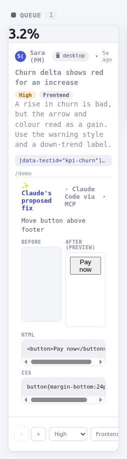

# Pin your first comment and hand it to Claude Code

In about 15 minutes you run Loupe on your own machine, pin a comment on the demo page, triage it on the dashboard, and let Claude Code read it over MCP. MCP (Model Context Protocol) is the standard way an AI coding agent such as Claude Code connects to outside tools.

This tutorial follows one path from start to finish. Do every step in order. Each step tells you what you should see before you move on.

## Contents

- [Before you begin](#before-you-begin)
- [Step 1: Start the local server](#step-1-start-the-local-server)
- [Step 2: Open the demo page](#step-2-open-the-demo-page)
- [Step 3: Pin a comment on an element](#step-3-pin-a-comment-on-an-element)
- [Step 4: Reply and mention](#step-4-reply-and-mention)
- [Step 5: Triage on the dashboard](#step-5-triage-on-the-dashboard)
- [Step 6: Connect Claude Code](#step-6-connect-claude-code)
- [Step 7: Let Claude propose a change](#step-7-let-claude-propose-a-change)
- [Step 8: Review and resolve](#step-8-review-and-resolve)
- [What you learned](#what-you-learned)
- [If something goes wrong](#if-something-goes-wrong)
- [Next steps](#next-steps)

## Before you begin

You need:

- **Node 24.** The project is built and tested on Node 24 in CI, and the local server runs its `.ts` files directly with `node`. Check your version with `node --version`. You should see `v24` followed by a minor version.
- **git**, to clone the repository.
- **Chrome or another Chromium browser**, such as Edge or Brave.
- **Claude Code** (optional). You need it only for steps 6 and 7. You can do steps 1 to 5 and step 8 without it.

## Step 1: Start the local server

The local server is a small Node API that stores comments and serves the demo page and the dashboard.

1. Clone the repository:

   ```bash
   git clone https://github.com/mohamed-ashraf-elsaed/loupe.git
   ```

   You should see git finish with `done.` and a new `loupe` directory.

2. Move into the clone:

   ```bash
   cd loupe
   ```

3. Install the dependencies:

   ```bash
   npm install
   ```

   You should see npm finish with an `added ... packages` summary.

4. Build the packages:

   ```bash
   npm run build
   ```

   You should see each package build in turn, in the order shared, sdk, mcp, dashboard, extension, with no errors.

5. Create the demo project:

   ```bash
   npm run seed
   ```

   You should see output that ends like this:

   ```text
   [loupe] embedded Postgres (PGlite) at <CLONE>/packages/server/data/pg
   Seeded project: pk_demo_acme
     admin key   (dashboard ?key= / X-Loupe-Admin): sk_demo_acme_0f3b9c
     demo HMAC    (host-app-injected for u_92): decb2c23961bbcea494b1034aad995b8f30c9a2e517598667b791b73e8752846
   ```

   `<CLONE>` is the absolute path of your clone. npm also prints its own `> @loupekit/server@0.14.1 seed` header lines above this output.

   The seed creates a project named **Acme Analytics (demo)** with the project key `pk_demo_acme`. The admin key `sk_demo_acme_0f3b9c` is the project secret. You use it later to open the dashboard and to connect Claude Code. The demo HMAC is a signature that proves the demo user `u_92` is who the page says it is.

6. Start the server:

   ```bash
   npm start
   ```

   You should see output that ends like this:

   ```text
   [loupe] embedded Postgres (PGlite) at <CLONE>/packages/server/data/pg
   [loupe] API + static on http://localhost:8787  (dashboard: /dashboard/ · demo: /demo/)
   ```

Leave this terminal running for the rest of the tutorial.

## Step 2: Open the demo page

The demo page is a fake analytics product with the Loupe widget already installed. The widget is the panel and the buttons that Loupe adds to a page.

1. In your browser, open http://localhost:8787/demo/.

   You should see the **Q3 Performance Overview** page. The Loupe panel is open on the right, and a short tour starts with a highlighted card titled **Home shows what needs you**.

   

2. Click **Next** on each card until the last one, then click **Done**.

   The tour has five cards. It shows only on your first visit.

3. Click **Close** (the × icon) in the panel header.

   You should see the panel close and a round launcher button appear in the corner of the page.

   

4. Click the launcher button.

   You should see the panel open again on the **Activity** tab, where the tour ended.

5. Click the **Home** tab.

   You should see the Home view, with the **✛ Pin feedback on this page** button.

## Step 3: Pin a comment on an element

A comment in Loupe is attached to an element on the page, so a developer knows exactly what you mean.

1. On the **Home** tab, click **✛ Pin feedback on this page**.

   You should see the panel switch to the **Comments** tab, and the Inspect tool turn on.

2. Move your pointer over the **Send invite** button in the invite form.

   You should see the button outlined, with a small tip above it that reads `button`. The tip shows the element's tag name, plus `#` and its id when the element has one.

   

3. Click the **Send invite** button.

   You should see the composer, a small form for your comment, open next to the button. Its header names the element you picked: `button[data-testid="btn-invite"]`.

4. In the title field, type `Invite button is hard to see`.

5. In the description field, type `Make the Send invite button stand out more.`

   The **Comment** button stays disabled until both the title and the description have text.

6. Leave the priority at **Medium**, the change type at **Other**, and the **Attach screenshot** box checked.

   

7. Click **Comment**.

   You should see a numbered pin, **1**, appear on the **Send invite** button, and your comment at the top of the **Comments** list.

   

## Step 4: Reply and mention

Every comment is also a conversation thread. You can reply and mention people with `@`.

1. In the **Comments** list, click your comment.

   You should see it expand to show the screenshot, the **Resolve** and **Delete** buttons, and a reply box with the placeholder `Reply… use @ to mention`.

2. Click the reply box and type `@Sa`.

   You should see a suggestion list with **Sara (PM)**, the demo user.

3. Click **Sara (PM)**.

   You should see `@Sara(PM)` inserted in the reply box.

4. Type `can you check this one?` after the mention, then press **Enter**.

   The mention already ends with a space, so you do not need to type one.

   Enter sends the reply. Shift+Enter adds a new line instead.

   You should see your reply appear in the conversation, with `@Sara` highlighted. The highlight stops at the `(`, because a mention handle contains only letters, digits, `.`, `_` and `-`.

   

## Step 5: Triage on the dashboard

The dashboard is a Kanban board where your team sorts comments into stages: Queue, To Do, In Progress, In Review and Resolved.

1. In a new browser tab, open this address:

   ```text
   http://localhost:8787/dashboard/?key=sk_demo_acme_0f3b9c
   ```

   The `?key=` value is the admin key from step 1. The dashboard saves it in your browser, so later visits work without it.

   You should see the board with five columns. Your comment is a card in the **Queue** column.

   

2. On your card, click **Move forward** (›).

   You should see the card move to the **To Do** column.

Leave this tab open. You come back to it in step 7.

## Step 6: Connect Claude Code

Skip to [step 8](#step-8-review-and-resolve) if you do not use Claude Code.

Loupe's MCP server gives Claude Code tools to read your comments and write back proposed changes. Claude Code starts it with `npx`, which downloads the published `@loupekit/mcp` package.

1. The server still runs in your first terminal, so open a second terminal. Create an empty directory to use with Claude Code, and move into it:

   ```bash
   mkdir -p ~/loupe-try && cd ~/loupe-try
   ```

   You should see no output. Any other project directory works too.

2. In that directory, create a file named `.mcp.json` with this content:

   ```json
   {
     "mcpServers": {
       "loupe": {
         "command": "npx",
         "args": ["-y", "@loupekit/mcp"],
         "env": {
           "LOUPE_API": "http://localhost:8787",
           "LOUPE_PROJECT_KEY": "pk_demo_acme",
           "LOUPE_ADMIN_KEY": "sk_demo_acme_0f3b9c"
         }
       }
     }
   }
   ```

   The three environment variables tell the MCP server where your local server runs (`LOUPE_API`), which project to read (`LOUPE_PROJECT_KEY`), and the project secret to sign in with (`LOUPE_ADMIN_KEY`).

3. Start Claude Code in that project directory. If Claude Code is already running there, exit and start it again so it reads the new file.

   If Claude Code asks whether to use the `loupe` server from `.mcp.json`, approve it.

   To check the connection, type `/mcp` in Claude Code. You should see `loupe` listed as connected.

4. Ask Claude Code:

   ```text
   List the Loupe comments.
   ```

   Claude Code may ask permission before it runs a `loupe` tool. Approve it, here and in step 7.

   You should see Claude Code call the `list_comments` tool. The tool returns text in this shape:

   ```text
   1 comment(s):

   - [To Do] Medium · Other · #<COMMENT_ID> — Invite button is hard to see: Make the Send invite button stand out more.
       ↳ [data-testid="btn-invite"] on /demo/ (by Sara (PM))

   Use get_comment(id) for the full element context.
   ```

   `<COMMENT_ID>` is the generated id of your comment. The stage is **To Do** because you moved the card in step 5.

## Step 7: Let Claude propose a change

1. Ask Claude Code:

   ```text
   Get the full context for that comment, then propose a change that fixes it.
   ```

   You should see Claude Code call `get_comment`, which returns the comment, the page, the button's HTML, its computed styles and the screenshot. Then it calls `propose_change`. The tool answers `Proposal saved for #<COMMENT_ID>.`

2. Switch to the dashboard tab from step 5.

   The board refreshes on its own every few seconds. You can also click **Refresh**.

3. Click your card to expand it.

   You should see a section titled **✨ Claude's proposed fix · Claude Code via MCP**. It shows **Before** (the screenshot) next to **After (preview)**, a live render of the proposed HTML and CSS, followed by the HTML and CSS code.

   The preview runs in a sandboxed frame with scripts turned off, so it shows the markup and styles only.

   

## Step 8: Review and resolve

The MCP tools tell an agent to move a comment to **In Review** and to leave resolving to a person. This is an instruction to the agent, not a permission check. You decide whether the change is done.

1. Switch to the demo page tab.

2. In the **Comments** list, click your comment to expand it.

3. Click **Resolve**.

   You should see the button change to **Reopen**, and the pin on the **Send invite** button change to its resolved style.

4. Switch to the dashboard tab.

   You should see your card in the **Resolved** column after the next refresh.

## What you learned

- `npm run build`, `npm run seed` and `npm start` give you a complete local Loupe: the API, the demo page and the dashboard on port 8787.
- The Inspect tool pins a comment to one element and captures a screenshot of it.
- Each comment is a thread you can reply to and mention people in.
- The dashboard moves comments through five stages, from Queue to Resolved.
- The MCP server lets Claude Code list comments, read their full context and propose a change, which appears on the dashboard card.
- The MCP tools ask an agent to stop at **In Review**, so a person decides when a comment is resolved.

## If something goes wrong

| Symptom | Cause | Fix |
|---|---|---|
| `npm start` fails or the server does not start on port 8787. | Another program is using port 8787. | Stop the other program, then run `npm start` again. |
| The demo page loads, but the panel never appears. | The SDK bundle was not built. | Stop the server, run `npm run build`, then run `npm start`. |
| Clicking **Comment** fails, or the reply is not saved. | You ran `npm run seed` with `LOUPE_DEMO_SECRET` set. The demo page signs requests with a signature made from the default secret, so a different secret makes them fail. | Unset `LOUPE_DEMO_SECRET`, run `npm run seed` again, then reload the demo page. |
| The tour does not appear. | You already finished or skipped it in this browser, or the window is 640 pixels wide or narrower. | Widen the browser window, or open **Settings** in the panel header and click **Restart tour**. |
| The dashboard shows "Not authorized. Open this page with ?key=…" | The `?key=` value is missing or wrong. | Open the dashboard address from step 5 again, with `?key=sk_demo_acme_0f3b9c`. |
| The dashboard shows "Can't reach the API at …" | The server is not running. | Run `npm start` in the clone and reload the page. |
| Claude Code does not list a `loupe` server. | `.mcp.json` is not in the directory where you started Claude Code, or you did not approve the server. | Start Claude Code from the directory that holds `.mcp.json`, approve `loupe`, then run `/mcp`. |
| The `loupe` server exits with `ERR_MODULE_NOT_FOUND` for `@loupekit/shared`. | `npx` ran `@loupekit/mcp` 0.14.0, which has this defect. Fixed in 0.14.1. | Change the argument to `@loupekit/mcp@0.14.1` in `.mcp.json`, then restart Claude Code. |
| `list_comments` fails with `GET /v1/comments?... → 401`. | `LOUPE_ADMIN_KEY` does not match the project secret. | Set `LOUPE_ADMIN_KEY` to `sk_demo_acme_0f3b9c` in `.mcp.json` and restart Claude Code. |
| `list_comments` fails with `GET /v1/comments?... → 404`. | `LOUPE_PROJECT_KEY` names a project the server does not know, or the data directory is new and the demo project was never seeded. | Set `LOUPE_PROJECT_KEY` to `pk_demo_acme` in `.mcp.json`, run `npm run seed`, then restart Claude Code. |
| `list_comments` answers `No comments match.` | The project exists but has no comments, for example after the server started with a fresh data directory. | Pin a new comment on the demo page, then ask again. |

## Next steps

- Add Loupe to your own app:
  - [Install Loupe from npm](../how-to/install-npm.md)
  - [Install Loupe in a Laravel app](../how-to/laravel-install.md)
  - [Use the browser extension](../how-to/browser-extension.md) on a site you cannot change
- Learn every tool in the panel: [Use the widget](../how-to/use-the-widget.md).
- See every MCP tool and setting: [MCP reference](../reference/mcp.md).
