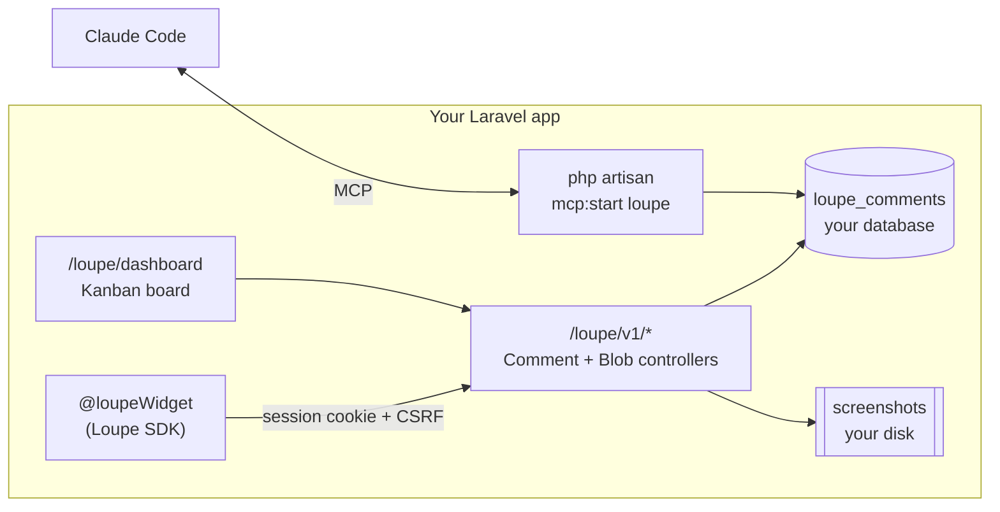

<div align="center">

<a href="https://mohamed-ashraf-elsaed.github.io/loupe/">
  
</a>

<h1>loupekit/laravel</h1>

<p><strong>Loupe for Laravel — visual feedback, in your own app.</strong><br />
Your users pin a comment to any element on your live product and capture a screenshot.<br />
Comments are stored in <strong>your</strong> database, gated to <strong>your</strong> users, triaged on <strong>your</strong> dashboard,<br />
and handed to <strong>Claude Code</strong> over MCP — no separate backend to run.</p>

<p>
  <a href="https://packagist.org/packages/loupekit/laravel"></a>
  <a href="https://packagist.org/packages/loupekit/laravel"></a>
  
  
  
  
</p>

<p>
  <a href="https://mohamed-ashraf-elsaed.github.io/loupe/"><b>Website</b></a> ·
  <a href="https://mohamed-ashraf-elsaed.github.io/loupe/guide/#laravel"><b>Docs</b></a> ·
  <a href="https://github.com/mohamed-ashraf-elsaed/loupe"><b>GitHub</b></a> ·
  <a href="https://github.com/mohamed-ashraf-elsaed/loupe/blob/main/docs/LARAVEL.md"><b>Full guide</b></a> ·
  <a href="https://github.com/mohamed-ashraf-elsaed/loupe/blob/main/CHANGELOG.md"><b>Changelog</b></a> ·
  <a href="https://www.npmjs.com/package/@loupekit/sdk"><b>SDK</b></a>
</p>

</div>

---

## Overview

Traditional feedback — _"the revenue card looks off on the dashboard"_ — loses the one thing
an engineer needs: **which element, in what state, on which page.** Loupe captures all of it at
the moment of the comment. This package brings that loop into any Laravel app: the widget is a
single Blade directive, comments are Eloquent rows in **your** database, and the triage board is
a route **you** own behind **your** auth.

<div align="center">
  
</div>

## Table of contents

- [Features](#features)
- [Requirements](#requirements)
- [Install](#install)
- [Quick start](#quick-start)
- [How it works](#how-it-works)
- [Authorization — who can use it](#authorization--who-can-use-it)
- [The dashboard](#the-dashboard)
- [Claude Code over MCP](#claude-code-over-mcp)
- [Configuration](#configuration)
- [Data model](#data-model)
- [Try it locally](#try-it-locally)
- [Publishing](#publishing)
- [Testing](#testing)
- [Related packages](#related-packages)

## Features

| | |
| --- | --- |
| 🎯 **Click-to-comment inspector** | Hover-highlight any element, click to pin a comment — dropped in with one `@loupeWidget` directive. |
| 💬 **Free comments** | Drop a page-level note anywhere with the **Note** mode — no element, no screenshot. |
| ▭ **Free-region screenshots** | Drag a free-size box, screenshot exactly that area, comment on it. Anchors to the element under its center so it tracks reflow and scrolling. |
| 🧲 **Dockable control** | A DevTools-style panel — dock it left / right / bottom (pushes your page over so nothing is covered) or float it; light/dark theme, collapses to a small `◎` launcher, and a bottom sheet on mobile. |
| 🔁 **Redeploy-surviving re-anchoring** | A multi-signal fingerprint re-locates the element after the UI changes; if it can't, the pin **detaches** instead of pointing at the wrong thing. |
| 🗄️ **Your database** | Comments are an Eloquent `Comment` model in a `loupe_comments` table. Swap in your own subclass to add relations/scopes. |
| 🔐 **Per-user gating** | `loupe:use` / `loupe:admin` Gate abilities **and** config closures decide who sees the widget and who opens the dashboard. |
| 📋 **Dashboard on your routes** | The full Kanban triage board at `/loupe/dashboard`, behind your session auth. |
| 🤖 **Claude Code over MCP** | `php artisan mcp:start loupe` hands Claude the fully-contextual backlog. |
| 🔑 **No secrets to manage** | Authenticates with your existing session + CSRF token. No HMAC keys. |
| ✅ **100% tested** | A Testbench suite with a hard 100% line-coverage gate, across Laravel 11/12/13. |

## Requirements

| | Supported |
| --- | --- |
| **PHP** | **8.4** and higher |
| **Laravel** | **11, 12, 13** |
| **Database** | anything Eloquent supports (MySQL, PostgreSQL, SQLite, SQL Server) |
| **MCP** (optional) | `laravel/mcp` **^0.8** — Laravel 11, 12 & 13 |

## Install

```bash
composer require loupekit/laravel
php artisan loupe:install
php artisan migrate
```

`loupe:install` publishes the config, migration and browser assets (to `public/vendor/loupe`),
then publishes and registers an `App\Providers\LoupeServiceProvider` where you control access.

## Quick start

**1.** Add the widget to your Blade layout, just before `</body>`:

```blade
@loupeWidget
</body>
```

**2.** Decide who sees it. By default the widget and dashboard are visible **only in `local`**.
Open `app/Providers/LoupeServiceProvider.php` and grant access:

```php
Gate::define('loupe:use', fn ($user) => $user->is_staff);   // who sees the widget
Gate::define('loupe:admin', fn ($user) => $user->is_admin);  // who opens the dashboard
```

**3.** Open the board at **`/loupe/dashboard`**. That's the whole setup.

## How it works



Identity is always the authenticated session user (`auth()->user()`); the store endpoint rejects
a comment whose `author.id` is not the current user, so nobody can post as someone else.

## Authorization — who can use it

Two abilities, checked in this order — **config closure**, then **Gate ability**:

```php
// Option A — Gate abilities (in the published App\Providers\LoupeServiceProvider)
Gate::define('loupe:use',   fn ($user) => $user->hasRole('staff'));
Gate::define('loupe:admin', fn ($user) => $user->hasRole('admin'));

// Option B — config closures (config/loupe.php); take precedence over the Gates
'authorize' => [
    'use'       => fn ($user) => $user->can_give_feedback,
    'dashboard' => fn ($user) => $user->is_admin,
],
```

Denied users never receive the widget markup, and the API/dashboard return `403`.

## The dashboard

The full Kanban board — open / in progress / done, page filter, screenshot thumbnails, status
moves, delete, and **Copy for Claude** — served at `/loupe/dashboard` behind your `web`+`auth`
middleware and the `loupe:admin` ability. Configuration is injected server-side, so no secret
ever reaches the browser.

<div align="center">
  
</div>

## Claude Code over MCP

With `laravel/mcp` installed, a local MCP server named **`loupe`** is registered automatically:

```bash
php artisan mcp:start loupe
```

It reads your database directly (no HTTP hop, no admin key) and exposes three tools:

| Tool | Arguments | Returns |
| --- | --- | --- |
| `list_comments` | `status?`, `url?` | the backlog, newest first |
| `get_comment` | `id` | Claude-ready package: request + element HTML + computed styles + screenshot (or region rect) |
| `update_status` | `id`, `status` | marks a comment open / in_progress / done |

<div align="center">
  
</div>

## Configuration

`config/loupe.php` (published by `loupe:install`):

| Key | Default | Purpose |
| --- | --- | --- |
| `enabled` | `true` | Master switch. |
| `path` | `loupe` | Route prefix for the API + dashboard. |
| `project_key` | `app` | Scopes comments (one app = one project). |
| `middleware.api` | `['web','loupe.auth']` | Guards the JSON API. |
| `middleware.dashboard` | `['web','loupe.auth']` | Guards the dashboard. |
| `guards` | `env('LOUPE_GUARDS')` | Auth guards to resolve the user through, in order (e.g. `web,admin`). Empty = default guard. |
| `authorize.use` / `authorize.dashboard` | `null` | Closures `fn($user): bool` (take precedence over Gates). |
| `user_resolver` | `null` | Customize the `{id,name,email}` payload sent to the SDK. |
| `comment_model` | `Loupekit\Loupe\Models\Comment` | Swap for your own subclass. |
| `disk` | `public` | Filesystem disk for screenshots. |
| `asset_url` | `env('LOUPE_ASSET_URL')` | Origin Loupe's own JS is served from. Defaults to the app URL — see the CDN note below. |

### Multiple auth guards

If your app uses separate guards for users and admins (e.g. `web` and `admin`), tell
Loupe which guards to resolve the current user through, in order:

```env
LOUPE_GUARDS=web,admin
```

Loupe then resolves identity the **same way** when rendering the widget and when handling
the API request (first authenticated guard wins), so a user logged into a non-default
guard no longer hits `403 "cannot post as another user"`. Leave it unset for single-guard
apps (identical to `auth()->user()`).

### Heads-up: CDN / `ASSET_URL`

Loupe's browser files live on your app's own filesystem at `public/vendor/loupe/**`, and
Loupe loads them from your **app URL** — it deliberately does **not** use Laravel's
`asset()` helper. That matters if you set `ASSET_URL` to a CDN/S3 bucket and upload only
your Vite build (`public/build`) there: `asset()` would point Loupe's files at the CDN,
which doesn't host them, and the widget would silently fail to load. Loupe sidesteps this
automatically. If you *do* serve `public/vendor/loupe` from another origin, set
`LOUPE_ASSET_URL` to that origin.

See the [full guide](https://github.com/mohamed-ashraf-elsaed/loupe/blob/main/docs/LARAVEL.md) for
Sanctum/SPA setups, private screenshot disks, and the complete reference.

## Data model

Migration `create_loupe_comments_table` → `loupe_comments`:

| Column | Type | Notes |
| --- | --- | --- |
| `id` | string (PK) | client-generated UUID |
| `project_key` | string, indexed | scopes to this app |
| `url` | text | normalized (utm / click ids stripped) |
| `status` | string, indexed | `open` · `in_progress` · `done` |
| `body` | text | the comment |
| `kind` | string | `element` · `region` · `free` (page-level note) |
| `author` / `author_id` | json / string | `{id,name,email?}` + denormalized id |
| `anchor` / `context` / `offset` | json | fingerprint, element HTML + styles, pin position |
| `region` | json, nullable | rectangle for region comments |
| `screenshot_url` | text, nullable | URL of the stored screenshot |
| `created_at` / `updated_at` | timestamps | |

## Try it locally

Point a scratch Laravel app at this package with a [path repository](https://getcomposer.org/doc/05-repositories.md#path):

```jsonc
// composer.json of your test app
"repositories": [
  { "type": "path", "url": "../loupe/packages/laravel" }
]
```

```bash
composer require loupekit/laravel:@dev
php artisan loupe:install && php artisan migrate
# add @loupeWidget to resources/views/…​, log in, and open /loupe/dashboard
```

## Publishing

This package lives in the Loupe monorepo under `packages/laravel`. Packagist reads a
repo's **root** `composer.json`, so it's mirrored to a dedicated repo automatically by
[`.github/workflows/laravel-split.yml`](https://github.com/mohamed-ashraf-elsaed/loupe/blob/main/.github/workflows/laravel-split.yml):

- every push to `main` syncs the split repo's `main`;
- every **`vX.Y.Z` tag is forwarded** to the split repo → Packagist auto-updates.

The same tag also drives the npm release (`@loupekit/*`), so **one `vX.Y.Z` tag ships the
npm packages and the Packagist package together**.

**One-time setup:**

1. Create the target repo (default `loupekit/laravel`; override via the
   `LARAVEL_SPLIT_ORG` / `LARAVEL_SPLIT_REPO` repository variables).
2. Add a Personal Access Token with `repo` scope as the **`ACCESS_TOKEN`** secret.
3. Submit the split repo once at
   [packagist.org/packages/submit](https://packagist.org/packages/submit) and enable
   **Auto-update** (the Packagist GitHub webhook).

After that, releasing is just: `git tag -a vX.Y.Z && git push --tags`.

## Testing

```bash
composer install
composer test               # run the suite
composer test:coverage-100  # run with the hard 100% coverage gate
```

Every push runs the suite across Laravel 11/12/13 in CI
([`.github/workflows/laravel.yml`](https://github.com/mohamed-ashraf-elsaed/loupe/blob/main/.github/workflows/laravel.yml)).
The browser bundles in `resources/dist` are vendored from `@loupekit/sdk` and
`@loupekit/dashboard`; refresh them with `bin/sync-assets.sh` after changing either.

## Related packages

- [**@loupekit/sdk**](https://www.npmjs.com/package/@loupekit/sdk) — the embeddable widget (bundled here).
- [**@loupekit/mcp**](https://www.npmjs.com/package/@loupekit/mcp) — the standalone MCP server.
- [**@loupekit/shared**](https://www.npmjs.com/package/@loupekit/shared) — canonical types + `normalizeUrl`.

## Author

Created and maintained by **[Mohamed Ashraf Elsaed](https://www.linkedin.com/in/mohamedashrafelsaed/)** —
[LinkedIn](https://www.linkedin.com/in/mohamedashrafelsaed/) ·
[GitHub](https://github.com/mohamed-ashraf-elsaed) ·
[m.ashraf.saed@gmail.com](mailto:m.ashraf.saed@gmail.com)

## License

[MIT](LICENSE) © [Mohamed Ashraf Elsaed](https://www.linkedin.com/in/mohamedashrafelsaed/)
